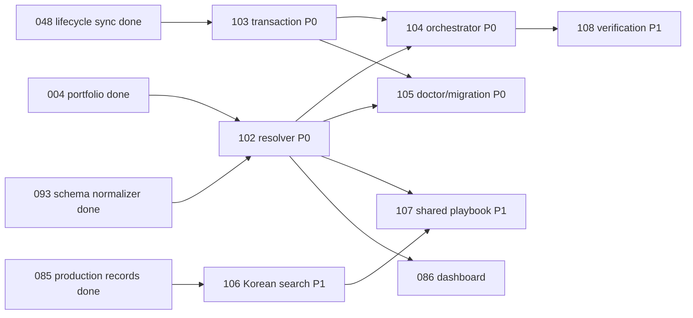

# 소스 감사: 안전한 멀티프로젝트 요청 오케스트레이션

상태: 구현 전 검토용 증거 정리 완료(2026-08-19) · 구현/구현 계획 미착수
범위: Issues `102`–`108` 및 기존 `048`, `075`, `076`, `085`, `086`, `092`, `093`, `094`, `097`, `101`과의 중복·의존성

## 결론

개선 요청은 타당하다. 다만 현재 ModuFlow가 “전부 경로를 고정해서 쓰는 상태”는 아니다. Issue `093`이 만든 정규화 이슈 계층은 이미 설정 경로와 경로 이탈 방지를 지원한다. 정확한 문제는 다음 네 가지다.

1. 이 안전한 경로 계층을 쓰는 기능과 여전히 `root/issues`, `root/workspace`를 직접 만드는 기능이 섞여 있다.
2. lifecycle·loop·production·migration 쓰기가 파일별로 분리되어 중간 실패 시 일부 파일만 바뀔 수 있다.
3. intake, 제작 기록 조회, capability routing, 검증이 각각 존재하지만 하나의 실행 가능한 요청 파이프라인으로 연결돼 있지 않다.
4. 한국어 검색/ID, 승인된 공용 지식, 승인자 준비, 산출물별 검증은 첫 버전 수준에서 멈춰 있다.

따라서 Issues `102`–`108`의 분리는 유지한다. 중복 이슈는 없으며, Issue `102`만 “전체 경로 기능 신규 개발”이 아니라 **프로젝트 Resolver 신규 개발 + 아직 남은 소비자의 공용 경로 계약 전환**으로 범위를 바로잡았다.

## 이미 구현되어 보존할 부분

| 보존 대상 | 현재 동작 | 후속 이슈의 역할 |
|---|---|---|
| 설정된 issue/spec/workspace 경로 | `project_issue_schema.py:79-137`, `:1169-1200` | `102`가 재사용하고 남은 소비자만 통합 |
| canonical 이슈 상태와 drift 검출 | `project_lifecycle.py:361-417` | `103`이 쓰기 트랜잭션을 추가 |
| 프로젝트 로컬 제작 기록 격리 | `project_production.py:240-245` | `107`은 별도 승인 공용 계층만 추가 |
| 사람 승인 플레이북 | `project_production.py:293-348` | `107·108`이 설정·증거를 강화 |
| intake 분류와 관련 이슈 후보 | `project_intake.py:204-225`, `:306-358` | `104`가 교체하지 않고 연결 |
| capability 권한/가용성 라우팅 | `capability_routing.py:241-335` | `104`가 결과를 소비하고 권한을 넓히지 않음 |
| 승인 플레이북 우선 retrieval | `project_production.py:430-468` | `106`이 한국어 토큰·일치 이유를 추가 |
| 한 파일의 임시 쓰기 후 replace | `project_review.py:364-369` | `103`이 복구 가능한 다중 파일 계약으로 확장 |

## 실제 재현 결과

### 설정 경로 불일치

`.moduflow/config.json`의 issue 경로를 `product/issues`로 설정하고 `777-configured-path.md`를 넣었다.

```text
정규화 이슈 스키마: [777-configured-path]
intake 이슈 목록:    []
```

원인: schema 계층은 설정 경로를 사용하지만 `project_intake.py:175-179`는 `<root>/issues`만 연다.

### lifecycle 부분 반영

stale state와 활성 이슈를 준비하고 dashboard 읽기 단계에서 예외가 나도록 했다.

```text
오류: IsADirectoryError at workspace/dashboard.md
실패 후 state.active_issue: old → 048-active
dashboard: 변경되지 않음
```

원인: `project_lifecycle.py:418-429`가 state를 먼저 저장하고, `:431-452`에서 dashboard를 처리한다. 공통 staging/rollback이 없다.

### 한국어 검색과 ID

`스플래시`와 `배너`가 서로 다른 필드에 있는 기록으로 확인했다.

```text
스플래시       → 검색됨
배너           → 검색됨
스플래시 배너  → 검색 안 됨
스플래시 배너  → slug untitled
모두의충전 이벤트 배너 → slug untitled
아이파킹EV 여행 지도   → slug ev
```

원인: 검색은 하나의 연속 substring만 검사하고(`project_production.py:379-427`), slug는 ASCII 이외 문자를 제거한다(`project_memory.py:63-65`).

### 제작물 검증 누락

`published` Production Record가 가리키는 PNG 내용을 12바이트 `not-an-image`로 만들었다.

```json
{"errors": [], "warnings": []}
```

원인: `project_production.py:505-529`는 경로와 존재 여부만 확인하며 이미지 openability, format, pixel, ratio, size를 확인하지 않는다.

## 이슈별 상세 수정 범위

### Issue 102 — Project Registry and Resolver

**지금의 문제**

- `moduflow.projects.v1`은 기본적으로 프로젝트 `path` 목록이며 alias, trust scope, canonical named paths가 없다.
- 어떤 프로젝트가 선택됐는지와 모호성 이유를 설명하는 공용 Resolver가 없다.
- 정규화 schema는 설정 경로를 쓰지만 intake, loop, Doctor, production issue link, execution, PR, GitHub issue sync, promote 등은 직접 경로를 만든다.

**수정 내용**

- `projects.v2` parser와 순수 Resolver를 추가한다.
- 결과는 `resolved | ambiguous | unresolved`, reason code, 후보, canonical root/paths, 경고, 질문 한 개를 포함한다.
- 선택 순서는 명시 ID → 포함 CWD → 정확한 이름/별칭 → 등록된 active issue project → 유효한 최근 명시 선택 → 실패로 고정한다.
- `project_issue_schema.configured_project_paths`를 기존 issues/specs/workspace 호환 기반으로 재사용한다.
- 나머지 소비자는 bare root 대신 resolved context의 named path를 사용한다.
- v1은 읽되, v2 migration proposal만 보여주고 자동 재작성하지 않는다.

**검증**

- 한국어 별칭, 별칭 충돌, ID 우선순위, nested path, symlink containment, missing root.
- ambiguous 상태에서 후보 프로젝트 파일 open 0건, write 0건.
- Project A/B에서 intake·schema·Doctor·production·dashboard가 같은 canonical 경로를 사용.

### Issue 103 — Atomic Lifecycle State Transaction

**지금의 문제**

- lifecycle은 state와 dashboard를 순차 저장한다.
- loop, promotion, playbook 승인, migration도 각각 직접 저장한다.
- 여러 파일을 묶는 변경 계획, 예상 상태 검증, 원본 바이트 저널, rollback이 없다.

**수정 내용**

- `plan → staged bytes render → projected tree validate → apply → verify` 계약을 만든다.
- 각 파일은 temp + replace로 반영하고, 원본 바이트와 새로 만든 경로를 저널에 남긴다.
- 중간 실패 시 기존 파일은 바이트 단위로 복구하고 이 트랜잭션이 만든 파일만 제거한다.
- 결과는 `applied | noop | rolled_back`, 영향 경로, 실패 단계, 검증 결과, next command를 기록한다.
- start/update/pause/resume/complete와 Production Record 연계 상태 변경을 같은 경계로 묶는다.

**정확한 보장 범위**

여러 파일을 하나의 OS rename으로 바꾸는 kernel-level atomicity는 이식 가능한 파일시스템에서 불가능하다. 목표는 staged replace + 복구 저널 + rollback + 사후 검증을 이용한 **애플리케이션 수준 all-or-nothing**이다.

**검증**

- 각 replace 전후 실패 주입.
- rollback 후 모든 기존 대상 byte-identical.
- 재시도는 `noop`, 성공/실패 뒤 lifecycle drift 0건.

### Issue 104 — Project-Aware Natural-Language Request Orchestrator

**지금의 문제**

- intake, production retrieval, capability router는 각각 테스트되지만 서로 호출하지 않는다.
- 현재 결과 계약 하나로 project/issue/context/capability/verification/transaction을 추적할 수 없다.

**수정 내용**

- 기존 `/moduflow` 자연어 진입점 뒤에 얇은 coordinator를 추가한다.
- 순서는 `resolve(102) → attach/create 판단 → local context → approved shared context → capability route → specialist handoff → verify(108) → transaction(103)`이다.
- `moduflow.request-routing.v1`에 request ID, project evidence, action, issue, context refs, capability, stage, output, next command를 넣는다.
- 리사이즈·압축·문구 수정은 source identity가 같으면 기존 issue/record 버전으로 연결한다.
- routing metadata만으로 전문 기능을 실행했다고 표시하지 않는다.

**검증**

- 기존 캠페인 수정은 새 이슈 0건.
- 독립 납품물만 새 이슈 후보.
- ambiguous project는 specialist call/write 0건.
- A 요청 컨텍스트에 B 원본 issue/record/playbook/brand copy 0건.

### Issue 105 — Schema Migration and Doctor Triage

**지금의 문제**

- 현재 migrate는 기존 상태 값을 변환하지 않고 누락된 구조만 만든다.
- CLI는 `--write`이며 명시적 `--plan/--apply` 복구 흐름이 없다.
- Doctor는 component별 raw 진단을 나열하고 현재 차단과 legacy noise를 우선순위로 구분하지 않는다.
- Doctor의 loop-state 존재 검사는 설정 workspace가 아닌 고정 `workspace/loop-state.json`을 본다.

**수정 내용**

- 진단을 현재 차단, active issue, state drift, legacy migration, safe fix, warning으로 분류한다.
- raw 결과는 보존하고 `--summary`, `--current` view를 추가한다.
- migration registry에 path/field/before/after/rationale/confidence/reversibility를 기록한다.
- `--fix-safe`는 결정론적인 변환만 적용하고 의미가 모호한 값은 human decision으로 남긴다.
- resolved path(102)와 transaction(103)을 사용한다.

**검증**

- mixed Markdown/frontmatter, nested path, safe/ambiguous state, rollback fixture.
- 적용 뒤 schema/lifecycle drift 0건, 두 번째 실행 `noop`.
- 요청서의 96건은 외부 실제 프로젝트에서 나온 수치이므로 이 repo에서는 독립 재현하지 않았다고 명시한다.

### Issue 106 — Korean Production Search and Stable IDs

**지금의 문제**

- 전체 검색어가 연속으로 있어야 하며, 일치 필드/이유/가중치가 없다.
- 한국어 제목은 `untitled`, 우연한 영문 한 조각이 있으면 `ev`처럼 축약된다.

**수정 내용**

- Unicode NFKC, casefold, 문장부호/띄어쓰기 토큰화를 적용한다.
- 기본 AND와 명시 OR를 제공한다.
- title/retrieval trigger, Failed Attempts/Do Not Repeat, artifact, generic body 순으로 필드 가중치를 둔다.
- 기존 approved/recency 점수와 결합하고 matched tokens/fields/reason/score breakdown을 반환한다.
- 새 ID는 명시 ASCII alias가 있으면 사용하고, 없으면 project ID + issue/source identity + type + date + short hash로 만든다.
- 기존 ID는 자동 변경하지 않는다.

**검증**

- 한국어 띄어쓰기/문장부호/분리 필드/AND/OR.
- approved vs candidate 순위와 일치 이유.
- 동일 source identity 동일 ID, 다른 source silent collision 0건, legacy ID 불변.

### Issue 107 — Shared Approved Playbook Layer

**지금의 문제**

- 현재 로컬 격리는 올바르며 유지해야 한다.
- 별도 조직 workspace, shared schema, redaction, promotion history, hold/revoke/expire 상태가 없다.

**수정 내용**

- 102가 신뢰하는 별도 조직 Git workspace를 설정한다.
- local playbook/record의 raw 본문을 복사하지 않고 일반화된 rule + source project/record/playbook ID로 candidate를 만든다.
- 등록 브랜드/고객명, 가격·기간·캠페인 패턴, internal reporting copy를 검사하고 사람의 redaction/allow 결정을 기록한다.
- candidate/approved/rejected/held/revoked/expired 상태와 append-only decision history를 둔다.
- 다른 프로젝트에는 활성 approved projection만 반환하며 source type을 표시한다.

**검증**

- B 요청 중 A raw store traversal 0건.
- 한국어 브랜드명, 가격, 날짜, 내부 보고 문구 누출 fixture.
- reject/hold/revoke/expire rule은 authoritative 결과 0건.

### Issue 108 — Production Approval and Verification Gates

**지금의 문제**

- 승인 명령은 humans.json을 엄격히 검사하지만 production init은 승인자 준비 상태를 안내하지 않는다.
- 현재 validate는 파일 존재만 확인해 가짜 PNG도 `published`로 통과한다.
- 검증 증거와 final/approved/published/upload-ready 전환이 연결되지 않는다.

**수정 내용**

- lightweight/production init과 승인 직전에 approver readiness를 보여준다.
- profile owner나 중앙 identity는 후보로만 제시하고, 명시 확인이 있어야 humans 설정에 반영한다.
- `deliverable_type + channel + variant`로 필요한 검증 profile만 선택한다.
- `moduflow.production-verification.v1`에 artifact hash, check/evidence, adapter/version, verifier, time, result, N/A/needs-review 이유를 저장한다.
- 이미지/banner/splash, HTML, ZIP/handoff, document, Korean copy용 초기 adapter를 둔다.
- evidence 누락·실패·만료·artifact hash 불일치면 final-like 상태를 막는다.
- 사람의 브랜드/법무/출시 승인은 자동 검증과 별도다.

**검증**

- missing approver, owner confirmation, unsupported adapter, pass/fail/needs-review/N/A.
- image/HTML/ZIP/document/Korean copy 대표 fixture.
- verification link + record lifecycle + issue/state를 103으로 함께 반영.

## 확정된 의존성



권장 순서는 `102 검토·승인 → 103과 106 스펙 병행 → 104/105 → 107 → 108`이다. 구현은 아직 시작하지 않는다.

## 계획 진행 승인된 결정 5개

1. portfolio workspace의 `projects.json`을 유일한 멀티프로젝트 registry 위치로 사용할지.
2. 최근 선택에는 project ID와 timestamp만 저장하고 프로젝트 내용은 cache하지 않을지.
3. Issue `103`의 보장을 위의 application-level transaction으로 확정할지.
4. 새 한국어 record ID는 억지 음역보다 stable source identity를 우선할지.
5. 공용 플레이북은 각 프로젝트가 암묵적으로 읽는 폴더가 아니라 별도 설정된 조직 Git workspace로 둘지.

Dongwon Lee가 2026-08-19 “진행 하자고”로 다섯 결정을 승인했다. 구현 계획은 작성됐으며, 소스 구현은 별도 `product:execute 102-project-registry-and-resolver` 단계에서 시작한다.
