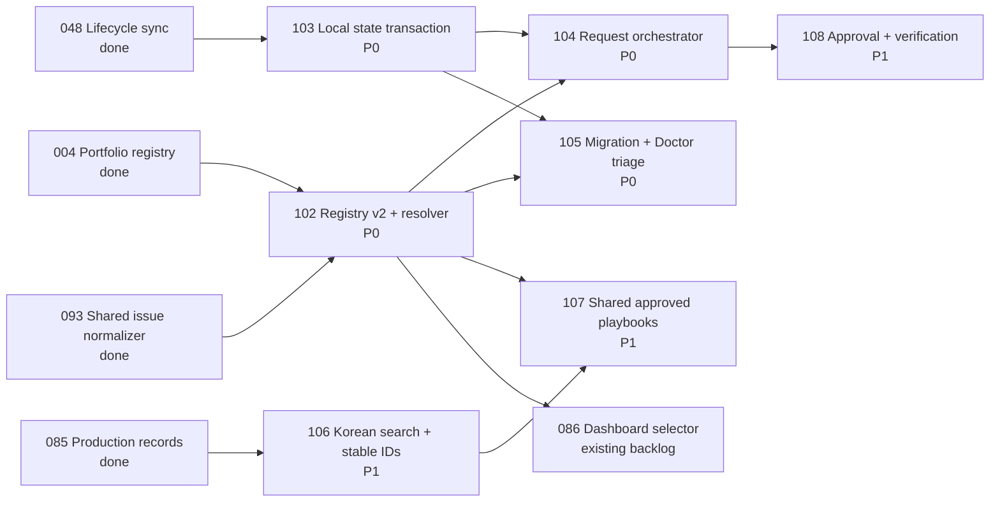

# Source Audit: Safe Multi-Project Request Orchestration

Status: evidence complete for human review — no implementation started (2026-08-19)
Scope: Issues `102`–`108` and their overlap with `048`, `075`, `076`, `085`, `086`, `092`, `093`, `094`, `097`, and `101`

## Bottom Line

The requested improvement is valid, but the source does not have one single defect. It has four disconnected foundations and three confirmed failure modes:

1. configured issue paths already work in the normalized issue-schema/lifecycle layer, but several neighboring commands still reconstruct `root/issues` or `root/workspace` themselves;
2. lifecycle and production mutations write files sequentially, so an exception can leave a partial state;
3. intake, production retrieval, capability routing, and verification are separate entry points rather than one executable request pipeline;
4. production search, identifiers, shared knowledge, approver readiness, and artifact verification stop at a minimal first version.

Issues `102`–`108` should remain separate. None duplicates an existing completed issue, but Issue `102` must be framed as **resolver creation plus remaining-consumer convergence**, not as a rewrite of the configured-path support already delivered by Issue `093`.

## Audit Method and Baseline

- Inspected the current `main` source, tests, command surface, templates, and existing issue/spec records.
- Compared requested behavior with Issues `048`, `075`, `076`, `085`, `086`, `092`, `093`, `094`, `097`, and `101`.
- Ran the focused baseline suites for issue schema, loop, portfolio, intake, production, lifecycle, Doctor, and migration.
- Result: `204` focused tests passed. One initial test invocation named the nonexistent module `tests.test_project_migrate`; rerunning the actual `tests.test_project_migration` module passed `7/7`.
- Added temporary, repository-external reproductions for path isolation, partial state mutation, Korean search/ID behavior, and artifact verification. No implementation files were changed.

## What Already Works and Must Be Preserved

| Existing capability | Current evidence | Consequence for the new issues |
|---|---|---|
| Safe configured issue/spec/workspace paths | `scripts/project_issue_schema.py:79-137` validates project-relative paths; `list_normalized_issues` consumes them at `:1169-1200` | Issue `102` reuses this contract and migrates remaining consumers; it does not replace the Issue `093` normalizer |
| Lifecycle drift detection and canonical issue status | `scripts/project_lifecycle.py:361-417` evaluates normalized issues before propagation | Issue `103` adds transaction semantics around mutations; it does not replace issue Markdown as truth |
| Project-local production isolation | `scripts/project_production.py:240-245` reads only the selected root's records/playbooks | Issue `107` adds a separate approved shared projection; it must not federate local raw stores |
| Human-only local playbook approval | `scripts/project_production.py:293-348` requires a configured human and records approval history | Issues `107` and `108` preserve this gate and improve setup/evidence |
| Intake shaping and duplicate hints | `scripts/project_intake.py:204-225` and `:306-358` classify and return related issue candidates | Issue `104` coordinates this existing primitive rather than replacing it |
| Pure capability routing | `scripts/capability_routing.py:241-335` returns bounded routing and permission metadata without invoking specialists | Issue `104` consumes the router result and must not widen permissions |
| Approved-playbook-first retrieval scoring | `scripts/project_production.py:430-468` assigns authoritative approved playbooks a higher score | Issue `106` can extend this ranking with token matches and explanations |
| Single-file atomic replace pattern | `scripts/project_review.py:364-369` writes a temporary file then replaces one target | Issue `103` generalizes this into an application-level multi-file transaction with recovery |

## Confirmed Reproductions

### R1 — Configured issue path is visible to schema but invisible to intake

Fixture: `.moduflow/config.json` configured `issues: product/issues`, containing `777-configured-path.md`.

```text
normalized issue schema: [777-configured-path]
intake issue summaries:  []
```

Cause: the normalizer uses `configured_project_paths`, while `scripts/project_intake.py:175-179` directly opens `<root>/issues`.

### R2 — Lifecycle sync can partially commit

Fixture: one active issue, stale `.moduflow/state.json`, and a dashboard target that fails when read.

```text
sync error: IsADirectoryError at workspace/dashboard.md
state after failure: active_issue changed from old to 048-active
dashboard: not updated
```

Cause: `scripts/project_lifecycle.py:418-429` writes state first, then `:431-452` reads/writes the dashboard. There is no shared staging, projected-state validation, or rollback boundary.

### R3 — Korean multi-token search and title IDs lose meaning

Fixture: one record containing `스플래시` and `배너` in separate searchable fields.

```text
query 스플래시:       match
query 배너:           match
query 스플래시 배너:  no match
slug 스플래시 배너:   untitled
slug 모두의충전 이벤트 배너: untitled
slug 아이파킹EV 여행 지도: ev
```

Cause: `scripts/project_production.py:379-427` performs one contiguous substring check, while `scripts/project_memory.py:63-65` removes every non-ASCII letter/number before generating a slug.

### R4 — A non-image can pass a published image record validation

Fixture: a valid published Production Record linked to `banner-final.png`, whose content is the 12 bytes `not-an-image`.

```json
{"errors": [], "warnings": []}
```

Cause: `scripts/project_production.py:505-529` checks lifecycle, artifact declaration, URL shape, portability, and existence. It does not inspect file openability, format, dimensions, aspect ratio, size policy, package integrity, or copy rules.

## Issue-by-Issue Change Definition

### `102-project-registry-and-resolver` — correct the selection and path boundary

**Current problem**

- `portfolio/projects.json` is only a `moduflow.projects.v1` list; `scripts/project_portfolio.py:8-16` defines no aliases, trust scope, named canonical paths, or resolver contract.
- `collect_project_statuses` at `scripts/project_portfolio.py:112-139` trusts each registry `path` and reads it directly; it does not explain project selection or ambiguity.
- The normalized schema path layer is already safe, but intake, production, loop, Doctor, execution, PR, GitHub issue sync, promotion, repository identity, and issue generation still contain direct path construction. Confirmed examples include `project_intake.py:176`, `project_loop.py:56`, `project_doctor.py:498`, `project_production.py:511`, `project_execution.py:48`, and `project_pr.py:209`.

**Required modification**

- Add a versioned `projects.v2` parser and a pure resolver returning `resolved | ambiguous | unresolved`, reason code, candidates, canonical root, named paths, warnings, and at most one clarification question.
- Keep `project_issue_schema.configured_project_paths` as the compatibility base for project-local `issues/specs/workspace`; extend the resolved context with memory, production, playbook, and trust-scope locations.
- Resolve only explicit registrations in this order: explicit project ID, containing CWD, exact normalized name/alias, registered active-issue project, valid recent explicit selection, then fail closed.
- Migrate remaining direct-path consumers to accept the resolved context. Compatibility wrappers may still accept a root for single-project callers, but must derive the same context internally.
- Make `projects.v1` read-compatible and emit a deterministic v2 migration proposal; do not silently rewrite it.

**Interfaces and tests to change**

- Registry/portfolio parser and resolver module; project profile/config compatibility adapter.
- Intake, loop, Doctor, lifecycle, production, execution/PR/GitHub sync, dashboard read models, and issue writers.
- Contract fixtures for nested paths, Korean aliases, alias collision, explicit-ID precedence, symlink containment, missing roots, and unregistered siblings.
- Negative-I/O test proving ambiguous resolution opens no candidate project issue/memory/playbook files.

**Why it is separate**

Issue `086` owns the dashboard selector UI. Issue `102` supplies the shared selection/path contract that the UI and non-UI commands must consume.

### `103-atomic-lifecycle-state-transaction` — prevent partial local mutations

**Current problem**

- Lifecycle sync writes state and dashboard sequentially (`project_lifecycle.py:418-452`).
- Loop state writes independently (`project_loop.py:508-515`).
- Promotion writes the issue and source record independently (`project_promote.py:277-279`).
- Playbook approval writes the Production Record before the playbook (`project_production.py:327-348`).
- Migration and other workflows use the same direct-write pattern.

**Required modification**

- Introduce one mutation contract: `plan → render staged bytes → validate projected tree → apply → verify`, with a journal containing original bytes and created-path markers.
- Use per-file temporary replace for each local target, then perform post-apply validation. On any failure, restore every replaced file and remove only files created by that transaction.
- Record `applied | noop | rolled_back`, affected paths, validation evidence, next command, and failure stage.
- Route lifecycle start/update/pause/resume/complete and production-linked state changes through the same application-level transaction boundary.
- Preserve prose sections by using current structured renderers; absence of an optional view must not cause it to be created unless the workflow owns that projection.

**Technical constraint**

A portable filesystem cannot provide one kernel-level atomic rename across many files. The achievable guarantee is application-level all-or-nothing behavior using staged bytes, atomic replacement per file, a recovery journal, rollback, and verification. The spec must use this precise meaning.

**Interfaces and tests to change**

- Shared transaction planner/applicator plus adapters for lifecycle, loop, roadmap/index projection, promotion, production approval, and migration.
- Failure injection before/after every replacement, process-interruption recovery, idempotent retry, and byte-identical rollback tests.
- Drift test after successful apply and after rollback.

### `104-project-aware-natural-language-request-orchestrator` — connect existing primitives

**Current problem**

- `route_intake` returns `moduflow.intake-routing.v1` with classification, active work, related issues, candidates, and next command (`project_intake.py:306-358`).
- `retrieve_production_context` separately ranks local approved playbooks and records (`project_production.py:430-468`).
- `route_request` separately returns capability/permission/availability handoff metadata (`capability_routing.py:241-335`).
- No runtime entry point calls these in the required order, and no current contract includes resolved project, production context, capability handoff, verification result, and transactional update together.

**Required modification**

- Add a thin coordinator behind the existing `/moduflow`/natural-language entry point; `product:request` may remain an internal/direct alias only if the spec justifies it.
- Execute a fail-closed pipeline: resolve project (`102`) → intake/duplicate decision → retrieve project context → retrieve approved shared rules (`107`, when available) → capability route → specialist handoff → verification (`108`, when required) → transaction (`103`).
- Emit `moduflow.request-routing.v1` with request ID, resolved project evidence, attach/create/capture/clarify action, issue identity, local/shared knowledge references, capability metadata, current stage, output artifact, and next command.
- Treat resize/compression/copy revisions as versions attached to an existing issue/record when source identity matches; do not create a new issue merely because wording changed.
- Never claim specialist execution from routing metadata alone.

**Interfaces and tests to change**

- Existing command/skill entry-point guidance plus a request coordinator module; no replacement of the `097` capability router.
- End-to-end contract fixtures for existing campaign revision, independent deliverable, ambiguous project, unavailable/forbidden adapter, failed verification, and failed transaction.
- Project A/B disclosure tests asserting the coordinator never passes raw B context into A work.

### `105-schema-migration-and-doctor-triage` — turn diagnostics into recovery

**Current problem**

- `project_migrate.py:153-170` already emits `moduflow.migration-plan.v1`, but `apply_migration_plan` at `:196-219` only creates missing metadata/directories. It does not transform legacy values or reconcile existing state.
- The CLI exposes `--write`, not the requested explicit `--plan`/`--apply` vocabulary (`project_migrate.py:222-237`).
- Doctor aggregates component-shaped raw output (`project_doctor.py:503-569`) and appends generic recommendations in fixed order. It has no severity/current-work triage model and no `--summary`, `--current`, or `--fix-safe` view.
- Doctor checks loop-state existence at hardcoded `workspace/loop-state.json` (`project_doctor.py:498`) even when workspace is configured elsewhere.

**Required modification**

- Add a diagnostic classifier that groups: current blockers, active-issue defects, state drift, legacy migrations, deterministic safe fixes, and warnings/recommendations.
- Preserve full raw diagnostics while adding concise summary/current projections and ordered repair steps.
- Add a migration registry of explicit source schema/value → target schema/value transformations. Each proposed change records path, field, before, after, rationale, confidence, reversibility, and dependency.
- `--fix-safe` applies only deterministic entries; ambiguous lifecycle/readiness meaning stays unchanged as a human decision.
- Use resolved canonical paths (`102`) and the transaction/recovery boundary (`103`) for multi-file applies.

**Interfaces and tests to change**

- Doctor result schema/renderers and command options; migration action model and compatibility alias for existing `--write`.
- Mixed legacy Markdown/frontmatter fixtures, nested paths, safe/ambiguous mappings, rollback, active-only filtering, and second-run `noop`.
- A real 96-diagnostic project snapshot may be added as sanitized fixture evidence; the exact reported count was not independently reproduced in this repository.

### `106-korean-production-search-and-stable-ids` — make retrieval deterministic and explainable

**Current problem**

- Search is one case-folded contiguous substring test (`project_production.py:379-427`), so tokens in different fields do not match together.
- Results have no match reasons or field weights.
- `project_memory.slugify` drops Korean and falls back to `untitled` (`project_memory.py:63-65`); incidental ASCII such as `EV` can become the whole identifier.
- Existing IDs include title slugs and numeric collision suffixes (`project_production.py:684-755`), but the fallback lacks a stable source identity.

**Required modification**

- Normalize with Unicode NFKC, case folding, punctuation/spacing tokenization, and explicit AND-default/OR modes.
- Build field-indexed match evidence and weights: title/retrieval trigger, failed attempts/`Do Not Repeat`, artifact labels, then generic sections; combine with current approval/recency scoring.
- Return matched tokens, fields, reason codes, authoritative status, and score components.
- Generate new IDs from an explicit ASCII alias when supplied; otherwise use stable project ID + issue/source identity + record type + date + short content/source hash. Use a counter only for a true hash/source collision.
- Never rewrite existing IDs automatically.

**Interfaces and tests to change**

- Search/retrieval result contract, record creation ID helper, and templates/command docs for optional alias/source identity.
- Korean punctuation/spacing, AND/OR, separated-field, approved-vs-candidate, repeat-generation, collision, and backward-compatibility fixtures.

### `107-shared-approved-playbook-layer` — add sharing without breaking isolation

**Current problem**

- Current list/search functions read only `<selected-project>/playbooks` and local production records (`project_production.py:240-245`). This is correct isolation, not a defect.
- Approval history exists only for a project-local record/playbook pair (`project_production.py:293-348`).
- There is no configured organization workspace, shared schema, redaction evidence, promotion history, hold/revoke state, or shared retrieval contract.

**Required modification**

- Add a separate organization workspace configured through the trusted registry boundary (`102`); do not search source projects during another project's request.
- Create a promotion candidate from selected local playbook/record references, generalized rule text, source project IDs, and immutable provenance IDs. Raw source bodies remain in their projects.
- Run deterministic leakage checks for registered brand/customer terms, price/date/campaign patterns, internal-report sections, and project-only copy. A human records redaction/allow decisions.
- Model candidate/approved/rejected/held/revoked/expired states with append-only decision history and review dates.
- Return only active approved shared projections, after local approved playbooks and local production evidence, with source type visible.

**Interfaces and tests to change**

- Shared playbook/candidate schemas, promotion/decision commands, organization-store reader, and retrieval adapter.
- Two-project non-traversal tests, Korean brand/price/date leakage, hold/reject/revoke/expiry, provenance retention, and source-access removal.

### `108-production-approval-and-verification-gates` — require evidence before final states

**Current problem**

- `decide_playbook_update` correctly rejects an unknown approver (`project_production.py:293-306`), but production initialization creates only `memory/production-records` and `playbooks` (`project_production.py:568-592`). It gives no early human-setup readiness result.
- Record validation verifies metadata/link existence, not artifact quality (`project_production.py:471-565`). The fake-PNG reproduction passed without warnings.
- There is no verification result schema linked to final/approved/published/upload-ready transitions.

**Required modification**

- Add approver-readiness inspection during lightweight/production setup and before approval. It may propose the confirmed profile owner or central identity, but requires an explicit recorded confirmation before writing authorization.
- Select a verification profile from `deliverable_type + channel + variant`; run only required/advisory checks for that profile.
- Define `moduflow.production-verification.v1` with record/issue/artifact identity, selected profile, checks, evidence, adapter/version, verifier, timestamp, result, and N/A/needs-review rationale.
- Initial adapters cover image/banner/splash openability/format/dimensions/aspect/size; HTML link/asset integrity; ZIP openability/required contents; document openability/required outputs; and Korean copy terms/spacing/date/price/brand rules.
- Block final-like lifecycle transitions when required evidence is absent, failed, stale, or for a different artifact hash. Human brand/legal approval remains a distinct gate.
- Apply verification link, Production Record lifecycle, issue/state projections, and next command through Issue `103`.

**Interfaces and tests to change**

- Production setup/readiness, verification profile registry, replaceable adapter contract, verification artifact template, and lifecycle transition gate.
- Missing approver, explicit confirmation, unsupported adapter, pass/fail/needs-review/N/A, stale/hash-mismatch evidence, representative artifact, and Project A/B rule-isolation fixtures.

## Dependency Graph and Delivery Order



Recommended spec sequence:

1. Review and approve corrected Issue `102` spec and this source audit.
2. Specify `103` in parallel with `106`; neither needs the other.
3. Implement/spec-gate `104` and `105` only after `102` and `103` contracts are stable.
4. Implement/spec-gate `107` after `102` and `106`.
5. Implement/spec-gate `108` after `104`; its transaction dependency is satisfied transitively through `104 → 103`.

## Decisions Approved for Planning

1. Confirm the portfolio workspace containing `projects.json` is the one canonical multi-project registry location.
2. Confirm recent project selection may be stored as only project ID + timestamp, with no cached project content.
3. Confirm Issue `103` uses the application-level transaction guarantee described above, not an impossible multi-file kernel-atomic guarantee.
4. Confirm new Korean record IDs may prioritize stable source identity over a human-readable transliteration.
5. Confirm the shared playbook store is a separately configured organization Git workspace, not a folder implicitly readable from every project.

Dongwon Lee approved all five decisions on 2026-08-19 with “진행 하자고”.

## Implementation Gate

The implementation plan now exists. Source implementation has not started and requires the explicit `product:execute 102-project-registry-and-resolver` step.
