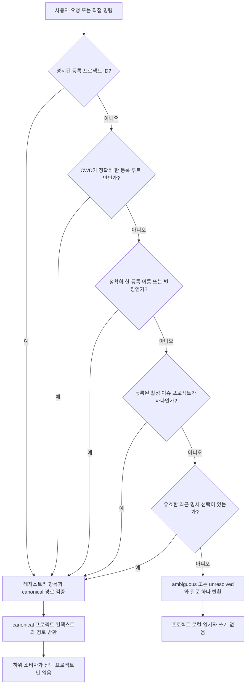

# 스펙: 프로젝트 레지스트리와 Resolver

Issue: `102-project-registry-and-resolver`
상태: Dongwon Lee 계획 진행 승인(2026-08-19: “진행 하자고”)
이전: 소스 감사와 의존성 검토 · 계획 검토 후 다음: `product:execute 102-project-registry-and-resolver`

## 문제

ModuFlow의 프로젝트 컨텍스트는 프로젝트 로컬 프로필/설정, 포트폴리오 `projects.json`, 호출자의 현재 작업 경로라는 세 부분으로 나뉘어 있다. 이들은 하나의 버전 있는 판별 계약을 이루지 않는다. Issue `093`이 정규화된 이슈 스키마/lifecycle 경로를 이미 안전하고 설정 가능하게 만들었지만, 일부 이웃 소비자는 여전히 대상 루트에서 `issues/`, memory, playbook, workspace 경로를 직접 조합한다. 따라서 `projects/modu-charge/issues/`의 이슈가 schema/lifecycle에는 보이지만 intake 등 다른 명령에는 빈 프로젝트로 보이거나, 잘못된 폴더를 검증하거나, 서로 다른 경로에 상태를 기록할 수 있다.

이는 편의 기능이 아니라 안전 경계다. 자연어 요청이 어느 등록 프로젝트에 속하고 어떤 경로가 canonical인지 증명하기 전에는 프로젝트 데이터를 검색하거나 변경하면 안 된다.

## 목표

1. 명시적 프로젝트 등록만 멀티프로젝트 탐색의 근거로 사용한다.
2. 하나의 프로젝트를 결정론적으로 선택하고 어떤 신호가 선택을 만들었는지 설명한다.
3. 판별이 모호하거나 실패하면 정보 노출 위험이 있는 읽기와 모든 쓰기를 중단한다.
4. 모든 프로젝트 인식 소비자가 하나의 canonical 경로 인터페이스를 사용한다.
5. 기존 프로젝트 프로필과 `moduflow.projects.v1`을 명시적인 마이그레이션 경로로 호환한다.

## 범위 제외

- 전체 자연어 요청 파이프라인 구현은 Issue 104가 담당한다.
- 원자적 lifecycle 쓰기는 Issue 103이 담당한다.
- 대시보드 프로젝트 선택 UI는 Issue 086이 이 계약을 소비한다.
- 등록되지 않은 형제 폴더를 탐색해 프로젝트를 추론하지 않는다.
- 기존 이슈, memory, playbook, 산출물 폴더를 이동하지 않는다.
- 중앙 DB나 벡터 인덱스를 도입하지 않는다.

## 사용자와 시나리오

### 프로젝트를 명시한 요청

여러 제품을 관리하는 사용자가 `모두의충전 이벤트 배너 수정해줘`라고 말하면 별칭 `모두의충전`이 `modu-charge`로 판별되고, 이후 사용하는 모든 경로는 등록된 해당 프로젝트에 속한다.

### 등록 프로젝트 내부에서 실행

등록된 프로젝트 루트 또는 설정된 하위 경로에서 작업하는 에이전트는 프로젝트명을 생략해도 현재 경로를 근거로 판별할 수 있다.

### 모호한 요청

여러 프로젝트가 가능한 상태에서 `지난번 배너 다시 만들어줘`라고 말하면 프로젝트 선택 질문 하나를 받는다. 답하기 전에는 프로젝트 로컬 이슈, 제작 기록, 플레이북을 읽지 않고 어떤 파일도 변경하지 않는다.

### 중첩된 아티팩트 경로

이슈가 `projects/modu-charge/issues/`에 있는 프로젝트도 intake, lifecycle, Doctor, dashboard, migration에서 같은 이슈 집합을 본다. 각 소비자가 `root/issues`를 따로 만들지 않기 때문이다.

## 제안 구조

### 1. 버전 있는 레지스트리

포트폴리오 수준의 명시적 레지스트리로 `moduflow.projects.v2`를 정의한다.

```yaml
schema: moduflow.projects.v2
projects:
  - id: modu-charge
    name: 모두의충전
    root: /configured/project/root
    aliases: [모두의충전, modu-charge, 모두충전]
    paths:
      issues: projects/modu-charge/issues
      specs: specs
      workspace: workspace
      memory: memory
      playbooks: playbooks
      production: production
    trust_scope: internal
```

`root`는 경로 포함 범위다. 상대 경로는 이 아래에서 해석한다. 외부 경로는 별도의 명시적 스키마 필드와 검증이 필요하며, 평범한 `../` 이탈은 잘못된 설정이다. 레지스트리 순서로 별칭 충돌을 결정하지 않는다.

### 2. 순수 판별 결과

Resolver는 읽기 전용이며 프로젝트 로컬 파일을 읽기 전에 다음 결과를 반환한다.

```yaml
schema: moduflow.project-resolution.v1
status: resolved | ambiguous | unresolved
project_id:
reason_code: explicit_id | cwd | alias | active_issue | recent_selection | no_match | multiple_matches
candidates: []
canonical_root:
paths: {}
question:
```

판별 순서는 고정한다.

1. 요청 또는 직접 명령 인자로 전달된 명시적 프로젝트 ID.
2. 현재 작업 경로를 포함하는 등록된 canonical root가 정확히 하나인 경우.
3. 정규화 후 정확히 일치하는 등록 프로젝트명 또는 별칭.
4. 프로젝트 ID가 명시되어 있고 여전히 등록된 활성 이슈.
5. 충돌 신호가 없고 여전히 등록된 최근의 명시적 선택.
6. 그 외에는 `ambiguous` 또는 `unresolved`.

명시적 ID와 현재 작업 경로가 충돌해도 ID가 우선하지만, 충돌 경고를 결과에 기록한다. 동률 후보는 최근 선택으로 임의 해소하지 않는다.

### 3. Canonical 경로 서비스

모든 프로젝트 인식 소비자는 단순 루트 경로 대신 판별된 프로젝트 컨텍스트를 받고, 그 안의 이름 있는 canonical 경로를 사용한다. 최초 적용 대상은 다음과 같다.

- intake와 중복 탐지
- 이슈 lifecycle과 정규화된 이슈 스키마
- Doctor와 migration
- Production Record와 playbook
- dashboard/project-home read model
- issue/spec/workspace writer

호환 어댑터는 `projects.v1`의 `path`와 프로젝트 로컬 설정을 v2 읽기 모델로 변환할 수 있다. 마이그레이션 안내는 제공하지만 원본 메타데이터를 자동 재작성하지 않는다.

초기 구현은 기존 `issues/specs/workspace` 호환성과 포함 범위 검증을 위해 `project_issue_schema.configured_project_paths`를 재사용한다. 두 번째 이슈 parser나 경로 normalizer를 만들지 않는다.

### 4. 읽기/쓰기 안전 경계

판별 단계는 레지스트리, 현재 프로세스 경로, 이미 로드된 전역 loop 메타데이터만 읽을 수 있다. `resolved`가 되기 전에는 후보 프로젝트의 issue, memory, production, playbook 파일을 열면 안 된다. `ambiguous`와 `unresolved`는 프로젝트 로컬 읽기와 모든 쓰기에 대해 fail-closed다.



## 의존성 계약

- Issue 102는 103이나 104에 의존하지 않으며 순수한 resolved-project 컨텍스트를 만든다.
- Issue 103은 나중에 resolved context를 받을 수 있지만 transaction 의미론은 독립적으로 설계할 수 있다.
- Issue 104는 102와 103이 모두 끝날 때까지 차단된다.
- Issue 105는 canonical 경로를 제공하는 102와 되돌릴 수 있는 다중 파일 적용을 제공하는 103에 의존한다.
- Issue 106은 독립적이며 병렬로 진행할 수 있다.
- Issue 107은 신뢰 경계용 102와 공용 검색 동작용 106에 의존한다.
- Issue 086은 두 번째 프로젝트 선택 소스를 만들지 않고 v2 레지스트리/Resolver를 소비해야 한다.

## 검토한 대안

### A. 루트 경로 인자를 유지하고 명령별로 수정

기각. 경로 로직 중복과 소비자 간 drift가 남고, 서로 다른 명령이 다른 프로젝트를 선택한 이유를 설명할 수 없다.

### B. 형제 폴더 자동 탐색

기각. 격리 원칙을 위반하고 등록되지 않은 프로젝트의 존재나 내용을 노출하며, 워크스테이션 폴더 구조에 따라 결과가 달라진다.

### C. 중앙 DB를 프로젝트 카탈로그로 사용

현재 단계에서 기각. 이식 가능한 Git 메타데이터를 새로운 가용성·동기화 의존성으로 교체한다. 명시적 버전 레지스트리로 충분하다.

### D. 공용 v2 레지스트리와 순수 Resolver

선택. 작은 안전 경계를 만들고 Git/JSON canonical 원칙을 유지하며, 중첩 경로와 하위 기능의 안정적인 인터페이스를 지원한다.

## 수용 기준

1. `moduflow.projects.v2`는 고유 ID, 정규화된 별칭, canonical root, 이름 있는 경로, trust scope를 검증한다.
2. 명시적 ID, CWD, 별칭, 활성 이슈, 최근 선택 fixture가 문서화된 우선순서로 판별된다.
3. 충돌하거나 중복된 별칭은 `ambiguous`이며 파일시스템/레지스트리 순서가 동률을 깨지 않는다.
4. `ambiguous`와 `unresolved`는 후보 프로젝트 로컬 issue, memory, production, playbook을 읽지 않고 쓰기도 하지 않는다.
5. 등록되지 않은 형제 디렉터리는 후보가 아니며 탐색하지 않는다.
6. 설정된 상대 아티팩트 경로는 canonical root 아래에 포함되어야 하며, 이탈은 실행 가능한 진단과 함께 거부된다.
7. intake, lifecycle, issue schema, Doctor, migration, Production Record, dashboard fixture가 모두 같은 resolved path map을 사용한다.
8. `issues/`와 `projects/modu-charge/issues/`를 각각 쓰는 두 프로젝트가 모든 이전 소비자에서 정확히 격리된 이슈 집합을 반환한다.
9. `projects.v1`은 계속 읽을 수 있고, Resolver는 결정론적 v2 마이그레이션 제안을 보여주되 명시적 migration action 없이 재작성하지 않는다.
10. 판별 결과에는 상태, 프로젝트 ID, reason code, 후보, canonical root/path, 경고, 필요한 경우 질문 하나가 포함된다.
11. 테스트는 한국어 별칭, Unicode 정규화, symlink/realpath 포함 범위, 중첩 경로, Project A/B 격리를 포함한다.
12. 기존 단일 프로젝트 동작과 `python3 scripts/release_check.py .`가 유지된다.
13. 기존 Issue `093` 설정 경로 fixture가 유지되고, intake와 모든 이전 대상 소비자가 normalizer와 동일한 중첩 이슈 집합을 보는 회귀 fixture가 추가된다.

## 오류 처리

- 잘못된 레지스트리 스키마: 차단 진단을 반환하고 파일시스템 탐색으로 fallback하지 않는다.
- 등록 root 누락: 손상된 레지스트리 항목을 표시한 `unresolved`를 반환한다.
- 프로젝트 ID 중복: 첫 항목을 선택하지 않고 레지스트리를 무효로 처리한다.
- 별칭 충돌: 민감하지 않은 프로젝트 라벨만 포함한 `ambiguous`를 반환한다.
- 경로 이탈 또는 symlink 포함 범위 위반: 해당 경로를 거부하고 프로젝트 로컬 작업을 막는다.
- 오래된 활성 이슈/최근 선택: 후보에서 제외하고 경고를 기록한 뒤 다음 안전 단계로 진행한다.

## 테스트 전략

- v1/v2 parsing, normalization, precedence, ambiguity, containment, migration proposal 단위 테스트.
- 하나의 resolved context를 최초 대상 소비자 각각에 주입해 같은 경로를 쓰는지 확인하는 contract test.
- 판별 전 후보 프로젝트 로컬 파일이 열리지 않는지 확인하는 negative I/O test.
- 한국어 별칭, 다른 레이아웃, 충돌하는 record명, 유혹용 미등록 형제 폴더를 가진 Project A/B fixture.
- 소비자 이전 후 전체 project validation, lifecycle drift, release gate.

## 확정된 설계 결정

- **레지스트리 위치:** 기존 명시적 포트폴리오 workspace를 멀티프로젝트 판별의 canonical로 사용한다. 프로젝트 로컬 프로필은 자신을 설명할 수 있지만 형제 프로젝트를 등록하지 못한다.
- **최근 선택 저장:** 포트폴리오 선택 메타데이터에는 선택된 project ID와 시각만 저장하고 프로젝트 내용은 캐시하지 않는다.
- **symlink를 통한 다중 root:** canonical realpath로 비교하고, 향후 스키마에서 포함된 subproject 관계를 명시하지 않는 한 root 중첩은 실패 처리한다.
- **외부 아티팩트 경로:** v2 기본 범위에서 제외한다. 실제 필요가 확인되면 무제한 이탈 대신 별도 검토된 path-grant 필드를 추가한다.
- **마이그레이션 순서:** 호환 어댑터 뒤에서 소비자를 단계적으로 이전할 수 있지만, 모든 지정 소비자가 공용 contract test를 통과하기 전에는 v2 완료로 보지 않는다.

## 검토 게이트

Dongwon Lee가 2026-08-19 “진행 하자고”로 이 스펙, 소스 감사의 설계 결정, 102→108 의존성 그래프의 계획 진행을 승인했다. 구현은 별도 `product:execute` 단계에서 시작한다.

소스 증거와 이슈별 변경 면은 `specs/102-project-registry-and-resolver/source-audit.ko.md`에 기록한다.

## 다음 명령

계획 검토 후: `product:execute 102-project-registry-and-resolver`.
