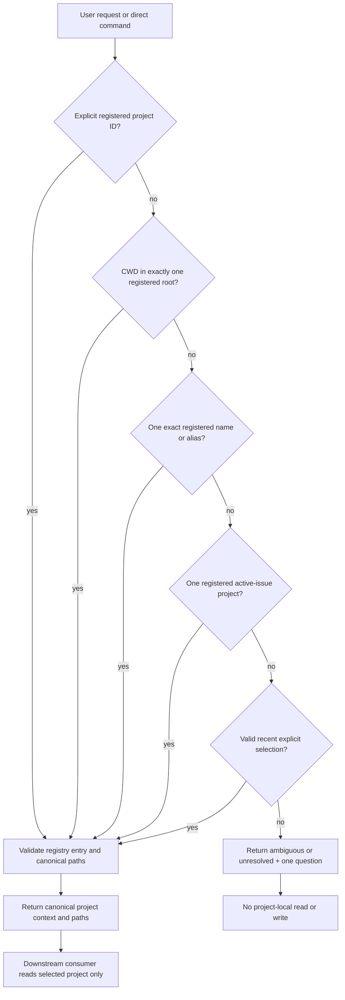

# Spec: Project Registry and Resolver

Issue: `102-project-registry-and-resolver`
Status: approved for planning by Dongwon Lee (2026-08-19: “진행 하자고”)
Prev: source audit and dependency review · Next after plan review: `product:execute 102-project-registry-and-resolver`

## Problem

ModuFlow has three partial sources of project context: project-local profile/config metadata, the portfolio `projects.json`, and caller working-directory assumptions. They do not form one versioned resolution contract. Issue `093` already made the normalized issue-schema/lifecycle path safe and configurable, but several neighboring consumers still derive `issues/`, memory, playbook, and workspace locations directly from the target root. A project whose canonical issues live at `projects/modu-charge/issues/` can therefore be visible to schema/lifecycle evaluation while intake or another command reports it as empty, validates the wrong folder, or updates a different view.

This is a safety boundary, not only a convenience feature. A natural-language request must not search or mutate any project until ModuFlow can prove which registered project owns the request and which paths are canonical.

## Goals

1. Make explicit project registration the only multi-project discovery source.
2. Resolve one project deterministically and explain which signal won.
3. Stop before reads with disclosure risk or any writes when resolution is ambiguous or unresolved.
4. Give every project-aware consumer one canonical path-resolution interface.
5. Preserve compatibility with current project profiles and `moduflow.projects.v1` registries through an explicit migration path.

## Non-Goals

- Implementing the full natural-language request pipeline; Issue 104 owns it.
- Implementing atomic lifecycle writes; Issue 103 owns them.
- Building or changing the dashboard project selector; Issue 086 consumes this contract.
- Searching arbitrary sibling folders to infer a project.
- Moving existing issue, memory, playbook, or artifact folders.
- Introducing a central database or vector index.

## Users & Scenarios

### Explicit project request

As a user managing multiple products, I can say `모두의충전 이벤트 배너 수정해줘`; the alias `모두의충전` resolves to `modu-charge`, and every downstream path belongs to that registered project.

### Working inside a registered project

As an agent operating inside a registered project root or one of its configured subdirectories, I can omit the project name and receive a resolution backed by the current directory.

### Ambiguous request

As a user who says `지난번 배너 다시 만들어줘` when more than one registered project is plausible, I receive one project-selection question. ModuFlow does not inspect project-local issues, records, or playbooks and performs no write until I answer.

### Nested artifact layout

As a project owner whose issues live at `projects/modu-charge/issues/`, I see the same issue set in intake, lifecycle, Doctor, dashboard, and migration commands because none of them reconstructs `root/issues` independently.

## Proposed Solution

### 1. Versioned registry

Define `moduflow.projects.v2` as the explicit portfolio-level registry:

```yaml
schema: moduflow.projects.v2
projects:
  - id: modu-charge
    name: 모두의충전
    root: /configured/project/root
    aliases: [모두의충전, modu-charge, 모두충전]
    paths:
      issues: projects/modu-charge/issues
      specs: specs
      workspace: workspace
      memory: memory
      playbooks: playbooks
      production: production
    trust_scope: internal
```

`root` is the containment boundary. Relative paths resolve under it. An external path requires an explicit schema field and validation; a plain `../` escape is invalid. Registry order never decides ambiguous aliases.

### 2. Pure resolver result

The resolver is read-only and returns a machine-readable result before any project-local read:

```yaml
schema: moduflow.project-resolution.v1
status: resolved | ambiguous | unresolved
project_id:
reason_code: explicit_id | cwd | alias | active_issue | recent_selection | no_match | multiple_matches
candidates: []
canonical_root:
paths: {}
question:
```

Resolution precedence is fixed:

1. Explicit project ID supplied in the request or direct command argument.
2. Current working directory contained by exactly one registered canonical root.
3. Exact normalized registered name or alias.
4. Active issue whose project identity is explicit and still registered.
5. Most recent explicitly selected project, when it is still registered and the request contains no conflicting project signal.
6. Otherwise `ambiguous` or `unresolved`.

An explicit ID that conflicts with the working directory still wins, but the result records the conflict as a warning. Two equal candidates never fall through to recency.

### 3. Canonical path service

All project-aware consumers receive the resolved project context rather than a bare path and use named canonical locations from it. The initial adoption set is:

- intake and duplicate detection;
- issue lifecycle and normalized issue schema;
- Doctor and migration;
- Production Records and playbooks;
- dashboard/project-home read models;
- issue/spec/workspace writers.

Compatibility adapters may translate `projects.v1` (`path`) and project-local config into the v2 read model. They emit migration guidance but do not rewrite source metadata automatically.

The initial implementation reuses `project_issue_schema.configured_project_paths` for existing `issues/specs/workspace` compatibility and containment behavior. It does not introduce a second issue parser or path normalizer.

### 4. Read/write safety boundary

Resolution itself may read only the registry, current process path, and already-loaded global loop metadata. It must not open candidate project issue, memory, production, or playbook files before returning `resolved`. `ambiguous` and `unresolved` results are fail-closed for project-local reads and all writes.



## Dependency Contract

- Issue 102 does not depend on Issues 103 or 104. It produces a pure resolved-project context.
- Issue 103 may accept a resolved context later but can build transaction semantics independently.
- Issue 104 is blocked until both 102 and 103 are done.
- Issue 105 is blocked until 102 supplies canonical paths and 103 supplies reversible multi-file apply.
- Issue 106 is independent and may proceed in parallel.
- Issue 107 depends on 102 for trust boundaries and 106 for shared-search behavior.
- Issue 086 must consume the v2 registry/resolver rather than creating a second project-selection source.

## Alternatives Considered

### A. Keep root-path arguments and fix each command independently

Rejected. It preserves duplicate path logic, makes consumer drift likely, and cannot explain why two commands selected different projects.

### B. Automatically scan sibling folders and infer projects

Rejected. It violates the requested isolation model, leaks the existence or content of unregistered projects, and makes results dependent on workstation layout.

### C. Use a central database as the project catalog

Rejected for this stage. It would replace portable Git metadata with a new availability and synchronization dependency. The explicit versioned registry is sufficient.

### D. Shared v2 registry plus pure resolver

Selected. It creates one small safety boundary, keeps Git/JSON canonical, supports nested paths, and gives all downstream features a stable interface.

## Acceptance Criteria

1. A `moduflow.projects.v2` registry validates unique IDs, normalized aliases, canonical roots, named paths, and trust scopes.
2. Explicit ID, CWD, alias, active issue, and recent selection fixtures resolve in the documented precedence order.
3. Conflicting or duplicate aliases return `ambiguous`; filesystem order and registry order do not break ties.
4. `ambiguous` and `unresolved` resolution performs no candidate project-local issue, memory, production, or playbook reads and no writes.
5. Unregistered sibling directories are never candidates and are not traversed.
6. Every configured relative artifact path is contained under the canonical root; invalid escapes are rejected with an actionable diagnostic.
7. Intake, lifecycle, issue schema, Doctor, migration, Production Records, and dashboard fixtures all consume the same resolved path map.
8. Two projects with `issues/` and `projects/modu-charge/issues/` layouts return their correct, isolated issue sets across all migrated consumers.
9. `projects.v1` remains readable; the resolver reports a deterministic v2 migration proposal and does not rewrite the registry without an explicit migration action.
10. Resolution output records status, project ID, reason code, candidates, canonical root, canonical paths, warnings, and a single clarification question when applicable.
11. Focused tests include Korean aliases, Unicode normalization, symlink/realpath containment, nested paths, and Project A/B isolation.
12. Existing single-project behavior and `python3 scripts/release_check.py .` remain green.
13. The existing Issue `093` configured-path fixtures remain green, while a regression fixture proves that intake and every other migrated consumer sees the same nested issue set as the normalizer.

## Error Handling

- Invalid registry schema: return a blocking registry diagnostic; do not fall back to filesystem discovery.
- Missing registered root: return unresolved with the broken registry entry identified.
- Duplicate project ID: invalidate the registry rather than selecting the first entry.
- Alias collision: return ambiguous with only non-sensitive project labels.
- Path escape or invalid symlink containment: reject that path and block project-local operations.
- Stale active issue or recent selection: ignore it as a candidate, record a warning, and continue to the next safe resolution step.

## Testing Strategy

- Unit tests for v1/v2 parsing, normalization, precedence, ambiguity, containment, and migration proposals.
- Contract tests that inject one resolved context into each initial consumer and prove they use the same paths.
- Negative I/O tests that assert no candidate project-local files are opened before resolution.
- Project A/B fixtures with Korean aliases, different layouts, conflicting record names, and intentionally tempting sibling directories.
- Full project validation, lifecycle drift, and release gate after consumer migration.

## Confirmed Design Decisions

- **Registry location:** the existing explicit portfolio workspace is canonical for multi-project resolution. A project-local profile may describe itself but cannot register sibling projects.
- **Recent selection persistence:** store only the selected project ID and timestamp in portfolio selection metadata; never cache project content.
- **Multiple roots through symlinks:** compare canonical real paths and fail on overlapping roots unless one registration explicitly declares a contained subproject relationship in a future schema revision.
- **External artifact paths:** keep out of v2 by default. If a real project requires them, add a separately reviewed path-grant field rather than permitting unrestricted escapes.
- **Migration sequencing:** consumer migration should be incremental behind compatibility adapters, but release cannot claim v2 complete until all named consumers pass the shared contract tests.

## Review Gate

Dongwon Lee approved this spec, the source-audit decisions, and the 102→108 dependency graph on 2026-08-19 with “진행 하자고”. Planning is authorized; implementation still requires the explicit `product:execute` step.

Source evidence and per-issue change surfaces are recorded in `specs/102-project-registry-and-resolver/source-audit.md`; the Korean review packet is `source-audit.ko.md`.

## Next Command

After plan review: `product:execute 102-project-registry-and-resolver`.
