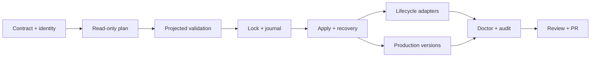

# Atomic Lifecycle State Transaction Implementation Plan

> **For agentic workers:** REQUIRED SUB-SKILL: Use superpowers:subagent-driven-development (recommended) or superpowers:executing-plans to implement this plan task-by-task. Steps use checkbox (`- [ ]`) syntax for tracking.

**Goal:** Replace best-effort lifecycle propagation with one capability-gated, recoverable application transaction that either updates every selected Git-native artifact consistently or proves byte-for-byte rollback.

**Architecture:** Add a focused `project_lifecycle_transaction.py` boundary that owns intent normalization, target planning, private staging, projected validation, lock/journal durability, deterministic replacement, rollback, recovery, and redacted evidence. Existing lifecycle, loop, dashboard, and production mutation entry points become renderers or adapters into that boundary; canonical path resolution remains in Issue 109 APIs and authorization remains in Issue 110 APIs.

**Tech Stack:** Python 3 standard library, `dataclasses`, `pathlib`, SHA-256, JSON/Markdown, `os.open`/`fsync`/`replace`, `unittest`, existing ModuFlow project resolver, issue schema, operation authorization, validation, Doctor, and release gates.

## Global Constraints

Constitution v1.0 applies (`workspace/constitution.md`). Plan-specific additions:

- Enforce `project_operation.require_project_capability(context, "write")` before creating locks, journals, staging directories, temporary files, evidence, or canonical writes.
- Obtain every participating path from the one resolved Issue 109 context. The only fixed control path is `.moduflow/transactions`; durable evidence and optional physical issue index are children of the canonical workspace root.
- Describe the guarantee only as application-level all-or-nothing behavior. Never call the multi-file operation kernel-atomic.
- Issue Markdown remains canonical. `start` maps to `active`, `complete` maps to `done`, `update` may preserve status, and `pause`/`resume` preserve an active issue while changing loop blocker/status metadata.
- The physical `workspace/issue-index.json` is optional and selected only when already present or `require_issue_index=True`; the in-memory issue index is always rebuilt from projected issue bytes.
- Roadmap mutation is selected only when an intent carries `roadmap_change`; the renderer edits one bounded `moduflow:roadmap-projection` block and preserves all other bytes.
- Production transaction intents require an explicit semantic version. Existing records without `version` remain readable and are not migrated.
- The idempotency key binds project ID/root, issue ID, action, normalized intended state, source-event identity, and production version when present; timestamps and temporary paths are excluded.
- A transaction may not perform Git, subprocess, network, or remote-system operations. Those occur only after local success through existing downstream gates.
- Recovery payloads and staging files use mode `0600`, directories use `0700`, never follow symlinks, never escape the project root, and never appear in logs, Git diffs, durable evidence, or returned errors.
- Every behavior change follows RED/GREEN TDD. Failure injection must cover every durable journal boundary and every target position.
- Existing positional CLI and Python callers keep their current result keys where compatibility requires them; the complete transaction result is additive under `transaction` or returned by the new public transaction APIs.

## Recommended Discipline

| Stream | Discipline / Adapter | Reason |
| --- | --- | --- |
| A — contract and projected state | Superpowers TDD + ModuFlow Git-native artifact model | The plan/result schemas and canonical target selection are the compatibility boundary for every later stream. |
| B — journal, apply, and recovery | Superpowers TDD + systematic-debugging | Failure order, fsync boundaries, rollback, and crash recovery need deterministic injected-failure evidence. |
| C — lifecycle and production adapters | Superpowers TDD | Existing public writers must preserve compatibility while losing their bypass paths. |
| D — audit, Doctor, and completion | verification-before-completion + ModuFlow review | Release claims require a clean mutator inventory, full regression, recovery diagnostics, and review evidence. |

## File Structure

### Create

- `scripts/project_lifecycle_transaction.py`: public transaction contract, intent normalization, target plan/render, projected validation, persistence protocol, recovery, and result serialization.
- `tests/lifecycle_transaction_fixture.py`: nested canonical project, poisoned defaults, target snapshots, failure injector, and crash-restart fixtures.
- `tests/test_project_lifecycle_transaction.py`: contract, target selection, authorization, idempotency, concurrency, rollback, and recovery tests.
- `specs/103-atomic-lifecycle-state-transaction/status.md`: implementation and verification evidence.
- `specs/103-atomic-lifecycle-state-transaction/review.md`: acceptance and constitution review.
- `specs/103-atomic-lifecycle-state-transaction/review-handoff.md`: generated execution-to-review handoff.

### Modify

- `scripts/project_lifecycle.py`, `tests/test_project_lifecycle.py`: pure issue/state/dashboard render helpers, transaction-backed transition/reconcile entry points, and CLI recovery/transition modes.
- `scripts/project_loop.py`, `tests/test_project_loop.py`: pure loop-state renderer and transaction-backed public loop-state mutation.
- `scripts/project_production.py`, `tests/test_project_production.py`: optional record version parsing, versioned record rendering, duplicate-version detection, and transaction adapter.
- `scripts/validate_project_artifacts.py`, `tests/test_validation_distribution.py`: validate the private projected root and require transaction files in distributions.
- `scripts/project_doctor.py`, `tests/test_project_doctor.py`: incomplete/recovery-required transaction diagnostics with exact recovery command.
- `scripts/project_operation_audit.py`, `config/project-operation-entrypoints.json`, `tests/test_project_operation_audit.py`: classify transaction persistence and ensure legacy public writers cannot bypass it.
- `scripts/validate_moduflow.py`, `scripts/release_check.py`: package and execute the new transaction gates without recursive test discovery.
- `commands/product-doctor.md`, `docs/architecture.md`, `docs/workflow.md`: document recovery, result statuses, local-only guarantees, and post-success remote sequencing.
- `issues/103-atomic-lifecycle-state-transaction.md`, `.moduflow/state.json`, `workspace/loop-state.json`, `workspace/dashboard.md`, `workspace/roadmap.md`: lifecycle and progress tracking.

## Stable Interfaces

```python
@dataclass(frozen=True)
class LifecycleIntent:
    issue_id: str
    action: str  # start | update | pause | resume | complete | reconcile | production-version
    actor: str
    source_event: str
    target_lifecycle: str | None = None  # backlog | active | done
    next_command: str = ""
    idempotency_key: str = ""
    expected_issue_sha256: str = ""
    loop_blocker: str = ""
    roadmap_change: dict | None = None
    production_change: dict | None = None
    require_issue_index: bool = False

@dataclass(frozen=True)
class PlannedTarget:
    role: str
    relative_path: str
    existed: bool
    before_sha256: str
    after_sha256: str
    after_size: int
    changed: bool
    validation_rules: tuple[str, ...]
    apply_order: int
    rollback_order: int
    _before_bytes: bytes = field(repr=False)
    _after_bytes: bytes = field(repr=False)

@dataclass(frozen=True)
class LifecycleTransactionPlan:
    schema: str
    transaction_id: str
    idempotency_key: str
    project_id: str
    canonical_root: str
    issue_id: str
    action: str
    target_lifecycle: str | None
    targets: tuple[PlannedTarget, ...]
    _project_context: Mapping = field(repr=False)

    def to_public_dict(self) -> dict:
        return serialize_transaction_plan({
            "schema": self.schema,
            "transaction_id": self.transaction_id,
            "idempotency_key": self.idempotency_key,
            "project_id": self.project_id,
            "canonical_root": self.canonical_root,
            "issue_id": self.issue_id,
            "action": self.action,
            "target_lifecycle": self.target_lifecycle,
            "targets": [target.to_public_dict() for target in self.targets],
        })

def plan_lifecycle_transaction(
    project_root,
    intent: LifecycleIntent,
    *,
    project_context=None,
    clock=None,
) -> LifecycleTransactionPlan:
    """Compute one immutable transaction plan without filesystem writes."""

def validate_projected_transaction(plan: LifecycleTransactionPlan) -> dict:
    """Materialize and validate a private projected root; never replace canonical targets."""

def apply_lifecycle_transaction(
    project_root,
    intent: LifecycleIntent,
    *,
    project_context=None,
    clock=None,
    fault_injector=None,
) -> dict:
    """Return schema moduflow.lifecycle-transaction.v1 and one terminal status."""

def recover_incomplete_transaction(
    project_root,
    *,
    transaction_id="",
    project_context=None,
    clock=None,
    fault_injector=None,
) -> dict:
    """Recover one/all incomplete journals or return recovery_required without guessing."""
```

`status` is exactly one of `applied`, `noop`, `denied`, `conflict`, `rolled_back`, or `recovery_required`. `failed_stage` and `error_code` are non-empty for non-success terminal failures. Target records use `role`, `relative_path`, `existed`, `before_sha256`, `after_sha256`, `after_bytes`, `changed`, `validation_rules`, `apply_order`, and `rollback_order`; unrestricted content is never serialized.

## Implementation Readiness Contracts

- **API contract mapping:** No HTTP API. The four Python transaction functions, `LifecycleIntent`, `PlannedTarget`, and `LifecycleTransactionPlan` above are new. Existing lifecycle/loop/production functions retain positional parameters and add only keyword-only transaction inputs. CLI JSON keeps existing compatibility keys and adds `transaction` where needed.
- **Test strategy:** Pure contract tests prove hashes, target order, action mapping, conditional targets, and deterministic IDs. Integration tests prove nested paths, zero-write denial, projected validation, expected-hash conflicts, idempotency, production-version uniqueness, exact rollback, and recovery at each persisted phase.
- **Storybook required states:** Not applicable; no frontend component changes.
- **MSW fixture baseline:** Not applicable; no browser or API-backed UI.
- **Playwright smoke matrix:** Not applicable; dashboard HTML rendering behavior is unchanged.
- **Permission/role model:** Issue 110 `write` authorization is mandatory before all transaction-local and canonical side effects. Read-only diagnostics and Doctor remain available for archived/read-only projects.
- **Release/rollback:** Release requires focused transaction/lifecycle/loop/production/Doctor/audit suites, full discovery, valid project artifacts, spec consistency, drift `[]`, diff hygiene, and source release check. Code rollout is commit-by-commit; live transaction rollback is journal-driven reverse replacement with verified original hashes.

---

### Stream A — Contract, Planning, and Projected Validation

### Task A1: Transaction contract, normalized intent, and deterministic identity

**Files:**
- Create: `scripts/project_lifecycle_transaction.py`
- Create: `tests/lifecycle_transaction_fixture.py`
- Create: `tests/test_project_lifecycle_transaction.py`

**Interfaces:**
- Consumes: one resolved Issue 109 context and Issue 110 authorization data.
- Produces: `LifecycleIntent`, deterministic `transaction_id`/`idempotency_key`, plan/result serializers, target hash helpers, and reusable test fixtures for all later tasks.

- [ ] **Step 1: Write RED contract tests.** Add tests that construct each action, reject unsupported status/action combinations, derive the same key across different clocks/temp roots, and reject one key reused with a different normalized intent.
- [ ] **Step 2: Run the contract slice.** Run `python3 -m unittest tests.test_project_lifecycle_transaction.TransactionContractTests -v`; expected RED is `ModuleNotFoundError` for `project_lifecycle_transaction`.
- [ ] **Step 3: Implement the minimal pure contract.** Add the dataclass and helpers below, using canonical JSON with sorted keys and SHA-256:

```python
def derive_idempotency_key(project_context, intent):
    semantic = {
        "project_id": project_context.get("project_id") or "explicit-root",
        "canonical_root": project_context["canonical_root"],
        "issue_id": intent.issue_id,
        "action": intent.action,
        "target_lifecycle": intent.target_lifecycle,
        "source_event": intent.source_event,
        "roadmap_change": intent.roadmap_change,
        "production_change": intent.production_change,
    }
    return hashlib.sha256(canonical_json_bytes(semantic)).hexdigest()
```

- [ ] **Step 4: Implement stable plan/result envelopes.** Reject unknown keys in persisted journal/result records, use the exact schemas in this plan, and expose logical paths plus hashes only.
- [ ] **Step 5: Run GREEN and commit.** Run the contract slice, then commit `feat(103): define lifecycle transaction contract`.

### Task A2: Read-only lifecycle transaction planner

**Files:**
- Modify: `scripts/project_lifecycle_transaction.py`, `tests/test_project_lifecycle_transaction.py`
- Modify: `scripts/project_lifecycle.py`, `tests/test_project_lifecycle.py`
- Modify: `scripts/project_loop.py`, `tests/test_project_loop.py`

**Interfaces:**
- Consumes: Task A1 intent/identity contract and canonical roles from the resolved context.
- Produces: immutable `PlannedTarget`/`LifecycleTransactionPlan`, redacted `to_public_dict()`, `plan_lifecycle_transaction()`, target renderers, deterministic target ordering, and safe `LifecyclePlanError` metadata.

- [ ] **Step 1: Write RED target-selection tests.** Cover owning issue, state, loop, dashboard, evidence; optional `workspace/issue-index.json`; roadmap only with `roadmap_change`; Production Record only with `production_change`; and absent optional files staying absent.
- [ ] **Step 2: Define the immutable plan boundary.** Add frozen `PlannedTarget` and `LifecycleTransactionPlan` values, recursively detach/freeze the bound project context, hide private bytes from representations, and delegate `to_public_dict()` to `serialize_transaction_plan()`.
- [ ] **Step 3: Extract pure renderers.** Add `render_issue_transition()`, `render_state_projection()`, `render_dashboard_projection()`, `render_loop_projection()`, `render_issue_index()`, and `render_roadmap_projection()`; the last renderer owns only this bounded block:

```markdown
<!-- moduflow:roadmap-projection:start -->
- `<issue-id>` — priority `<p0-p3>`; dependencies `<ids-or-none>`; release order `<value-or-none>`.
<!-- moduflow:roadmap-projection:end -->
```

- [ ] **Step 4: Build immutable planned targets.** Read each potential target once, record exact original bytes privately in memory, render proposed bytes, and sort roles as `issue`, `state`, `loop`, `dashboard`, `issue-index`, `roadmap`, `production-record`, `evidence`.
- [ ] **Step 5: Prove canonical-path and no-write behavior.** Configure all Issue 109 roles below `product/*`, poison default folders, assert every selected source is read at most once, and prove planning does not create directories, temporary files, writes, replacements, Git, subprocess, or network calls.
- [ ] **Step 6: Enforce safe planner failures.** Reject invalid context, missing/unreadable/non-regular/symlink targets, path escape, and invalid renderer output with the stable codes `PLAN_CONTEXT_INVALID`, `PLAN_TARGET_MISSING`, `PLAN_TARGET_UNREADABLE`, `PLAN_TARGET_NOT_REGULAR`, `PLAN_TARGET_SYMLINK`, `PLAN_PATH_ESCAPE`, and `PLAN_RENDER_INVALID` without absolute temporary paths or artifact payloads.
- [ ] **Step 7: Run GREEN and commit.** Run transaction, lifecycle, loop, and nested-context focused suites; commit `feat(103): plan lifecycle transactions`.

### Task A3: Private projected-state validation

**Files:**
- Modify: `scripts/project_lifecycle_transaction.py`, `tests/test_project_lifecycle_transaction.py`
- Modify: `scripts/validate_project_artifacts.py`, `tests/test_validation_distribution.py`

**Interfaces:**
- Consumes: Task A2 immutable plan with private preimages/proposed bytes and the detached resolved context.
- Produces: `validate_projected_transaction(plan: LifecycleTransactionPlan) -> dict` without canonical replacement.

- [ ] **Step 1: Write RED projected-validation tests.** Inject malformed projected issue/state/production bytes and assert validation reports stable rule/error IDs with zero canonical replacement calls.
- [ ] **Step 2: Prove denial before side effects.** Substitute archived/read-only/malformed detached contexts and assert zero calls to mkdir, tempfile, staging, replacement, Git, subprocess, or network boundaries.
- [ ] **Step 3: Materialize the private projected root.** After Issue 110 `write` authorization, create a mode-`0700` validation root inside transaction-private staging, copy canonical artifact roles without following symlinks, and overlay only `PlannedTarget._after_bytes`.
- [ ] **Step 4: Validate the projected state.** Call `validate_project_artifacts.validate_project()` plus lifecycle and Production Record validators against the projected root and return only redacted validation summaries.
- [ ] **Step 5: Prove canonical byte stability.** Snapshot all canonical selected targets before validation and assert byte-for-byte equality plus zero canonical replacement calls after both valid and invalid projected runs.
- [ ] **Step 6: Run GREEN and commit.** Run transaction and validation-distribution focused suites; commit `feat(103): validate projected lifecycle state`.

### Stream B — Durable Apply, Rollback, and Crash Recovery

### Task B1: Secure lock, staging, journal, and evidence primitives

**Files:**
- Modify: `scripts/project_lifecycle_transaction.py`
- Modify: `tests/test_project_lifecycle_transaction.py`

**Interfaces:**
- Consumes: Task A2 plan with private preimages and proposed bytes.
- Produces: exclusive project lock, same-filesystem staging, journal state machine, atomic journal updates, cleanup, and redacted evidence bytes.

- [ ] **Step 1: Write RED persistence tests.** Patch `os.open`, `os.fsync`, `os.replace`, and path probes to assert mode `0600`/`0700`, journal flush before first canonical replace, progress flush after each replace, and no symlink traversal.
- [ ] **Step 2: Define journal phases.** Persist only `planned`, `staged`, `prepared`, `applying`, `post-validating`, `finalizing`, `rolling-back`, `complete`, `rolled-back`, or `recovery-required`; reject any other phase during load.
- [ ] **Step 3: Implement exclusive lock ownership.** Create `.moduflow/transactions/lifecycle.lock` with `O_CREAT|O_EXCL|O_WRONLY`, record transaction ID/PID/time, and remove it only when contents still match the owner.
- [ ] **Step 4: Implement durable private storage.** Store each preimage as a numbered payload plus manifest hash, stage proposed files on the target filesystem, write journal updates through `mkstemp` + file `fsync` + `os.replace` + directory `fsync`.
- [ ] **Step 5: Render redacted evidence.** Include target metadata, validation summaries, actor/source, statuses, failed stage, rollback counts, and next command; exclude preimage bytes and its own serialized hash.
- [ ] **Step 6: Run GREEN and commit.** Run `TransactionPersistenceTests`; commit `feat(103): add durable lifecycle transaction journal`.

### Task B2: Deterministic apply, optimistic conflict handling, and recovery

**Files:**
- Modify: `scripts/project_lifecycle_transaction.py`
- Modify: `tests/test_project_lifecycle_transaction.py`

**Interfaces:**
- Consumes: Tasks A2/A3/B1 plan, projected-validation, staging, lock, and journal primitives.
- Produces: `apply_lifecycle_transaction()` and `recover_incomplete_transaction()` with all six terminal statuses.

- [ ] **Step 1: Write RED failure-matrix tests.** Parameterize every journal boundary and every target index; before first replacement expect unchanged bytes, after replacement expect verified reverse-order restoration, and an injected restore failure must retain payloads and return `recovery_required`.
- [ ] **Step 2: Add conflict/idempotency tests.** Mutate a target after planning but before lock comparison, assert `conflict`; rerun an applied intent, assert `noop` plus original transaction reference; reuse its key for another intent, assert `IDEMPOTENCY_KEY_CONFLICT`.
- [ ] **Step 3: Implement apply protocol.** Authorize, recover/block incomplete work, plan, stage, validate, lock, recompare all hashes/absence, prepare journal, replace changed targets in plan order, post-validate hashes/state, finalize evidence, scrub private payloads, and release the lock.
- [ ] **Step 4: Implement exact rollback.** Restore existing targets from preimages and remove newly created targets in reverse order; verify every original hash/absence marker before declaring `rolled_back`.
- [ ] **Step 5: Implement deterministic recovery.** Roll back `prepared`/`applying`/`post-validating`; finalize only `finalizing` journals whose complete proposed hashes and evidence are provable; otherwise retain evidence and return `recovery_required`.
- [ ] **Step 6: Prove denial ordering.** Use archived/read-only/malformed contexts and assert zero calls to mkdir, tempfile, lock, journal, replace, Git, subprocess, or network mocks.
- [ ] **Step 7: Run GREEN and commit.** Run the full transaction suite; commit `feat(103): apply and recover lifecycle transactions`.

### Stream C — Public Mutation Adapters

### Task C1: Route lifecycle, loop, dashboard, index, and roadmap mutation through the transaction

**Files:**
- Modify: `scripts/project_lifecycle.py`, `tests/test_project_lifecycle.py`
- Modify: `scripts/project_loop.py`, `tests/test_project_loop.py`
- Modify: `scripts/project_lifecycle_transaction.py`, `tests/test_project_lifecycle_transaction.py`

**Interfaces:**
- Consumes: Task B2 apply/recovery boundary.
- Produces: transaction-backed `transition_lifecycle()`, compatibility `sync_lifecycle()`, transaction-backed `write_loop_state()`, and CLI transition/recovery JSON.

**Execution slices (updated 2026-09-01):**

- [x] **C1a — transition/recovery adapter and CLI.** Added the public lifecycle adapter and strict CLI dispatch in `e8530cd` and `5001ada`.
- [x] **C1b — compatibility sync/reconcile adapter.** Replaced `sync_lifecycle()` direct state/dashboard writes with one `reconcile` intent, derived lifecycle projections from one shared projected issue evaluation, and preserved legacy result keys with additive transaction evidence in `7b53a00`. Detailed plan: `docs/superpowers/plans/2026-09-01-issue-103-c1b-sync-reconcile-adapter.md`.
- [ ] **C1c — loop mutation adapter.** Replace the remaining public loop-state writer with the transaction boundary and close the C1 direct-write bypass inventory.

- [ ] **Step 1: Write RED public-boundary tests.** Verify `start`, `update`, `pause`, `resume`, `complete`, and `reconcile`; exact legacy compatibility keys; optional index behavior; conditional roadmap block behavior; and zero direct public writes.
- [ ] **Step 2: Add CLI contract tests.** Cover `--transition`, `--issue-id`, `--target-status`, `--actor`, `--source-event`, `--idempotency-key`, `--expected-issue-sha256`, `--priority`, and `--recover`; invalid combinations exit `2` without writes.
- [ ] **Step 3: Convert direct writers to renderers/internal helpers.** `sync_lifecycle()` creates a `reconcile` intent; `write_loop_state()` creates an `update` intent; only the transaction persistence layer calls canonical replace.
- [ ] **Step 4: Preserve phase/routing behavior.** After projected issue bytes are applied, compute state/dashboard/loop next command from the projected shared issue evaluation, never from independently supplied derived values.
- [ ] **Step 5: Run GREEN and commit.** Run lifecycle, loop, issue-schema, and transaction suites; commit `feat(103): transact lifecycle state projections`.

### Task C2: Route versioned Production Record mutation through the transaction

**Files:**
- Modify: `scripts/project_production.py`, `tests/test_project_production.py`
- Modify: `scripts/project_lifecycle_transaction.py`, `tests/test_project_lifecycle_transaction.py`

**Interfaces:**
- Consumes: Task C1 public adapter pattern and Task B2 transaction engine.
- Produces: optional `version` parsing, `create_production_version()`, and transaction-backed `create_production_record()` compatibility.

- [ ] **Step 1: Write RED version tests.** Existing unversioned records remain valid; new records include an explicit version; duplicate `(issue_id, type, channel, variant, version)` intents return `noop`; same version with different bytes returns conflict.
- [ ] **Step 2: Add failure and nested-path tests.** Inject failure at every target position and prove no duplicate record survives; nested production roots receive the only write and poisoned defaults remain byte-identical.
- [ ] **Step 3: Extend parsing/rendering additively.** `parse_production_record()` returns `version` as an empty string for legacy records; new transaction-backed creation requires a non-empty normalized version and writes it to frontmatter.
- [ ] **Step 4: Route creation through one intent.** `create_production_record(..., version="1")` builds `production-version`; the transaction includes the owning issue/projections/evidence even when their proposed bytes are unchanged.
- [ ] **Step 5: Recheck uniqueness under lock.** Re-scan the production target set after lock acquisition; distinguish identical semantic retry (`noop`) from conflicting content/version reuse (`conflict`).
- [ ] **Step 6: Run GREEN and commit.** Run production and transaction suites; commit `feat(103): transact production record versions`.

### Stream D — Recovery Diagnostics, Audit, and Completion

### Task D1: Doctor recovery diagnostics and mutator-bypass audit

**Files:**
- Modify: `scripts/project_doctor.py`, `tests/test_project_doctor.py`
- Modify: `scripts/project_operation_audit.py`, `config/project-operation-entrypoints.json`, `tests/test_project_operation_audit.py`
- Modify: `scripts/validate_moduflow.py`, `tests/test_validation_distribution.py`
- Modify: `scripts/release_check.py`
- Modify: `commands/product-doctor.md`, `docs/architecture.md`, `docs/workflow.md`

**Interfaces:**
- Consumes: all transaction persistence and public adapters.
- Produces: read-only recovery diagnostics, exact recovery command, complete mutation inventory, distribution presence, and release gates.

- [ ] **Step 1: Write RED Doctor tests.** A prepared/applying/recovery-required journal reports transaction ID, phase, affected logical roles, safe hashes, and `python3 scripts/project_lifecycle.py <root> --recover <id>` without reading payload bytes; healthy/complete journals are silent.
- [ ] **Step 2: Write RED audit tests.** Legacy public lifecycle/loop/production canonical writes fail classification; only transaction persistence may own target replacement/journal/temp writes, while renderer helpers are pure.
- [ ] **Step 3: Implement read-only Doctor inspection.** Diagnostic reads work for archived/read-only projects and never acquire a lock or modify recovery state.
- [ ] **Step 4: Update operation inventory.** Classify the transaction apply/recover owners with operation `write`, remove obsolete direct-writer ownership, and require zero unclassified/unguarded/stale/duplicate/configuration errors.
- [ ] **Step 5: Add distribution/release gates.** Require the new module, fixture, test, docs, and focused suite; keep release discovery non-recursive.
- [ ] **Step 6: Document guarantees and recovery.** State local-only atomicity, denial order, journal privacy, terminal statuses, Doctor remediation, and remote-after-local sequencing.
- [ ] **Step 7: Run GREEN and commit.** Run Doctor, audit, validation-distribution, and release-focused suites; commit `test(103): gate lifecycle transaction recovery`.

### Task D2: Full verification, review evidence, and PR publication

**Files:**
- Create: `specs/103-atomic-lifecycle-state-transaction/status.md`
- Create: `specs/103-atomic-lifecycle-state-transaction/review.md`
- Generate: `specs/103-atomic-lifecycle-state-transaction/review-handoff.md`
- Modify: `issues/103-atomic-lifecycle-state-transaction.md`, `.moduflow/state.json`, `workspace/loop-state.json`, `workspace/dashboard.md`, `workspace/roadmap.md`

**Interfaces:**
- Consumes: Tasks A1–D1 and every acceptance criterion.
- Produces: review-ready evidence and one non-draft PR; no merge or plugin release without a new explicit human decision.

- [ ] **Step 1: Run focused suites.** Run transaction, lifecycle, loop, production, Doctor, audit, issue-schema, and validation-distribution suites; fix failures only through a new RED/GREEN cycle.
- [ ] **Step 2: Run full local gates.** Run `python3 -m unittest discover -s tests -v`, project artifact validation, Issue 103 spec consistency, lifecycle drift, operation audit, and `git diff --check`.
- [ ] **Step 3: Generate review handoff.** Run `python3 scripts/project_execution.py . --issue-id 103-atomic-lifecycle-state-transaction --review-handoff --write` and regenerate dashboard plus Issue 103 drill-down.
- [ ] **Step 4: Review every acceptance criterion.** Record implementation, QA, PM/spec, security/privacy, crash recovery, and Constitution v1.0 findings; fix every P0/P1/P2 defect before proceeding.
- [ ] **Step 5: Run fresh release validation.** Require `valid: true`, empty errors, complete operation audit, passing version gate, and all focused tests.
- [ ] **Step 6: Publish only after evidence is committed.** Update lifecycle artifacts, commit review evidence, run Git/GitHub preflights, push, and open one non-draft PR against `main`; merge remains separately human-gated.

## Execution Order and Rollback



- Revert adapters before the transaction engine, and the transaction engine before its pure contract.
- Never manually delete an incomplete transaction directory. Use `recover_incomplete_transaction()` and preserve `recovery_required` evidence when proof fails.
- A code rollback does not erase durable transaction evidence or private recovery material that still protects an incomplete write.

## Self-Review

- **Spec coverage:** All eleven acceptance criteria map to A2 (targets and immutable planning), A3 (projected state), B1/B2 (journal/failure/recovery/conflict), C1 (lifecycle/roadmap/index), C2 (production idempotency), or D1/D2 (bypass/release evidence).
- **Placeholder scan:** The plan contains no deferred implementation marker; every task names exact files, interfaces, commands, expected RED/GREEN behavior, and commit boundary.
- **Type consistency:** All later tasks consume the same `LifecycleIntent`, transaction plan/result schemas, six terminal statuses, and four public function names defined above.

## Next Command

`product:review 103-atomic-lifecycle-state-transaction` for plan PR #43; then `product:execute 103-atomic-lifecycle-state-transaction` after explicit execution approval.
