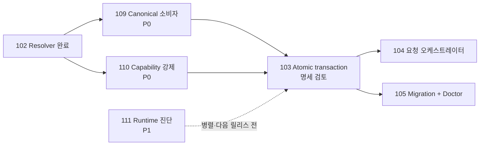

# Issue 103 명세: 원자적 라이프사이클 상태 트랜잭션

**상태:** 계획 수립 승인 — 2026-08-21 승인, Issues 109와 110 완료.
**소유자:** Dongwon Lee
**수정일:** 2026-08-21

## 1. 문제

이슈 Markdown이 라이프사이클의 원본이지만 한 번의 상태 변경은 `.moduflow/state.json`, loop state, 대시보드, 이슈 인덱스, 로드맵, Production Record까지 함께 바꿀 수 있다. 현재의 순차적 best-effort 쓰기는 중간 실패 시 서로 다른 상태를 남기고, 재시도 시 Production Record 버전을 중복 생성하거나 동시 편집을 덮어쓸 수 있다.

## 2. 목표

- 한 번의 라이프사이클 변경에 포함된 모든 로컬 산출물을 애플리케이션 수준에서 전부 성공 또는 전부 복원한다.
- 실제 파일 교체 전에 전체 예상 상태를 검증한다.
- 복구 가능한 실패는 원본 바이트와 파일 부재 상태까지 정확히 복원한다.
- 예상 해시로 동시 변경을 감지하고 재시도를 멱등하게 만든다.
- 이슈 Markdown과 Git 파일을 계속 정본으로 유지한다.

## 3. 제외 범위

- 여러 파일을 한 번에 바꾸는 커널 수준 원자성 보장.
- GitHub, 원격 Git, 외부 SaaS를 포함한 분산 트랜잭션.
- 데이터베이스나 새 라이프사이클 정본 도입.
- 경로 소비자 전환(Issue 109), 권한 정책(Issue 110), 레거시 마이그레이션(Issue 105).

## 4. 의존성

- 명세는 2026-08-21 계획 수립용으로 승인됐다.
- Issue 109의 canonical path와 Issue 110의 중앙 `write` capability가 완료되어 구현 의존성은 충족됐다.
- Issue 111은 병렬 진행할 수 있고 103 구현을 막지는 않지만 다음 플러그인 릴리스 전 필수다.

## 5. 핵심 불변식

1. 권한 거부는 임시 파일·저널을 포함한 어떤 프로젝트 쓰기보다 먼저 일어난다.
2. 모든 대상은 하나의 resolved project context에 속한다.
3. 이슈 Markdown만 라이프사이클 정본이며 파생 뷰는 독자적으로 상태를 정하지 않는다.
4. 쓰기 전 전체 대상과 원본 해시/부재 표식을 고정한다.
5. 첫 파일 교체 전에 전체 예상 상태 검증을 통과한다.
6. 잠금 후에도 예상 해시를 재확인해 외부 편집을 덮어쓰지 않는다.
7. 적용 중 실패하면 이미 바꾼 파일을 역순으로 원본 바이트까지 복원한다.
8. 같은 의도의 재시도는 `noop`이며 Production Record를 중복 생성하지 않는다.
9. 성공 범위는 로컬 프로젝트 산출물이며 원격 시스템까지 원자적이라고 표현하지 않는다.

`start`는 이슈를 `active`로, `complete`는 `done`으로 전환한다. `update`는 이슈 상태를 유지할 수 있고, `pause`/`resume`은 이슈를 `active`로 유지하면서 loop blocker/status만 바꾼다. Production intent는 명시적 semantic version을 사용하며 version 없는 기존 record는 읽기 호환만 유지하고 이 이슈에서 마이그레이션하지 않는다.

## 6. 대상 선택

항상 포함되는 대상:

- 소유 이슈 Markdown;
- canonical project root의 `.moduflow/state.json`;
- canonical `workspace/loop-state.json`;
- canonical dashboard projection.
- canonical workspace의 redacted transaction evidence.

조건부 대상:

- 물리적 `workspace/issue-index.json`: 이미 존재하거나 workflow가 생성을 명시적으로 요구할 때만. 스키마·의존성 검증용 메모리 내 이슈 인덱스는 예상 이슈 바이트로 항상 다시 계산하며 파일 대상이 아니다;
- 로드맵: 우선순위·의존성·릴리스 순서 등 로드맵 소유 필드가 바뀔 때만;
- Production Record: production mutation일 때만.

존재하지 않는 선택 파일은 workflow가 명시적으로 요구하지 않으면 만들지 않는다. 모든 경로는 Issue 109의 resolved context 또는 문서화된 project-root 제어 경로에서만 얻는다.

## 7. 실행 절차

1. 프로젝트 하나를 resolve하고 Issue 110의 `capabilities.write`를 검사한다.
2. 가능한 대상을 한 번 읽어 원본 바이트, 존재 여부, SHA-256을 스냅샷하고 전체 계획을 만든다.
3. 동일 파일시스템의 제한된 임시 위치에 예상 결과를 렌더링한다.
4. canonical 파일을 바꾸지 않은 상태로 전체 예상 뷰를 검증한다.
5. 프로젝트 단위 잠금을 잡고 모든 현재 해시/부재를 다시 비교한다.
6. 첫 교체 전 복구 저널을 저장하고 flush한다.
7. 정해진 순서로 파일을 교체하며 단계별 저널을 저장한다.
8. 실제 canonical 상태와 결과 해시를 다시 검증한다.
9. 민감하지 않은 증거를 저장하고 복구 payload를 삭제한 뒤 잠금을 해제한다.

이는 **애플리케이션 수준 all-or-nothing** 보장이다. 여러 파일이 하나의 커널 연산으로 바뀐다고 주장하지 않는다.

## 8. 복구 저널과 증거

- 복구 저널: `<canonical-project-root>/.moduflow/transactions/<transaction-id>/`.
- 원본 바이트는 제한 권한의 로컬 복구 영역에만 저장하며 Git·로그·리뷰 패킷에 넣지 않는다.
- 성공 또는 검증된 완전 롤백 뒤 원본 payload와 임시 파일을 제거한다.
- 미완료 저널은 다음 mutation 전에 복구하거나 `recovery_required`로 명시적으로 차단한다.
- 영구 증거: canonical workspace의 `transactions/<transaction-id>.json`이며 transaction의 마지막 계획 대상이다. staging 또는 교체가 실패하면 앞서 적용한 대상도 롤백한다.
- 증거에는 프로젝트/이슈, 작업, 상태, 대상, 전후 해시, 검증 요약, 실패 단계, 롤백 결과, 다음 명령, 행위자/출처, 시각만 기록한다.
- 자기 참조 해시를 피하기 위해 증거 문서는 자기 파일의 직렬화 해시를 내부에 넣지 않는다. 복구 저널과 반환 결과가 증거 파일의 예상/최종 해시를 기록한다.

## 9. 동시성·멱등성

- 프로젝트 단위 잠금은 ModuFlow writer를 직렬화한다.
- 잠금만 신뢰하지 않고 첫 적용 직전 모든 예상 해시를 비교한다.
- 완료된 idempotency key와 같은 의도는 기존 transaction을 가리키는 `noop`을 반환한다.
- 같은 key를 다른 의도로 재사용하면 거부한다.
- Production version 유일성은 예상 상태와 잠금 후 상태에서 모두 검사한다.

## 10. 실패·크래시 의미

- 첫 교체 전 실패: staging을 정리하고 canonical 파일은 그대로 둔다.
- 교체 후 실패: 원본 preimage로 역순 롤백한다.
- 원본 해시/부재가 모두 확인돼야 롤백 성공이다.
- 완전 복원을 증명할 수 없으면 `recovery_required`를 반환하고 저널을 보존하며 후속 mutation을 차단한다.
- 시작 시 또는 mutation 직전에 `recover_incomplete_transaction`이 미완료 저널을 점검한다. 충돌 상태를 추측해 진행하지 않는다.

## 11. 결과 계약

스키마는 `moduflow.lifecycle-transaction.v1`이며 다음을 포함한다.

- transaction/idempotency ID;
- 상태: `applied`, `noop`, `denied`, `conflict`, `rolled_back`, `recovery_required`;
- 프로젝트·이슈·작업·의도 상태;
- 순서가 있는 대상과 전후 해시;
- 예상/적용 후 검증 결과;
- 실패 단계·오류 코드·롤백 검증;
- 다음 명령, 행위자/출처, 생성·시작·완료 시각.

## 12. API 경계

- `plan_lifecycle_transaction(...)`: canonical 파일을 쓰지 않는 순수 계획 함수.
- `validate_projected_transaction(...)`: 전체 예상 뷰 검증.
- `apply_lifecycle_transaction(...)`: 권한, 잠금, 저널, 적용/롤백, 증거, 결과의 유일한 경계.
- `recover_incomplete_transaction(...)`: 유일한 복구 진입점.
- 기존 lifecycle/production mutation 공개 함수는 모두 이 경계를 통과하며 우회 감지 테스트를 둔다.

## 13. 보안

- 대상·staging·저널·복구 payload 모두 containment와 symlink 정책을 검사한다.
- 복구 원문은 로그, Git diff, review packet, 원격 시스템으로 내보내지 않는다.
- 오류는 논리 역할과 해시를 제공하되 민감 원문을 노출하지 않는다.

## 14. 대안 검토

- best-effort 쓰기 + 사후 drift 복구: 부분 상태 노출과 중복 production을 막지 못해 기각.
- 매 mutation을 즉시 Git commit: commit 전 working tree 구간을 보호하지 못하고 repo 정책과 과결합되어 기각.
- DB/event store: 두 번째 정본을 만들어 기각.
- 원격 작업까지 한 transaction에 포함: 외부 API가 로컬 롤백에 참여할 수 없어 기각. 로컬 성공 후 별도 멱등성/증거로 처리한다.

## 15. 인수 조건

- 모든 파일 교체·저널 경계에서 실패/프로세스 종료를 주입해 무변경 또는 byte-identical rollback을 증명한다.
- Issue 109의 nested canonical path가 모든 대상에 적용된다.
- Issue 110이 쓰기를 거부한 프로젝트는 `denied`와 zero-write를 반환한다.
- 외부 동시 편집을 덮어쓰지 않는다.
- start/update/pause/resume/complete/production-version 재시도는 첫 성공 후 `noop`이다.
- optional 파일과 roadmap은 선택 규칙에 맞을 때만 바뀐다.
- 성공 후 lifecycle drift가 0이고 redacted evidence가 완전하다.
- Issue 048 drift gate와 전체 release check가 통과한다.

## 16. 검토 결정

사람 검토에서 다음을 승인해야 한다.

- 조건부 이슈 인덱스·로드맵·Production Record 대상 규칙;
- 로컬 복구 저널과 Git 추적 redacted evidence의 분리;
- 여섯 종결 상태와 crash recovery 계약;
- Issues 109/110 완료 전 구현 금지.

명세, 의존성, 계획, readiness gate가 완료됐다. 명시적 실행 승인 후 다음 명령은 `product:execute 103-atomic-lifecycle-state-transaction`이다.
