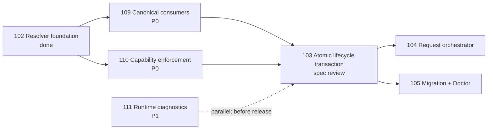

# Issue 103 Specification: Atomic Lifecycle State Transaction

**Status:** draft for human review — implementation is blocked by Issues 109 and 110.
**Owner:** Dongwon Lee
**Updated:** 2026-08-21

## 1. Problem

Issue Markdown is the canonical lifecycle record, but a lifecycle mutation can also affect `.moduflow/state.json`, loop state, dashboard projections, an issue index, roadmap priority, and Production Records. The current best-effort sequence can fail between writes and leave these views contradictory. Retrying can then duplicate a production version or overwrite a concurrent edit.

## 2. Goals

- Provide application-level all-or-nothing behavior across every artifact selected for one lifecycle mutation.
- Validate a complete projected state before replacing any target.
- Restore exact original bytes after a recoverable failure and retain enough local evidence to recover after a process crash.
- Detect concurrent changes with expected-content hashes.
- Make retries idempotent and return deterministic applied, no-op, denied, conflict, rollback, or recovery results.
- Preserve issue Markdown as lifecycle truth and Git-tracked files as the canonical data model.

## 3. Non-Goals

- Kernel-level atomicity across multiple files; portable filesystems do not provide it.
- Distributed transactions across GitHub, remote Git repositories, or SaaS systems.
- A database, event store, or replacement lifecycle schema.
- Project resolution/path migration (Issue 109) or capability policy (Issue 110).
- Automatic migration of legacy artifacts (Issue 105).

## 4. Dependency Contract

- This specification may be reviewed now.
- Implementation must not start until Issue 109 supplies canonical paths to every participating consumer and Issue 110 supplies a centrally enforced `write` capability.
- Issue 111 may proceed in parallel and does not block implementation, but it is required before the next plugin release.

## 5. Invariants

1. **Authorization first:** a transaction denied by project capabilities produces no project-local, Git, temporary, journal, or external write.
2. **One project:** every target belongs to the same resolved project context.
3. **Issue is canonical:** derived views cannot independently choose a lifecycle value.
4. **Complete plan:** the target set and each target's expected preimage are fixed before staging.
5. **Validate before replace:** the complete projected state passes schema, containment, lifecycle, and cross-artifact validation before the first target replacement.
6. **Optimistic concurrency:** an expected hash mismatch aborts without overwriting the changed target.
7. **Exact rollback:** a recoverable apply failure restores every already-replaced target byte-for-byte and restores absence for targets that did not exist.
8. **Idempotent retry:** the same intent never creates a second semantic mutation or duplicate Production Record version.
9. **No remote promise:** transaction success describes local project artifacts only.

## 6. Transaction Contract

The public result uses schema `moduflow.lifecycle-transaction.v1`.

### 6.1 Operation Inputs

- resolved project context from Issue 109;
- operation and intended lifecycle/production state;
- owning issue ID;
- actor and source event;
- idempotency key, or sufficient stable inputs to derive one;
- optional expected issue revision supplied by the caller.

The derived idempotency key binds project ID, issue ID, operation, intended semantic state, and source event identity. It must not depend on timestamps or temporary paths.

### 6.2 Target Selection

Always included when configured:

- owning issue Markdown;
- `.moduflow/state.json` under the canonical project root;
- canonical `workspace/loop-state.json`;
- canonical dashboard projection.
- redacted transaction evidence in the canonical workspace transaction path.

Conditionally included:

- issue index only when it already exists or the owning workflow explicitly requires it;
- roadmap only when priority, dependency, release ordering, or another roadmap-owned field changes;
- Production Record only for a production mutation.

Absent optional files remain absent unless the workflow explicitly requires their creation. Every path comes from the resolved project context or an explicitly documented project-root control path; no participant reconstructs a default folder.

### 6.3 Planned Target Record

Each target record contains:

- logical role and canonical path;
- whether the file existed;
- expected SHA-256 of the original bytes, or an absent marker;
- proposed SHA-256 and byte length;
- validation rules that apply;
- deterministic apply order and rollback order.

The plan contains hashes and metadata, not unrestricted file contents.

## 7. Execution Protocol

1. **Resolve and authorize:** resolve one project and enforce `capabilities.write`. Denial returns before transaction-local files are created.
2. **Snapshot and plan:** read all potential targets once, record exact bytes privately for recovery, and build the complete target plan.
3. **Render:** render proposed bytes into same-filesystem temporary files with restrictive permissions.
4. **Validate projected state:** validate the combined projected view without replacing canonical targets.
5. **Acquire lock and compare:** acquire one project-local lifecycle lock, then compare every current target to its expected hash/absence marker. The lock coordinates ModuFlow writers; hashes protect against external editors.
6. **Prepare journal:** persist and flush a recovery journal before the first replacement.
7. **Apply:** replace targets in deterministic order and update/flush journal progress after each replacement.
8. **Post-validate:** validate the actual canonical state and confirm all resulting hashes.
9. **Finalize:** persist redacted transaction evidence, remove sensitive recovery payloads, release the lock, and return the result.

This is application-level atomicity. The implementation must never describe a multi-file update as one kernel-atomic operation.

## 8. Journal and Evidence

### 8.1 Recovery Journal

- Location: `<canonical-project-root>/.moduflow/transactions/<transaction-id>/journal.json` plus private preimage payloads.
- The journal records schema, transaction ID, idempotency key, phase, ordered targets, expected/proposed hashes, applied set, rollback progress, and timestamps.
- Original bytes are stored only in the local recovery area with restrictive permissions; they are never copied into Git-tracked evidence.
- A successful transaction or verified complete rollback deletes original-byte payloads and temporary files.
- An incomplete journal is recovered or explicitly classified before the next mutation may begin.

### 8.2 Durable Evidence

- Location: canonical workspace path `transactions/<transaction-id>.json`.
- Redacted evidence is the final planned transaction target. If its staging or replacement fails, the other applied targets roll back.
- Evidence contains no original artifact bytes or secrets.
- It records project/issue, operation, status, targets, before/after hashes, validation summaries, failed stage if any, rollback result, next command, actor/source, and timestamps.
- To avoid a self-referential digest, the evidence document does not embed the hash of its own serialized bytes. The recovery journal and returned result record the evidence target's proposed/final hash.

## 9. Concurrency and Idempotency

- One project-local lock serializes ModuFlow lifecycle transactions.
- All expected hashes are rechecked after acquiring the lock and before the journal enters apply state.
- A mismatch returns `rolled_back` only if replacements had begun; otherwise it returns `noop` when the intended semantic state already exists and `conflict` when it does not.
- A completed idempotency key with matching intent returns `noop` and the original transaction reference.
- Reuse of an idempotency key with different intent is rejected.
- Production version uniqueness is checked in the projected state and again after lock acquisition.

## 10. Failure and Crash Semantics

- Failure before the first replacement cleans staging files and leaves canonical targets unchanged.
- Failure after replacement begins triggers reverse-order rollback from private preimages.
- Rollback is successful only after every restored/removed target matches its original hash/absence marker.
- If rollback cannot be proven, the result is `recovery_required`; the journal and recovery payload remain, further mutation is blocked, and Doctor exposes a specific recovery action.
- On startup or before mutation, `recover_incomplete_transaction` examines journals, finishes a provable rollback or finalization, and never guesses between conflicting states.
- Process termination at every journal boundary is a required test case.

## 11. Result Schema

Required fields:

- `schema`, `transaction_id`, `idempotency_key`;
- `status`: `applied`, `noop`, `denied`, `conflict`, `rolled_back`, or `recovery_required`;
- project ID/root and issue ID;
- operation and intended state;
- ordered target records with before/after hashes;
- projected and post-apply validation summaries;
- failed stage and error code when applicable;
- rollback status and verified target count;
- next command;
- actor/source and created/started/completed timestamps.

The result must be sufficient for callers to explain what happened without reading internal recovery payloads.

## 12. API Boundaries

- `plan_lifecycle_transaction(...)` is pure with respect to canonical project files and returns the plan plus staged render inputs.
- `validate_projected_transaction(...)` validates the combined projected view.
- `apply_lifecycle_transaction(...)` owns authorization, locking, journaling, replace/rollback, evidence, and final result.
- `recover_incomplete_transaction(...)` is the only recovery entry point.
- Existing public lifecycle and production mutation functions must route through this boundary; a guard test detects bypasses.

## 13. Security and Privacy

- Containment and symlink policy are checked on canonical targets, staging files, journal directories, and recovery payloads.
- Recovery data uses restrictive permissions and is never emitted to logs, review packets, Git diffs, or remote systems.
- Error messages expose logical roles and hashes, not secret contents.
- Capability denial precedes journal creation so archived/read-only projects remain unchanged.

## 14. Alternatives Considered

1. **Keep best-effort writes plus drift repair — rejected.** It detects damage after partial state is already visible and cannot prevent duplicate production records.
2. **Commit each mutation directly to Git — rejected.** Git does not protect the working-tree interval before commit and would couple local lifecycle state to repository policy.
3. **Introduce a database/event store — rejected.** It would create a second canonical data system and exceed the Git-native product contract.
4. **Make remote writes part of the transaction — rejected.** External APIs cannot participate in this local rollback protocol; remote work must occur after local success with its own idempotency/evidence.

## 15. Acceptance Criteria

- Failure injection before and after every replace/journal boundary proves unchanged state or byte-identical rollback.
- Crash-restart tests recover every incomplete phase or block with `recovery_required`; silent continuation is impossible.
- Nested canonical paths supplied by Issue 109 are honored for all participating artifacts.
- Archived/read-only or otherwise write-denied contexts supplied by Issue 110 produce `denied` with zero writes.
- Concurrent external edits produce deterministic conflicts and are never overwritten.
- Repeating start, update, pause, resume, complete, and production-version intents returns `noop` after the first success.
- Production retries cannot duplicate a semantic version.
- Optional absent files remain absent unless explicitly selected by the owning workflow.
- Roadmap is untouched for lifecycle changes that do not alter roadmap-owned fields.
- Successful transactions have zero lifecycle drift and complete redacted evidence.
- Existing Issue 048 drift checks detect manual bypasses and all release gates remain green.

## 16. Verification Strategy

- Pure plan/render/projected-validation unit tests.
- Status/trust capability matrix tests shared with Issue 110.
- Nested-path and decoy-default fixtures shared with Issue 109.
- Failure injection for each protocol phase and each target position.
- Process-crash recovery fixtures at every durable journal boundary.
- Concurrency/hash mismatch and idempotency-key collision tests.
- Production version deduplication tests.
- Full project validation, lifecycle drift check, and `python3 scripts/release_check.py .`.

## 17. Human Review Decisions

Reviewers must approve:

- the target-selection rules, especially conditional issue index/roadmap/Production Record behavior;
- the local journal and Git-tracked redacted evidence split;
- the six terminal statuses and crash-recovery contract;
- the dependency gate requiring Issues 109 and 110 before implementation.

After approval and completion of Issues 109 and 110, the next workflow command is `product:plan 103-atomic-lifecycle-state-transaction`.
