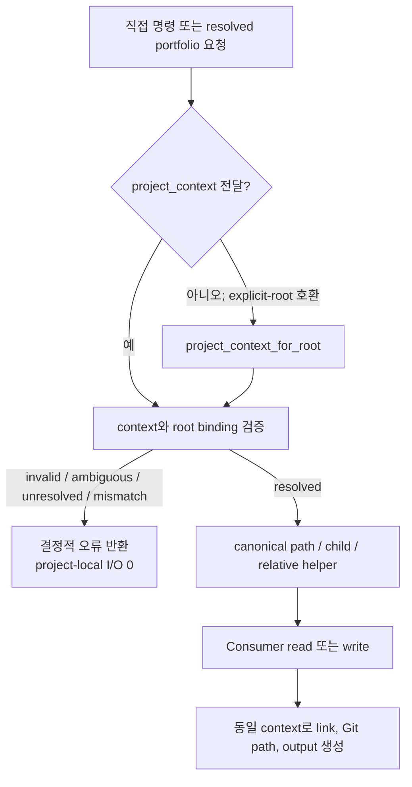

# 명세: Canonical Project Context 소비자 수렴

Issue: `109-canonical-project-context-consumer-convergence`
상태: 사람 검토용 초안; 구현 미착수
이전: `workspace/reviews/2026-08-21-issue-102-post-release-validation.json` · 승인 후 다음: `product:plan 109-canonical-project-context-consumer-convergence`
소유자: Dongwon Lee
수정일: 2026-08-21

## 문제

Issue 102는 결정적인 프로젝트 Resolver와 canonical path map을 제공했지만 모든 프로젝트 소비자가 그 경계를 사용하지는 않는다. 여러 명령이 여전히 bare project root에서 기본 `issues/`, `specs/`, `workspace/`, `knowledge/`, `memory/`, `workflow/` 경로를 조합한다. 일부 모듈은 resolved context 대신 `configured_project_paths`를 다시 읽고, Git 이력이나 adapter도 이슈와 스펙이 기본 위치에 있다고 가정한다.

따라서 프로젝트가 정상적으로 resolve되고 nested path를 제공해도 downstream 명령이 가짜 기본 폴더를 읽거나, 선택된 canonical 폴더 밖에 쓰거나, 존재하는 산출물을 없다고 보고하거나, 잘못된 repo-relative link를 만들 수 있다. 이 상태에서 Issue 103을 구현하면 잘못된 대상 집합을 원자적으로 갱신하게 되므로 109가 먼저 완료되어야 한다.

## 목표

1. 모든 target-project 산출물 소비자가 하나의 resolved project context를 경로 권한으로 사용한다.
2. 기존 explicit-root API는 하나의 호환 경계로 유지하되 소비자 내부의 기본 폴더 재조합은 제거한다.
3. 외부 리뷰의 7개 파일뿐 아니라 읽기·쓰기·검증·Git 이력·생성 링크·adapter 경로를 모두 감사한다.
4. unresolved, ambiguous, malformed, containment 위반, root/context 불일치는 프로젝트 로컬 I/O 전에 실패한다.
5. 분류된 정적 guard와 nested/decoy 행동 테스트로 재발을 막는다.

## 제외 범위

- 프로젝트 상태와 read/write/execute/publish 정책: Issue 110.
- 다중 파일 transaction과 rollback: Issue 103.
- 폴더 이동, registry 자동 재작성, `moduflow.projects.v2` 소유권 변경.
- canonical project artifact role이 아닌 `.moduflow`, package-source 파일, worker 정의 등 고정 제어 경로의 설정화.
- `project_issue_schema` 교체 또는 두 번째 issue parser/path normalizer 도입.
- 소스 패키지 release layout과 target-project layout을 같은 것으로 취급하는 작업: Issue 111.

## 사용자와 시나리오

### Nested project layout

프로젝트가 `product/issues`, `delivery/specs`, `ops/workspace`, `project-knowledge`, `project-memory`, `team/workflow` 같은 비기본 경로를 등록해도 knowledge, review intake, spec validation, worker planning, Git-history, dashboard가 모두 같은 위치를 사용한다.

### 가짜 기본 폴더

기본 `issues/`, `specs/`, `workspace/`에 오래됐거나 충돌하는 파일이 있어도 registry가 비기본 경로를 선택하면 어떤 migrated consumer도 이를 읽거나 수정하지 않는다.

### Explicit-root 호환

기존 단일 프로젝트 caller는 project root를 계속 전달할 수 있다. 공개 진입점이 `project_context_for_root()`로 호환 context를 한 번 만든 뒤 registry-resolved 요청과 동일한 canonical path 흐름을 사용한다.

### 잘못된 context

unresolved/ambiguous context 또는 다른 프로젝트의 context가 전달되면 파일 open, stat, mkdir, delete, write 전에 거부된다.

## 현재 소스 감사

### 확인된 migration 대상

| 소비자 | 남은 가정 | 필요한 canonical role |
| --- | --- | --- |
| `project_knowledge.py` | knowledge 디렉터리와 산출물을 `root/knowledge`에서 조합 | `knowledge` |
| `project_workflow.py` | workflow state/record, review 입력, memory link가 기본 workflow/specs/issues를 가정 | `workflow`, `specs`, `issues`, `memory` |
| `validate_project_artifacts.py` | loop, memory, team workflow, active issue의 일부 경로가 resolved context 우회 | `workspace`, `memory`, `workflow`, `issues`, `specs`, `knowledge` |
| `project_review.py` | review packet과 candidate queue가 항상 `root/workspace` 사용 | `workspace` |
| `project_converge.py` | evidence, plan, tasks, judgment, 결과가 항상 `root/specs` 사용 | `specs` |
| `worker_orchestrator.py` | task/worker-plan이 `root/specs`; related memory에 context 미전달 | `specs`, `memory` |
| `spec_consistency.py` | spec/plan/tasks 분석이 항상 `root/specs` 사용 | `specs` |
| `project_memory.py` | memory CRUD는 context를 사용하지만 issue dashboard/drill-down은 configured paths를 독립 로드 | `memory`, `issues`, `specs`, `workspace` |
| `spec_kit_adapter.py` | canonical 입력과 validation 출력이 기본 issue/spec/workspace 위치로 고정 | `issues`, `specs`, `workspace` |
| `project_sync.py` | remote tree의 issue discovery/status가 Git prefix `issues/` 가정 | `issues` |
| `commit_resolution.py` | 과거 issue 등록 확인이 Git prefix `issues/` 가정 | `issues` |
| `project_reference_backlog.py` | backlog 위치와 origin-spec link가 기본 workspace/specs 가정 | `workspace`, `specs` |

이 표는 확인된 최소 범위다. 계획 단계의 저장소 전체 분류에서 추가 production hit가 발견되면 migration 또는 명시적 예외로 분류해야 하며, 이유 없이 제외할 수 없다.

### 유지할 기존 정상 패턴

- `project_lifecycle`, `project_loop`, `project_execution`, `project_production`, `project_pr`, `project_github_issues`, `project_doctor`, `project_promote`, repository identity의 주요 산출물 작업은 이미 context를 받거나 생성한다.
- `project_issue_schema`는 저수준 configured-path와 normalized issue 호환 계층으로 유지한다. caller가 `context["relative_paths"]`를 전달하며 resolver를 import해 순환 의존성을 만들지 않는다.
- `CANONICAL_PATH_DEFAULTS`, schema 기본값, 이미 canonical role root 아래의 하위 디렉터리, package manifest, source release 요구사항, 고정 `.moduflow` 제어 경로, test fixture는 검토된 분류가 있으면 literal을 유지할 수 있다.

## 제안 해결책

### 1. 공개 경계에서 한 번만 resolve

모든 공개 project-aware 함수는 필요한 경우 keyword-only `project_context=None`을 받는다.

- 오직 `None`만 `project_context_for_root(root)` 호환 변환을 실행한다.
- 전달된 context는 교체하거나 조용히 다시 resolve하지 않는다.
- context는 `resolved`여야 하고, root 인자가 함께 있으면 canonical root가 일치해야 하며 필요한 role이 있어야 한다.
- 이 검증은 첫 target-project filesystem 작업 전에 끝난다.

`project_context or project_context_for_root(root)` 패턴은 금지한다. 비어 있거나 잘못된 context가 다른 authority로 조용히 fallback할 수 있기 때문이다.

### 2. Resolver가 아닌 canonical path service 확장

기존 `canonical_path(context, role)`을 role root 정본으로 유지하고 반복되는 child/Git-relative 처리를 다음 경계로 표준화한다.

- `canonical_child_path(context, role, *parts)`: 상대적이고 비어 있지 않으며 parent traversal이 없는 구성요소만 허용하고 role root/project root containment를 확인한다.
- `canonical_relative_path(context, role, *parts)`: Git command, 생성 link, evidence, metadata에 사용할 project-root-relative POSIX 경로를 반환한다.

이 helper는 기존 context만 사용하며 registry 조회, 프로젝트 선택, capability 승인, 두 번째 path schema를 만들지 않는다.

### 3. 전체 호출 흐름에 같은 context 전달

공개 entry point가 context를 한 번 생성/검증하고 내부 read/write에 같은 객체를 전달한다. resolver import가 불필요하거나 순환 의존성을 만드는 저수준 parser는 canonical path 또는 `relative_paths` map을 직접 받는다.

### 4. 실제 소비자와 정당한 literal 분리

production path literal hit용 machine-readable allowlist를 둔다. 각 항목은 module, literal/pattern, 분류, 근거를 기록한다.

- `canonical_default_declaration`;
- 이미 resolved role root 아래의 `canonical_role_suffix`;
- `.moduflow` 같은 `project_control_path`;
- `package_source_layout` 또는 `distribution_manifest`;
- `test_fixture`.

실제 target-project read/write, 생성 링크, Git tree query, 사용자용 missing-path 진단은 현재 기본 layout이 동작한다는 이유만으로 allowlist에 넣을 수 없다. 반드시 context에서 파생한다.

### 5. 출력 호환 유지

- 기본 layout caller는 기존과 동일한 path 값과 output schema를 받는다. 기존 값이 틀린 경우만 수정한다.
- Nested layout output은 실제 project-relative path를 담는다.
- 기존 positional argument는 유지하고 `project_context`는 keyword-only로 추가한다.
- Git-history 함수는 canonical relative issue prefix를 받고 공개 경계에서 호환 context를 만든다.
- runtime error는 논리 role과 실제 canonical relative path를 말하며 무조건 `issues/` 또는 `specs/`라고 하지 않는다.

## 오류 처리

- **Unresolved/ambiguous/malformed context:** target-project filesystem call 전에 결정적 context 오류.
- **Root/context mismatch:** Project A context로 Project B root를 처리하지 못하도록 즉시 거부.
- **Canonical role 없음:** default 폴더로 fallback하지 않고 role과 복구 방법 보고.
- **Unsafe child/containment escape:** lookup 또는 생성 전 거부.
- **Configured artifact 없음:** 실제 canonical relative path 보고.
- **Decoy default 존재:** 완전히 무시하며 결과에 영향을 주지 못함.
- **Git revision에 configured issue prefix 없음:** default prefix를 추가 검색하지 않고 해당 revision에 등록 issue가 없는 것으로 처리.
- **Allowlist 불일치:** guard test 실패 후 migration 또는 검토된 분류 요구.

## 테스트 전략

### 공통 contract fixture

- Project A: 모든 기본 path.
- Project B: 8개 canonical role 모두 비기본 path.
- Project B 기본 폴더에는 충돌하는 issue, spec, workflow state, review packet, memory entry를 배치.
- registry-resolved context와 explicit-root compatibility context를 모두 제공.

### Consumer 행동 테스트

- 모든 migrated consumer를 default/nested layout에 parameterize한다.
- read/write/returned path/generated link/Git pathspec가 canonical role만 사용하는지 확인한다.
- decoy 파일이 열리거나 수정되지 않았음을 확인한다.
- unresolved, ambiguous, malformed, cross-project context에서 project-local I/O가 0인지 확인한다.
- read-only consumer와 mutator의 기존 의미는 유지한다. capability authorization은 Issue 110에서 별도 추가한다.

### Regression guard

- production Python AST/string join에서 default canonical path 재조합을 찾는다.
- 모든 hit를 검토된 allowlist와 비교한다.
- 새 미분류 hit, 오래된 allowlist, target-project I/O의 부당한 예외를 실패시킨다.
- 정적 guard는 보조 수단이며 behavior test가 최종 근거다.

### 기존 gate

- Issue 102 registry/resolution과 Project A/B isolation 테스트 유지.
- Issue 093 configured-path, frontmatter, containment, lifecycle 테스트 유지.
- 각 migrated module focused suite, 전체 project validation, lifecycle drift, `python3 scripts/release_check.py .` 실행.

## 검토한 대안

### A. 외부 리뷰가 지적한 7개만 수정

기각. 감사 결과 dashboard, Spec Kit, Git-history, reference-backlog 소비자도 남아 있었다. 최초 목록만 수정하면 Issue 109를 만든 원인인 잘못된 완료 선언을 반복한다.

### B. 모든 default path literal 일괄 교체

기각. 일부 literal은 canonical 기본값, package distribution, 고정 project-control path, test fixture다. 일괄 치환은 source validation과 target-project validation을 다시 섞는다.

### C. 전역 path singleton 추가

기각. 숨은 process state를 만들고 multi-project 동시 처리와 테스트를 어렵게 하며 Issue 102 context를 중복한다.

### D. 공개 경계의 resolved context + 분류된 literal

선택. authority가 명시되고 호환성을 유지하며 Git pathspec/metadata link 같은 비파일 소비자도 포함하고 향후 drift를 탐지한다.

## 인수 조건

1. 모든 production target-project path hit가 migrated 또는 승인된 non-consumer 예외로 분류되고 미분류 hit가 0이다.
2. 확인된 12개 migration module이 사용하는 모든 canonical role에 같은 resolved context를 적용한다.
3. supplied context는 project-local I/O 전에 검증하며 오직 명시적 `None`만 root 호환을 실행한다.
4. context/root mismatch, unresolved, ambiguous, malformed, missing-role, containment 실패는 target-project read/write가 0이다.
5. Project B nested path가 knowledge, workflow, validation, review, converge, worker, spec consistency, dashboard, Spec Kit, Git-history, reference-backlog에서 적용된다.
6. Poisoned default 폴더는 결과에 영향을 주지 않고 mutating test 뒤에도 byte-identical하다.
7. artifact link, review evidence, worker output, memory metadata, Git pathspec가 실제 canonical project-relative path를 사용한다.
8. 기본 layout positional-root caller는 호환되며 `project_context`는 keyword-only다.
9. `project_issue_schema`는 유일한 normalized issue/configured-path 계층으로 유지되고 resolver를 import하지 않는다.
10. 정적 guard가 새 미분류 canonical-folder 재조합과 오래됐거나 부당한 allowlist를 탐지한다.
11. Issue 102/093 focused suite가 유지되고 모든 migrated module에 nested + decoy coverage가 있다.
12. project validation `valid: true`, lifecycle drift 0, 전체 release check 통과.

## 위험과 열린 질문

- 정적 classifier만으로 runtime behavior를 증명할 수 없으므로 decoy behavior test가 필수다.
- Git-history 함수는 과거 revision의 path를 본다. configured issue prefix를 명시적으로 받고, 과거 registry 변화 추론은 109 범위에 넣지 않는다.
- Spec Kit의 no-symlink/no-follow 규칙은 일반 resolver보다 강하다. role root는 context에서 받되 더 강한 검사는 유지한다.
- 일부 public function은 동적 import된다. keyword-only context와 호환 테스트로 signature 파손을 방지한다.

미결정 제품 질문은 없다. 계획 단계에서 독립적으로 검증 가능한 consumer group으로 나눌 수 있지만 원래 7개만으로 완료 범위를 축소할 수 없다.

## 검토 게이트

Dongwon Lee는 2026-08-21에 공개 경계의 resolved context, 전체 consumer 분류, 정당한 fixed layout의 검토된 예외라는 설계 방향을 승인했다. 이 문서 자체는 `product:plan` 전에 사람 검토가 필요하며 구현 권한을 부여하지 않는다.

## 파이프라인

- Issue: `issues/109-canonical-project-context-consumer-convergence.md`
- 이전 근거: `workspace/reviews/2026-08-21-issue-102-post-release-validation.json`
- Canonical spec: `specs/109-canonical-project-context-consumer-convergence/spec.md`
- 한글 sidecar: `specs/109-canonical-project-context-consumer-convergence/spec.ko.md`
- 승인 후 다음: `product:plan 109-canonical-project-context-consumer-convergence`
