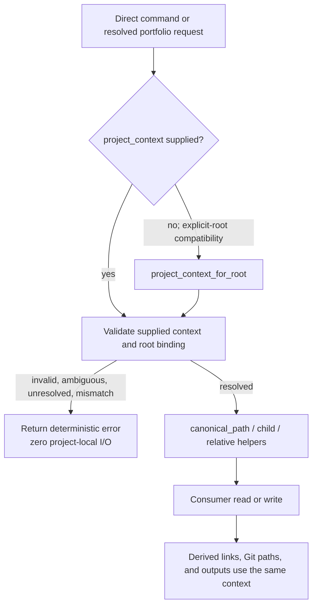

# Spec: Canonical Project Context Consumer Convergence

Issue: `109-canonical-project-context-consumer-convergence`
Status: draft for human review; no implementation started
Prev: `workspace/reviews/2026-08-21-issue-102-post-release-validation.json` · Next after approval: `product:plan 109-canonical-project-context-consumer-convergence`
Owner: Dongwon Lee
Updated: 2026-08-21

## Problem

Issue 102 delivered a deterministic project resolver and canonical path map, but not every project-aware consumer uses that boundary. Several commands still construct default `issues/`, `specs/`, `workspace/`, `knowledge/`, `memory/`, or `workflow/` locations from a bare project root. Some partially migrated modules use `configured_project_paths` directly rather than the already resolved context, and Git-history or adapter code still assumes that issues and specs live at their defaults.

The result is a split contract: a project may resolve correctly and expose valid nested paths while a downstream command reads a decoy default folder, writes an artifact outside the selected canonical folder, reports a missing artifact that exists, or links metadata to the wrong repository-relative path. This breaks project isolation and makes Issue 103 unsafe to implement because an atomic transaction would only make the wrong target set consistently wrong.

## Goals

1. Make one resolved project context the required path authority for every target-project artifact consumer.
2. Preserve existing explicit-root APIs through one compatibility boundary without preserving direct default-folder reconstruction inside consumers.
3. Cover read, write, validation, Git-history, generated-link, and adapter paths—not only the seven modules named by the external review.
4. Fail before project-local I/O when context is unresolved, ambiguous, malformed, outside containment, or bound to a different root.
5. Prevent regression with a classified repository-wide path-literal guard plus behavior-level nested-path tests.

## Non-Goals

- Adding project status or read/write/execute/publish policy; Issue 110 owns authorization.
- Implementing multi-file transactions or rollback; Issue 103 owns atomic lifecycle behavior.
- Moving existing folders, rewriting registries, or changing `moduflow.projects.v2` ownership.
- Making `.moduflow`, package-source files, worker definitions, or other fixed control paths configurable when they are not canonical project artifact roles.
- Replacing `project_issue_schema` or creating another issue parser/path normalizer.
- Treating a source-package release layout as a target-project layout; Issue 111 separates those validation roles.

## Users & Scenarios

### Nested project layout

As a project owner, I can register `product/issues`, `delivery/specs`, `ops/workspace`, `project-knowledge`, `project-memory`, `team/workflow`, and other non-default canonical roots. Knowledge, review intake, spec validation, worker planning, Git-history inspection, and dashboards all use those locations consistently.

### Decoy default folders

As an operator, I can leave stale or intentionally conflicting files under default `issues/`, `specs/`, or `workspace/` folders. When the registry selects non-default paths, no migrated consumer reads or mutates those decoys.

### Explicit-root compatibility

As an existing single-project caller, I can continue passing a project root without constructing a registry request. The public entry point creates one compatibility context through `project_context_for_root()` and then follows the same canonical-path code path as a registry-resolved request.

### Invalid or cross-project context

As a safety reviewer, I see an unresolved/ambiguous result or a root/context mismatch rejected before the consumer opens, stats, creates, deletes, or writes any project-local artifact.

## Current Source Audit

### Confirmed migration set

| Consumer | Remaining assumption | Required canonical roles |
| --- | --- | --- |
| `project_knowledge.py` | All knowledge directories and artifacts are built from `root/knowledge` strings | `knowledge` |
| `project_workflow.py` | Workflow state/records and review inputs assume `workflow`, `specs`, and `issues`; generated memory links use defaults | `workflow`, `specs`, `issues`, `memory` |
| `validate_project_artifacts.py` | Loop, memory, team workflow, active issue, and some validation paths bypass the resolved context | `workspace`, `memory`, `workflow`, `issues`, `specs`, `knowledge` |
| `project_review.py` | Review packet and candidate queue always use `root/workspace` | `workspace` |
| `project_converge.py` | Evidence, plan, tasks, judgment, and result paths always use `root/specs` | `specs` |
| `worker_orchestrator.py` | Task/worker-plan artifacts use `root/specs`; related memory lookup does not receive the selected context | `specs`, `memory` |
| `spec_consistency.py` | Spec/plan/tasks analysis always uses `root/specs` | `specs` |
| `project_memory.py` | Memory CRUD uses context, but issue dashboard and drill-down helpers independently reload configured issue/spec/workspace paths | `memory`, `issues`, `specs`, `workspace` |
| `spec_kit_adapter.py` | Canonical inputs and validation outputs are hard-coded to default issue/spec/workspace locations | `issues`, `specs`, `workspace` |
| `project_sync.py` | Remote-tree issue discovery and status reads assume the Git path prefix `issues/` | `issues` |
| `commit_resolution.py` | Historical issue registration assumes the Git path prefix `issues/` | `issues` |
| `project_reference_backlog.py` | Backlog storage and generated origin-spec links assume default workspace/spec paths | `workspace`, `specs` |

This table is the minimum known set, not permission to ignore another production hit. Planning must run the repository-wide classifier and either migrate or explicitly classify every hit before implementation is considered complete.

### Already conforming patterns to preserve

- `project_lifecycle`, `project_loop`, `project_execution`, `project_production`, `project_pr`, `project_github_issues`, `project_doctor`, `project_promote`, and repository identity flows already accept or derive a project context for their main artifact operations.
- `project_issue_schema` remains the low-level configured-path and normalized issue compatibility layer. Callers pass `context["relative_paths"]`; it must not import the resolver and create a cycle.
- `CANONICAL_PATH_DEFAULTS`, project-schema defaults, subdirectories relative to an already canonical role root, package distribution manifests, source release requirements, fixed `.moduflow` control paths, and test fixtures may retain literal defaults when classified.

## Proposed Solution

### 1. Resolve once at the public boundary

Every public project-aware function accepts a keyword-only `project_context=None` where it does not already. It applies this rule:

- only `None` activates explicit-root compatibility via `project_context_for_root(root)`;
- a supplied context is never replaced or silently re-resolved;
- the context must be `resolved`, its canonical root must match the explicit root argument when both exist, and all requested path roles must be available;
- validation happens before the first target-project filesystem operation.

Using `project_context or project_context_for_root(root)` is prohibited because an empty or malformed supplied context could silently fall back to a different authority.

### 2. Extend the canonical path service, not the resolver

Keep `canonical_path(context, role)` as the authority for role roots. Add or standardize bounded helpers for repeated child and Git-relative needs:

- `canonical_child_path(context, role, *parts)` accepts only relative, non-empty, non-parent components and proves the result remains inside the canonical role root and project root;
- `canonical_relative_path(context, role, *parts)` returns the contained project-root-relative POSIX path used by Git commands, generated links, evidence, and metadata.

These helpers reuse the existing resolved context. They do not inspect registries, select projects, grant capabilities, or create a second path schema.

### 3. Pass context through the complete call chain

Public entry points derive/validate context once and pass the same object through internal reads and writes. Lower-level pure parsers may instead receive a canonical path or `relative_paths` map when importing the registry would create an unnecessary dependency.

### 4. Separate real consumers from legitimate literals

Add a machine-readable allowlist for production path-literal hits. Each entry records module, literal/pattern, classification, and rationale. Allowed classifications are:

- `canonical_default_declaration`;
- `canonical_role_suffix` beneath an already resolved role root;
- `project_control_path` such as `.moduflow`;
- `package_source_layout` or `distribution_manifest`;
- `test_fixture`.

Runtime target-project reads/writes, generated target-project links, Git-tree queries, and user-facing missing-path diagnostics are not allowlistable merely because the default layout currently works. They must derive from context.

### 5. Preserve output compatibility

- Default-layout callers receive byte-compatible path values and existing output schemas unless a field was previously wrong.
- Nested-layout outputs contain actual project-relative paths.
- Function positional arguments remain compatible; `project_context` is keyword-only.
- Git-history functions accept the canonical relative issue prefix and default to the compatibility context at their public boundary.
- Runtime-facing error messages report the logical role and actual canonical relative path rather than claiming `issues/` or `specs/` unconditionally.

## Error Handling

- **Unresolved/ambiguous/malformed context:** return or raise a deterministic context error before any target-project filesystem call.
- **Root/context mismatch:** reject; never let a context for Project A operate on Project B's root argument.
- **Missing canonical role:** report the role name and remediation; do not fall back to its default folder.
- **Unsafe child component or containment escape:** reject before lookup or creation.
- **Missing configured artifact:** report the actual canonical relative path.
- **Decoy default present:** ignore it completely; existence must not change results.
- **Git revision lacks the configured issue prefix:** treat that revision as containing no registered issues rather than scanning a default prefix.
- **Allowlist mismatch:** fail the guard test and require an explicit migration or reviewed classification.

## Testing Strategy

### Shared contract fixture

Create a reusable Project A/B fixture:

- Project A uses all default paths.
- Project B configures non-default values for all eight canonical roles.
- Project B also contains poisoned default folders with conflicting issue IDs, specs, workflow state, review packets, and memory entries.
- The fixture supplies both a registry-resolved context and an explicit-root compatibility context.

### Consumer behavior tests

- Parameterize every migrated consumer over default and nested layouts.
- Assert reads, writes, returned paths, generated links, and Git command pathspecs use only the canonical role paths.
- Assert decoy files are neither opened nor mutated.
- Assert a supplied unresolved, ambiguous, malformed, or cross-project context performs zero project-local filesystem operations.
- Verify read-only consumers remain read-only and mutators preserve their current semantics; Issue 110 will add capability authorization separately.

### Regression guard

- Scan production Python AST/string-join patterns for default canonical path reconstruction.
- Compare every hit to the reviewed allowlist.
- Fail on unclassified additions, stale allowlist entries, or allowlisted runtime target-project I/O.
- Keep behavior tests authoritative; the static guard supplements rather than replaces them.

### Existing gates

- Preserve Issue 102 registry/resolution and Project A/B isolation tests.
- Preserve Issue 093 configured-path, frontmatter, containment, and lifecycle tests.
- Run focused suites for every migrated module, full project validation, lifecycle drift, and `python3 scripts/release_check.py .`.

## Alternatives Considered

### A. Patch only the seven externally reported modules

Rejected. The audit also found partially migrated dashboard, Spec Kit, Git-history, and reference-backlog consumers. Fixing only the initial list would preserve the same completion-claim gap that created Issue 109.

### B. Mechanically replace every default path literal

Rejected. Some literals define canonical defaults, package distribution structure, fixed project-control paths, or test fixtures. Blanket replacement would blur source validation with target-project validation and create new regressions.

### C. Add another global path singleton

Rejected. It would create hidden process state, complicate tests and concurrent projects, and duplicate the explicit context already delivered by Issue 102.

### D. Resolved context at boundaries plus classified literals

Selected. It makes authority explicit, preserves compatibility, covers non-filesystem consumers such as Git pathspecs and metadata links, and makes future drift detectable.

## Acceptance Criteria

1. Every production target-project path hit is classified as migrated or an approved non-consumer exception; zero hits remain unclassified.
2. The twelve confirmed migration-set modules use the same resolved context for all canonical artifact roles they consume.
3. A supplied context is validated before project-local I/O, and only an explicit `None` activates root compatibility.
4. Context/root mismatch, unresolved, ambiguous, malformed, missing-role, and containment failures perform zero target-project reads or writes.
5. Project B's nested paths are honored for knowledge, workflow, validation, review, converge, worker planning, spec consistency, dashboard/drill-down, Spec Kit, Git-history, and reference-backlog behavior.
6. Poisoned default folders do not affect any Project B result and remain byte-identical after mutating tests.
7. Generated artifact links, review evidence, worker outputs, memory metadata, and Git pathspecs contain the actual canonical project-relative paths.
8. Default-layout positional-root callers remain compatible, while optional `project_context` arguments are keyword-only.
9. `project_issue_schema` remains the single normalized issue/configured-path layer and receives paths from context without importing the resolver.
10. The static guard fails on any new unclassified direct canonical-folder reconstruction and detects stale or unjustified allowlist entries.
11. Existing Issue 102 and Issue 093 focused suites remain green, and every migrated module has nested-path plus decoy-path coverage.
12. Project validation reports `valid: true`, lifecycle drift is empty, and the full release check passes.

## Risks & Open Questions

- The static classifier cannot prove runtime behavior by itself; behavior-level decoy tests remain mandatory.
- Git-history functions inspect paths inside historical revisions. They must receive the configured issue prefix explicitly and must not infer historical registry changes beyond Issue 109's scope.
- Spec Kit has stricter no-symlink/no-follow rules than the general resolver. Migration must preserve those stronger checks while sourcing the role roots from context.
- Some public functions are imported dynamically by tests or sibling scripts. Keyword-only context additions and explicit compatibility tests prevent accidental signature breaks.

No unresolved product decision remains. Planning may decompose the migration into independently testable consumer groups, but it may not narrow the completion requirement to the original seven files.

## Review Gate

Dongwon Lee approved the selected design direction on 2026-08-21: resolved context at public boundaries, complete consumer classification, and reviewed exceptions for legitimate fixed layouts. This written spec still requires human review before `product:plan`; implementation is not authorized by this artifact.

## Pipeline

- Issue: `issues/109-canonical-project-context-consumer-convergence.md`
- Previous evidence: `workspace/reviews/2026-08-21-issue-102-post-release-validation.json`
- Canonical spec: `specs/109-canonical-project-context-consumer-convergence/spec.md`
- Korean sidecar: `specs/109-canonical-project-context-consumer-convergence/spec.ko.md`
- Next after approval: `product:plan 109-canonical-project-context-consumer-convergence`
