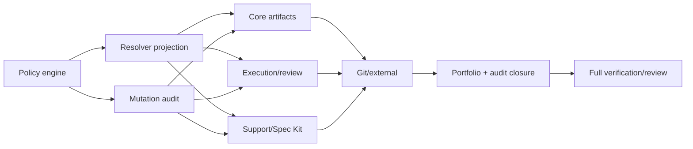

# Project Operation Capability Enforcement Implementation Plan

> **For agentic workers:** REQUIRED SUB-SKILL: Use superpowers:subagent-driven-development (recommended) or superpowers:executing-plans to implement this plan task-by-task. Steps use checkbox (`- [ ]`) syntax for tracking.

**Goal:** Make project discovery and operation authorization separate, explicit, fail-closed boundaries so archived, read-only, and unknown-policy projects remain inspectable but cannot be mutated.

**Architecture:** Add a side-effect-free `project_operation.py` policy module, attach its additive fields to every resolver result, and require one typed enforcing guard at each target-project mutation boundary. Add an AST-backed entry-point audit so direct file, Git, network, or external write surfaces cannot appear without a reviewed scope, operation, and guard owner; retain Issue 088 repository identity and human gates after project authorization.

**Tech Stack:** Python 3 standard library, `pathlib`, `dataclasses`, `unittest`, AST inspection, JSON/Markdown Git artifacts, existing ModuFlow project resolver and repository identity APIs.

## Global Constraints

Constitution v1.0 applies (`workspace/constitution.md`). Plan-specific additions:

- Project resolution `status` remains `resolved | unresolved | ambiguous`; project lifecycle policy is exposed only as `project_status`.
- Resolver fields are additive: raw `trust_scope` remains compatible, while `policy_trust_scope`, `policy_inputs`, `capabilities`, and `capability_reasons` carry authorization state.
- Registry status/trust values are authoritative. Only legacy `project_context_for_root()` may synthesize `project_status=active` and `policy_trust_scope=internal` while retaining raw `trust_scope=project-local` and synthetic evidence.
- Unknown/missing policy permits diagnostic `read` only. `write`, `execute`, `publish`, and unknown operation names deny fail-closed.
- Denial precedence is exactly `archived > read-only > status-unknown > trust-unknown`.
- Every target-project public mutator calls `context_for_operation()` and then `require_project_capability()` before its first unnecessary filesystem probe, tempfile, subprocess, Git, network, or external-client action.
- A denied operation leaves target files, `.moduflow` state, Git state, temporary locations, runners, and external systems byte-for-byte/call-for-call unchanged.
- `publish` means policy eligibility only. Repository identity, review evidence, release checks, required CI/status checks, and explicit human approval remain independently mandatory.
- Portfolio-control and package-maintenance writes never borrow authorization from a selected target project; their classification is explicit and separately reviewed.
- Issue 103 transaction/journal/rollback behavior is not implemented here.
- Existing positional calls remain valid; new context parameters are keyword-only and existing result keys change only additively.
- All behavior changes follow RED/GREEN TDD with focused `unittest` evidence before production edits.
- Git/subprocess calls retain injected runners, and authorization gate failures never use silent exception handling.

## Recommended Discipline

| Stream | Discipline / Adapter | Reason |
| --- | --- | --- |
| A — policy and resolver | Superpowers TDD | The full status × trust × operation matrix and additive resolver schema need exact RED/GREEN contract tests. |
| B — project-local enforcement | Superpowers TDD + ModuFlow Git-native artifact model | Every writer must stop before side effects without changing artifact ownership. |
| C — Git and external boundaries | Superpowers TDD + repository identity gate | Project policy must run before injected runners while preserving stronger downstream gates. |
| D — scope audit | Superpowers TDD | An AST-backed registry must reject unclassified, unguarded, duplicate, and stale entries. |
| E — completion | verification-before-completion + ModuFlow review | Completion requires focused/full suites, release gates, review evidence, and clean Git state. |

## File Structure

### Create

- `scripts/project_operation.py`: policy normalization, capability computation, authorization decisions, typed denial, and CLI-safe denial serialization.
- `scripts/project_operation_audit.py`: discover direct mutation/external surfaces and validate reviewed classifications and guard owners.
- `config/project-operation-entrypoints.json`: machine-readable module/function/mode/scope/operation/guard-owner inventory.
- `tests/test_project_operation.py`: policy matrix, reason precedence, decision schema, and typed denial tests.
- `tests/test_project_operation_audit.py`: unclassified, unguarded, duplicate, stale, invalid-scope, and current-repository audit tests.
- `tests/project_operation_fixture.py`: reusable active/archived/read-only/unknown contexts and no-side-effect sentinels.
- `specs/110-project-operation-capability-enforcement/status.md`: execution and verification evidence.
- `specs/110-project-operation-capability-enforcement/review.md`: acceptance-criterion review and findings.
- `specs/110-project-operation-capability-enforcement/review-handoff.md`: generated implementation-to-review handoff.

### Modify — policy/read surfaces

- `scripts/project_registry.py`, `tests/test_project_registry.py`: additive policy shape for every resolution route and explicit-root compatibility.
- `scripts/project_doctor.py`, `tests/test_project_doctor.py`: display resolved policy inputs, capabilities, and reasons without changing Doctor's report-only behavior.
- `scripts/project_portfolio.py`, `tests/test_project_portfolio.py`: show target capabilities and keep portfolio-control writes separately authorized.

### Modify — target-project mutation surfaces

- Core artifacts: `scripts/project_intake.py`, `project_knowledge.py`, `project_memory.py`, `project_workflow.py`, `project_lifecycle.py`, `project_loop.py` and their matching tests.
- Execution/review: `scripts/project_execution.py`, `project_review.py`, `project_converge.py`, `worker_orchestrator.py`, `capability_routing_simulation.py` and their matching tests.
- Product support: `scripts/project_production.py`, `project_profile.py`, `project_migrate.py`, `project_promote.py`, `project_reference_backlog.py`, `project_retention.py`, `issue_generator.py`, `antigravity_sync.py` and their matching tests.
- Spec Kit: `scripts/spec_kit_adapter.py`, `spec_kit_pilot.py` and their matching tests.
- Git/external: `scripts/project_sync.py`, `project_git_handoff.py`, `project_github_issues.py`, `project_pr.py` and their matching tests.

### Modify — distribution and evidence

- `scripts/validate_moduflow.py`, `scripts/release_check.py`, `tests/test_validation_distribution.py`: require and run the policy/audit artifacts.
- `.claude-plugin/plugin.json`: behavior release bump from `0.3.50` to `0.3.51` in the final feature commit.
- `docs/architecture.md`, `docs/workflow.md`, `commands/product-doctor.md`, `commands/product-projects.md`: document discovery/authorization separation and denial behavior.
- `issues/110-project-operation-capability-enforcement.md`, `.moduflow/state.json`, `workspace/dashboard.md`, `workspace/loop-state.json`, `workspace/roadmap.md`: lifecycle and evidence tracking.

## Stable Interfaces

```python
class ProjectOperationDenied(PermissionError):
    decision: dict

def compute_project_policy(
    project_status_source,
    trust_scope_source,
    *,
    resolution_status="resolved",
    explicit_root_compatibility=False,
):
    """Return project_status, policy_trust_scope, policy_inputs, capabilities, and capability_reasons."""

def authorize_project_operation(project_context, operation):
    """Return moduflow.project-operation-authorization.v1 without side effects."""

def require_project_capability(project_context, operation):
    """Return an allowed decision or raise ProjectOperationDenied carrying that decision."""

def denial_exit_payload(error):
    """Return the error decision for traceback-free CLI JSON and non-zero exit."""
```

Every guarded boundary uses this exact order:

```python
context = project_registry.context_for_operation(
    project_root,
    project_context=project_context,
)
project_operation.require_project_capability(context, "write")
```

`execute` or `publish` replaces `write` only when declared in the inventory. No caller treats resolver success or a truthy context as authorization.

## Reviewed Operation Inventory

| Scope | Operation | Public boundary or CLI mode |
| --- | --- | --- |
| target-project | `write` | `project_intake.append_inbox_record`; knowledge plan apply/artifact creation; memory initialization/entry/candidate/capture/dashboard outputs; workflow initialization/record/team-state writes; execution readiness/review-handoff writes; worker plan/report writes; reference backlog append; issue generation |
| target-project | `execute` | lifecycle sync; loop-state write; memory candidate approve/reject; workflow start/PR-state/review-check; review intake/decision application; converge judgment application; production playbook decision; profile identity proposal; migration apply; record promotion; retention archive; Antigravity bidirectional sync |
| target-project | dynamic | Spec Kit configure/persist/pilot report (`write`); project production init/new-record (`write`); converge evidence output (`write`) versus evidence read (`read`) |
| target-project Git | `execute` | repository sync with fetch; local commit-capability probe |
| target-project external | `publish` | GitHub Issue sync; push-capability probe; any future Git push, PR create/update, release, deploy, or external publication boundary |
| target-project read | `read` | Doctor/status/validation, registry resolution, sync with `fetch=False`, converge evidence without output, Spec Kit handoff without persistence, PR GitHub preflight |
| portfolio-control | `write` | portfolio initialization/render, explicit recent selection/history; these use the portfolio workspace context and cannot authorize a target write |
| package-maintenance | classified exemption | plugin registration/cache copy, vendored Spec Kit sync, vendor freshness, version bump; these mutate the ModuFlow package rather than a selected project |

The JSON inventory expands each grouped row into exact module/function/mode entries. Internal write helpers are classified as `internal_guarded_helper` with a concrete public `guard_owner`; a helper with a missing owner or an owner without the central guard fails the audit.

## Implementation Readiness Contracts

- **API contract mapping:** No HTTP API. The additive Python/JSON contracts are the five resolver policy fields and `moduflow.project-operation-authorization.v1`; existing positional parameters and existing resolver keys remain compatible.
- **Test strategy:** Table tests prove policy; resolver route tests prove field shape; per-module sentinel tests prove guard-before-side-effect; audit tests prove inventory completeness; Git FakeRunner tests prove zero calls on denial and downstream gate ordering on allow.
- **Storybook required states:** Not applicable; no frontend component changes.
- **MSW fixture baseline:** Not applicable; no browser/API-backed UI.
- **Playwright smoke matrix:** Not applicable; generated dashboards remain behaviorally unchanged.
- **Permission/role model:** `active+internal` allows read/write/execute and publish eligibility; archived, read-only, or unknown policy allows read only; invalid resolution permits nothing; publish retains repository/review/release/CI/human gates.
- **Release/rollback:** Release requires focused suites, audit validity, full discovery, project validation, spec consistency, lifecycle drift `[]`, `git diff --check`, version `0.3.51`, and `release_check`. Roll back task commits in reverse order, reverting enforcement consumers before resolver/policy commits; do not run Issue 103 rollback logic.

---

### Stream A — Policy, Resolver, and Audit

### Task A1: Side-effect-free policy engine and typed enforcing guard

**Files:**
- Create: `scripts/project_operation.py`
- Create: `tests/test_project_operation.py`
- Create: `tests/project_operation_fixture.py`

**Interfaces:**
- Consumes: raw project status/trust sources plus resolution state.
- Produces: `compute_project_policy()`, `authorize_project_operation()`, `require_project_capability()`, `ProjectOperationDenied`, and `denial_exit_payload()` for every later task.

- [ ] **Step 1: Write the policy matrix tests.** Add table cases for `active|archived|unknown × internal|read-only|unknown × read|write|execute|publish`, plus unsupported raw values and exact denial precedence.

```python
for status, trust, operation, allowed, reason in CASES:
    context = resolved_context(status=status, trust=trust)
    decision = project_operation.authorize_project_operation(context, operation)
    self.assertEqual((decision["allowed"], decision["reason_code"]), (allowed, reason))
```

- [ ] **Step 2: Run the focused suite and confirm RED.**

Run: `python3 -m unittest tests.test_project_operation -v`
Expected: FAIL because `scripts.project_operation` does not exist.

- [ ] **Step 3: Implement normalization and capability evidence.** Use immutable operation constants, the fixed reason precedence, deterministic English messages/recommendations, and all-denied shape for unresolved/ambiguous contexts.

```python
OPERATIONS = frozenset({"read", "write", "execute", "publish"})
DENIAL_PRECEDENCE = ("archived", "read-only", "status-unknown", "trust-unknown")
AUTHORIZATION_SCHEMA = "moduflow.project-operation-authorization.v1"
```

- [ ] **Step 4: Add guard/exception/unknown-operation tests and implementation.** Assert the exception contains the identical decision object and unknown operations return `PROJECT_OPERATION_UNKNOWN` without guessing.
- [ ] **Step 5: Run `python3 -m unittest tests.test_project_operation -v` and confirm GREEN.**
- [ ] **Step 6: Commit only Task A1 files with `feat(110): add project operation policy guard`.**

### Task A2: Additive resolver, compatibility, Doctor, and portfolio read projection

**Files:**
- Modify: `scripts/project_registry.py`, `tests/test_project_registry.py`
- Modify: `scripts/project_doctor.py`, `tests/test_project_doctor.py`
- Modify: `scripts/project_portfolio.py`, `tests/test_project_portfolio.py`

**Interfaces:**
- Consumes: Task A1 `compute_project_policy()` output.
- Produces: all five additive context fields for explicit ID, alias, CWD, active, recent, V1 compatibility, explicit root, unresolved, and ambiguous routes.

- [ ] **Step 1: Add failing resolver-shape tests.** Assert exact policy fields for archived/read-only/unknown registry entries, all-denied unresolved/ambiguous results, and synthetic explicit-root mapping.

```python
self.assertEqual(context["status"], "resolved")
self.assertEqual(context["project_status"], "archived")
self.assertEqual(context["policy_trust_scope"], "read-only")
self.assertEqual(context["capabilities"], {"read": True, "write": False, "execute": False, "publish": False})
```

- [ ] **Step 2: Run registry/Doctor/portfolio suites and confirm RED on missing policy fields.**

Run: `python3 -m unittest tests.test_project_registry tests.test_project_doctor tests.test_project_portfolio -v`

- [ ] **Step 3: Attach Task A1 output in `_resolution_base()` and `_resolved()`.** Preserve resolution `status`; pass selected registry status/trust without fallback; synthesize explicit-root policy only inside `project_context_for_root()`.
- [ ] **Step 4: Extend Doctor and portfolio status projections.** Include `project_status`, `policy_trust_scope`, `policy_inputs`, `capabilities`, and `capability_reasons` while keeping reads available for denied mutations.
- [ ] **Step 5: Re-run the three suites and confirm GREEN, including no candidate-project reads for ambiguous resolution.**
- [ ] **Step 6: Commit with `feat(110): expose project operation capabilities`.**

### Task A3: Machine-readable mutation entry-point audit

**Files:**
- Create: `scripts/project_operation_audit.py`
- Create: `config/project-operation-entrypoints.json`
- Create: `tests/test_project_operation_audit.py`
- Modify: `scripts/validate_moduflow.py`, `tests/test_validation_distribution.py`

**Interfaces:**
- Consumes: Python AST, reviewed inventory entries, and the exact central guard call name.
- Produces: `moduflow.project-operation-audit.v1` with counts, findings, unclassified surfaces, unguarded owners, stale/duplicate entries, and errors.

- [ ] **Step 1: Write failing temporary-repository tests.** Cover an unclassified `write_text`, a `gh issue create` runner call, a stale function, a duplicate entry, a target mutator without `require_project_capability`, and a valid internal helper with a guarded owner.

```python
result = project_operation_audit.inspect_project(root)
self.assertFalse(result["valid"])
self.assertEqual(result["counts"]["unguarded"], 1)
```

- [ ] **Step 2: Run `python3 -m unittest tests.test_project_operation_audit -v` and confirm RED.**
- [ ] **Step 3: Implement AST discovery and strict inventory validation.** Discover direct file mutations, `os.replace`, subprocess/injected-runner Git write verbs, GitHub create/edit calls, and URL/network write verbs; reject unknown scopes/operations, missing rationale/owner, duplicates, and stale entries.
- [ ] **Step 4: Seed the exact inventory from the Reviewed Operation Inventory.** Package-maintenance exemptions require a non-empty package rationale; target-project internal helpers require an existing guarded owner.
- [ ] **Step 5: Add the new files to distribution validation.** At this task the current-repository audit is expected to remain RED with unguarded owners; the audit unit suite and distribution file-presence assertions must be GREEN.
- [ ] **Step 6: Commit with `test(110): audit project mutation boundaries`.**

### Stream B — Target-Project Enforcement

### Task B1: Guard core artifact and lifecycle mutation boundaries

**Files:**
- Modify: `scripts/project_intake.py`, `tests/test_project_intake.py`
- Modify: `scripts/project_knowledge.py`, `tests/test_project_knowledge.py`
- Modify: `scripts/project_memory.py`, `tests/test_project_memory.py`
- Modify: `scripts/project_workflow.py`, `tests/test_project_workflow.py`
- Modify: `scripts/project_lifecycle.py`, `tests/test_project_lifecycle.py`
- Modify: `scripts/project_loop.py`, `tests/test_project_loop.py`

**Interfaces:**
- Consumes: Task A1 guard and Task A2 resolved context shape.
- Produces: guarded `write` artifact boundaries and guarded `execute` lifecycle/multi-artifact transitions.

- [ ] **Step 1: Add archived/read-only sentinel tests for every public boundary in this task.** Patch path reads/writes, temp creation, and subprocess entry points to raise if touched; assert `ProjectOperationDenied` occurs first.

```python
with mock.patch.object(Path, "write_text", side_effect=AssertionError("write")):
    with self.assertRaises(project_operation.ProjectOperationDenied):
        module.public_mutator(root, project_context=archived_context(root))
```

- [ ] **Step 2: Add active/internal compatibility tests.** Prove default positional calls and injected resolved contexts still write the same paths/results.
- [ ] **Step 3: Run all six focused suites and confirm RED only on missing enforcement.**
- [ ] **Step 4: Apply the exact context-then-guard sequence at public boundaries.** Use `write` for intake/knowledge/memory creation and workflow artifact writes; use `execute` for lifecycle sync, loop-state transition, memory approval/rejection, workflow start/PR-state/review-check.
- [ ] **Step 5: Make `list_memory_candidates()` a pure read.** Report stale or malformed candidates as warnings instead of deleting or swallowing them; pruning/rejection remains an explicit guarded execute action.
- [ ] **Step 6: Make CLI modes catch only `ProjectOperationDenied`, print `denial_exit_payload()` as JSON, and exit non-zero; unrelated errors retain their current behavior.**
- [ ] **Step 7: Re-run the six suites and the current-repository operation audit; confirm these owners are GREEN.**
- [ ] **Step 8: Commit with `feat(110): enforce core project mutation policy`.**

### Task B2: Guard execution, review, convergence, and worker boundaries

**Files:**
- Modify: `scripts/project_execution.py`, `tests/test_project_execution.py`
- Modify: `scripts/project_review.py`, `tests/test_project_review.py`
- Modify: `scripts/project_converge.py`, `tests/test_project_converge.py`
- Modify: `scripts/worker_orchestrator.py`, `tests/test_worker_orchestration.py`
- Modify: `scripts/capability_routing_simulation.py`, `tests/test_capability_routing_simulation.py`

**Interfaces:**
- Consumes: Task A1/A2 guard/context; keeps Issue 109 canonical paths.
- Produces: guarded planning evidence writes and guarded multi-artifact execution/review transitions.

- [ ] **Step 1: Add denied no-side-effect tests for readiness/review-handoff writes, review intake/decision writes, converge output/judgment writes, worker-plan writes, and simulation report writes.**
- [ ] **Step 2: Add dynamic converge tests.** Evidence collection without an output remains `read`; writing an evidence bundle requires `write`; applying judgment requires `execute` before Git or project reads not needed for validation.
- [ ] **Step 3: Run the five focused suites and confirm RED.**
- [ ] **Step 4: Replace truthiness fallbacks with `context_for_operation()` and apply guards.** Preserve injected runners and existing output schemas after authorization succeeds.
- [ ] **Step 5: Add CLI denial serialization and re-run focused suites plus the operation audit to GREEN for this stream.**
- [ ] **Step 6: Commit with `feat(110): enforce execution and review capabilities`.**

### Task B3: Guard product-support and Spec Kit mutation boundaries

**Files:**
- Modify: `scripts/project_production.py`, `tests/test_project_production.py`
- Modify: `scripts/project_profile.py`, `tests/test_project_profile.py`
- Modify: `scripts/project_migrate.py`, `tests/test_project_migration.py`
- Modify: `scripts/project_promote.py`, `tests/test_project_promote.py`
- Modify: `scripts/project_reference_backlog.py`, `tests/test_project_reference_backlog.py`
- Modify: `scripts/project_retention.py`, `tests/test_project_retention.py`
- Modify: `scripts/issue_generator.py`, `tests/test_issue_generator.py`
- Modify: `scripts/antigravity_sync.py`, `tests/test_antigravity_sync.py`
- Modify: `scripts/spec_kit_adapter.py`, `tests/test_spec_kit_adapter.py`
- Modify: `scripts/spec_kit_pilot.py`, `tests/test_spec_kit_pilot.py`

**Interfaces:**
- Consumes: central guard and canonical paths; Spec Kit retains no-follow and atomic-write constraints.
- Produces: guarded product records/configuration/migrations/promotions/retention/adapter persistence without scope expansion.

- [ ] **Step 1: Add table-driven denied sentinel tests across all ten modules.** Assert no target read/write, `os.replace`, temp file, or runner call occurs after context validation when policy denies the declared operation.
- [ ] **Step 2: Add active/internal regression cases and Spec Kit symlink/no-follow cases.** Existing error codes and atomic replacement behavior must remain unchanged after authorization succeeds.
- [ ] **Step 3: Run the ten focused suites and confirm RED on missing guards.**
- [ ] **Step 4: Enforce `write` on init/create/configure/persist/report operations and `execute` on identity proposal, migration, promotion, retention, and bidirectional synchronization.** Add keyword-only `project_context` to legacy boundaries without breaking positional root callers.
- [ ] **Step 5: Ensure `project_migrate` authorization precedes creation of `.moduflow`. For Antigravity sync, accept optional keyword-only `project_root`/`project_context`; when root is omitted, walk upward from the Git `tasks.md` to the nearest `.moduflow` project and fall back to its parent only for the legacy flat-file test shape. Validate a supplied context against that root, then deny before reading or writing either the Git task file or host task file.**
- [ ] **Step 6: Add CLI denial serialization; run focused suites and operation audit to GREEN for this stream.**
- [ ] **Step 7: Commit with `feat(110): enforce support and adapter capabilities`.**

### Stream C — Git/External and Portfolio Boundaries

### Task C1: Guard Git, network, and publication boundaries while preserving downstream gates

**Files:**
- Modify: `scripts/project_sync.py`, `tests/test_project_sync.py`
- Modify: `scripts/project_git_handoff.py`, `tests/test_project_git_handoff.py`
- Modify: `scripts/project_github_issues.py`, `tests/test_github_issue_sync.py`
- Modify: `scripts/project_pr.py`, `tests/test_project_pr.py`

**Interfaces:**
- Consumes: project policy guard first; Issue 088 `inspect_repository_identity()` and `operation_decision()` second.
- Produces: dynamic read/execute/publish enforcement with zero injected-runner calls on denial.

- [ ] **Step 1: Add FakeRunner ordering tests.** Archived/read-only contexts must deny before `git fetch`, `.git` write probes, `gh issue create/edit`, repository identity Git probes, or GitHub API preflight.

```python
runner = FakeRunner(fail_on_call=True)
with self.assertRaises(project_operation.ProjectOperationDenied):
    project_github_issues.sync_issue(root, issue_id, runner=runner, project_context=archived_context(root))
self.assertEqual(runner.calls, [])
```

- [ ] **Step 2: Add dynamic mode tests.** `inspect_repo_sync(fetch=False)` requires only `read`; `fetch=True` requires `execute`; commit probe requires `execute`; push probe and GitHub Issue sync require `publish`; local PR handoff write requires `write`; GitHub preflight remains read-only.
- [ ] **Step 3: Run the four focused suites and confirm RED.**
- [ ] **Step 4: Insert project guard before existing repository identity and runner calls.** Do not alter Issue 088 reason codes, identity ordering after policy, or human/CI/release requirements.
- [ ] **Step 5: Add CLI denial JSON/non-zero behavior and prove active/internal requests still reach existing downstream denial/allow paths.**
- [ ] **Step 6: Re-run focused suites and operation audit to GREEN for all target-project entries.**
- [ ] **Step 7: Commit with `feat(110): enforce git and publication capabilities`.**

### Task C2: Enforce portfolio-control ownership and close the audit

**Files:**
- Modify: `scripts/project_portfolio.py`, `tests/test_project_portfolio.py`
- Modify: `scripts/project_registry.py`, `tests/test_project_registry.py`
- Modify: `config/project-operation-entrypoints.json`
- Modify: `scripts/project_operation_audit.py`, `tests/test_project_operation_audit.py`

**Interfaces:**
- Consumes: explicit portfolio workspace context; never consumes selected target capabilities for portfolio writes.
- Produces: separately guarded portfolio initialization/render/selection and a zero-gap repository inventory.

- [ ] **Step 1: Add tests with a selected archived target and active portfolio context.** Portfolio recent-selection/history may write only the portfolio file; the same decision object cannot be reused to call a target mutator.
- [ ] **Step 2: Add denied portfolio-context tests.** A read-only portfolio context blocks portfolio writes before `project-selection.json.tmp`, dashboard, or weekly status files are touched.
- [ ] **Step 3: Run registry/portfolio/audit suites and confirm RED.**
- [ ] **Step 4: Pass an explicit `portfolio_context` to `record_recent_selection()` and portfolio write boundaries, require `write`, and keep selected target context read-only for status collection.**
- [ ] **Step 5: Finalize every inventory entry and audit classification.** Assert zero unclassified, unguarded, duplicate, prohibited, and stale entries in the current repository.
- [ ] **Step 6: Run `python3 -m unittest tests.test_project_registry tests.test_project_portfolio tests.test_project_operation_audit -v` and confirm GREEN.**
- [x] **Step 7: Bump `.claude-plugin/plugin.json` from `0.3.50` to `0.3.51` with portfolio authorization, then to `0.3.52` with the post-review authorization/audit correction.**

### Stream D — Completion

### Task D1: Distribution, documentation, full verification, and review handoff

**Files:**
- Modify: `scripts/release_check.py`, `scripts/validate_moduflow.py`, `tests/test_validation_distribution.py`
- Modify: `docs/architecture.md`, `docs/workflow.md`, `commands/product-doctor.md`, `commands/product-projects.md`
- Modify/Create: Issue 110 lifecycle/status/review/handoff files listed in File Structure.

**Interfaces:**
- Consumes: all prior task commits and all 14 acceptance criteria.
- Produces: source release evidence and a PR-ready branch; no merge or release.

- [x] **Step 1: Add release/distribution tests requiring `project_operation.py`, the audit, inventory, and both focused test modules in source/plugin packaging.**
- [x] **Step 2: Add the operation audit to `release_check.run_release_check()` importable gates and focused test command list without introducing recursive discovery.**
- [x] **Step 3: Document resolver-versus-authorization behavior, capability fields, CLI denial JSON, explicit-root compatibility, and downstream publish gates.**
- [x] **Step 4: Run all focused Issue 110 suites and fix any failure through a new RED/GREEN cycle.**
- [x] **Step 5: Run `python3 -m unittest discover -s tests -v`, `python3 scripts/validate_project_artifacts.py .`, `python3 scripts/spec_consistency.py . --issue-id 110-project-operation-capability-enforcement`, `python3 scripts/project_lifecycle.py . --drift`, and `git diff --check`.**
- [x] **Step 6: Generate the review handoff with `python3 scripts/project_execution.py . --issue-id 110-project-operation-capability-enforcement --review-handoff --write`, review every acceptance criterion, and record findings in `review.md` and evidence in `status.md`.**
- [x] **Step 7: Run `python3 scripts/release_check.py .` fresh; require valid true, audit zero gaps, version `0.3.52`, and no P0/P1/P2 review finding.**
- [x] **Step 8: Update issue/tasks/dashboard/roadmap/state to review-ready and commit with `docs(110): complete capability enforcement review`.**
- [x] **Step 9: Push and open one non-draft GitHub PR only after all local gates pass. Merge remains a separate explicit human decision.**

## Execution Order and Rollback



Rollback is commit-by-commit in reverse order. Revert consumer enforcement before resolver projection, then revert the audit, and revert the policy engine last. Do not partially retain additive resolver capability claims after removing enforcement, and do not use Issue 103 transaction machinery for rollback.

## Next

After implementation approach selection, run `product:execute 110-project-operation-capability-enforcement` task-by-task.
