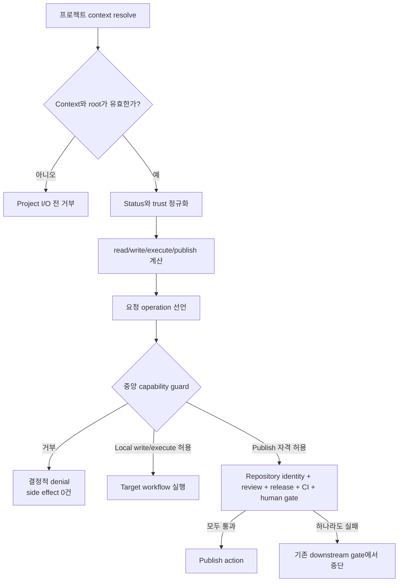

# 스펙: 프로젝트 작업 권한 강제

Issue: `110-project-operation-capability-enforcement`
Prev: `workspace/reviews/2026-08-21-issue-102-post-release-validation.md` · Next: `product:plan 110-project-operation-capability-enforcement`

## 문제

Issue 102는 프로젝트 선택을 결정적으로 만들었고 Issue 109는 canonical path를 권위로 만들었지만, resolved 프로젝트는 아직 쓰기 가능한 것으로 취급된다. 레지스트리에 `status`와 `trust_scope`가 있어도 resolved context에는 상태 기반 정책이 없고 mutating workflow는 공통 권한 경계를 사용하지 않는다. 그 결과 archived 또는 read-only 프로젝트가 올바르게 선택된 뒤 lifecycle, artifact, Git, publish workflow에 의해 변경될 수 있다.

프로젝트 발견은 **어느 프로젝트인가**를 답하고, 권한 부여는 **어떤 작업이 허용되는가**를 별도로 답해야 한다. Resolver 성공은 mutation 권한을 의미하지 않는다.

## 목표

1. 모든 resolved context에 정규화된 project status와 `read`, `write`, `execute`, `publish` capability를 추가한다.
2. archived, read-only, unknown-policy 프로젝트의 진단 읽기는 유지하고 모든 mutation은 fail-closed로 차단한다.
3. 모든 target-project mutating boundary가 첫 side effect 전에 하나의 공통 authorization guard를 사용하게 한다.
4. 파일, 임시 산출물, Git 변경, 네트워크 호출, 외부 작업 없이 결정적인 denial code와 해결 방법을 반환한다.
5. publish eligibility가 repository identity, review, release, status check, human approval보다 상위 권한이 되지 않게 한다.

## 비목표

- Issue 103의 atomic multi-file lifecycle transaction 또는 rollback journal 구현.
- Issue 109 canonical path 소유권 재작업이나 프로젝트 폴더 이동.
- Issue 088 repository identity authorization 대체.
- publish, merge, release, external write 승인을 암묵적으로 부여.
- 사용자/조직 RBAC, 인증, 원격 policy service 추가.
- 안전하게 resolved된 프로젝트의 read-only 진단 명령 차단.

## 정책 계약

### 정규화 입력

- `project_status`: `active | archived | unknown`.
- 정책 평가용 `trust_scope`: `internal | read-only | unknown`.
- 누락, 빈 값, 미지원 source value는 `unknown`으로 정규화한다. Doctor가 수정 방법을 설명할 수 있도록 denial evidence에는 관찰된 source value를 보존한다.
- unknown policy input은 안전하게 위치가 확인된 프로젝트를 undiscovered로 만들지 않는다. 진단 read만 허용하고 mutation은 거부한다.

### Capability 매트릭스

| 정규화 status | 정규화 trust | read | write | execute | publish |
| --- | --- | ---: | ---: | ---: | ---: |
| `active` | `internal` | 허용 | 허용 | 허용 | 자격 허용 |
| `archived` | 모두 | 허용 | 거부 | 거부 | 거부 |
| 모두 | `read-only` | 허용 | 거부 | 거부 | 거부 |
| `unknown` | 모두 | 허용 | 거부 | 거부 | 거부 |
| 모두 | `unknown` | 허용 | 거부 | 거부 | 거부 |

`publish: 자격 허용`은 프로젝트 정책이 publish를 거부하지 않는다는 뜻일 뿐이다. Repository identity, source release validation, review evidence, required status check, 명시적 human approval은 독립적으로 필수다.

### 작업 의미

- `read`: status, Doctor, issues, project inspection, validation 등 비변경 조회.
- `write`: execution 또는 publish transition을 시작하지 않는 project-local artifact 생성/수정.
- `execute`: lifecycle transition, implementation/review orchestration, worker execution, 여러 project/Git-local artifact를 바꿀 수 있는 workflow.
- `publish`: Git push, GitHub write, release/deploy, 외부 게시. 하나의 workflow가 `execute`와 `publish`를 모두 요구할 수 있으며 하나라도 거부되면 중단한다.

## 사용자와 시나리오

### 프로젝트 운영자

운영자는 archived/read-only 프로젝트를 검사하고 변경이 차단된 이유를 확인할 수 있어야 한다. 설정을 진단하되 mutation 위험은 없어야 한다.

### Workflow 작성자

각 모듈에서 status를 다시 해석하지 않고 선언된 operation으로 하나의 guard를 호출해 정책 일관성을 유지한다.

### Release 리뷰어

프로젝트 정책이 publish eligibility를 허용한 결과와 repository identity, CI, review, human approval을 구분할 수 있어야 한다.

### 예외 경로

- unknown/missing status 또는 trust는 read로 resolve되고 관찰된 정책 입력을 보여주며 `write`, `execute`, `publish`를 거부한다.
- unresolved, ambiguous, malformed, root mismatch context는 Issue 109 경계가 authorization 및 project-local I/O 전에 거부한다.
- denied operation은 임시 파일, lifecycle journal, Git 변경, subprocess side effect, network call, external write를 만들지 않는다.
- portfolio selection/history update는 선택된 target project가 아니라 portfolio control workspace에 대한 쓰기다. 별도 scope로 분류하고 portfolio repository 자체 context와 identity gate를 적용한다.

## 제안 해결책

### 1. 프로젝트 정책이 capability 계산을 소유

`project_registry` 옆의 작은 policy layer가 status/trust 입력을 정규화하고 하나의 immutable capability map을 계산한다. Resolver는 `project_status`, 정규화된 policy trust, capability boolean, capability별 reason evidence를 모든 resolved context에 포함한다. Unresolved/ambiguous 결과도 같은 shape를 유지하되 모든 capability를 거부한다.

거부된 capability는 stable `reason_code`, 짧은 `message`, 결정적인 `recommendation`, 진단용 관찰 status/trust를 가진다.

Resolver에 추가되는 필드는 정확히 다음과 같으며 기존 결과에 additive로 붙는다.

```json
{
  "project_status": "archived",
  "policy_trust_scope": "read-only",
  "policy_inputs": {
    "project_status_source": "archived",
    "trust_scope_source": "read-only"
  },
  "capabilities": {
    "read": true,
    "write": false,
    "execute": false,
    "publish": false
  },
  "capability_reasons": {
    "read": {"reason_code": "PROJECT_READ_ALLOWED_DIAGNOSTIC"},
    "write": {
      "reason_code": "PROJECT_OPERATION_DENIED_ARCHIVED",
      "message": "Archived projects are read-only.",
      "recommendation": "Reactivate the project through an approved registry change before writing project artifacts."
    },
    "execute": {
      "reason_code": "PROJECT_OPERATION_DENIED_ARCHIVED",
      "message": "Archived projects are read-only.",
      "recommendation": "Reactivate the project through an approved registry change before executing workflows."
    },
    "publish": {
      "reason_code": "PROJECT_OPERATION_DENIED_ARCHIVED",
      "message": "Archived projects are read-only.",
      "recommendation": "Reactivate the project through an approved registry change before publishing."
    }
  }
}
```

기존 resolution `status`는 계속 `resolved | unresolved | ambiguous`를 뜻하며 이름을 바꾸거나 다른 의미를 섞지 않는다. 기존 raw `trust_scope`는 호환성을 위해 유지하고 `policy_trust_scope`를 정규화된 authorization 입력으로 사용한다.

### 2. 하나의 authorization decision과 enforcing guard

```python
authorize_project_operation(project_context, operation) -> decision
require_project_capability(project_context, operation) -> decision
```

`authorize_project_operation`은 side-effect 없이 `moduflow.project-operation-authorization.v1`을 반환한다. `require_project_capability`는 허용 decision을 반환하거나 같은 payload를 가진 typed `ProjectOperationDenied`를 발생시킨다. Public mutator는 enforcing interface를 사용하므로 denied boolean을 무시하고 계속 진행할 수 없다.

### 3. 첫 side effect 전 guard

모든 target-project mutating public entry point는 `write`, `execute`, `publish`를 선언하고 `context_for_operation()` 직후, context validation에 필요하지 않은 path probe보다 먼저 guard를 호출한다. CLI mode, library API, tempfile, Git command, subprocess, external client 모두 같은 순서를 따른다.

검토된 machine-readable entry-point registry는 module, function/CLI mode, operation, scope, guard owner를 기록한다. Coverage test는 등록된 target-project mutator에 중앙 guard가 없거나 발견된 mutating command surface가 분류되지 않으면 실패한다.

### 4. Downstream gate 보존

Publish workflow는 project authorization을 먼저 실행한 뒤 기존 repository identity, review, release, CI/status check, human approval gate를 실행한다. Capability 결과는 downstream approval을 생성하거나 대체할 수 없다.

### 5. Portfolio-control write 분리

Portfolio recent-selection/history write는 `portfolio-control` scope로 명시한다. 선택된 project가 아닌 portfolio workspace를 변경하므로 target project 권한을 빌리지 않는다. 하나의 command가 target도 변경한다면 target mutation은 별도로 target guard를 통과해야 한다.



## 거부 계약

Authorization result는 다음 stable shape를 갖는다.

```json
{
  "schema": "moduflow.project-operation-authorization.v1",
  "allowed": false,
  "operation": "execute",
  "project_id": "archive-demo",
  "project_status": "archived",
  "policy_trust_scope": "read-only",
  "policy_inputs": {
    "project_status_source": "archived",
    "trust_scope_source": "read-only"
  },
  "reason_code": "PROJECT_OPERATION_DENIED_ARCHIVED",
  "message": "Archived projects are read-only.",
  "recommendation": "Reactivate the project through an approved registry change before executing workflows."
}
```

CLI는 traceback 없이 payload를 직렬화하고 non-zero로 종료한다. Library entry point는 side effect 전에 typed error를 발생시킨다. 허용 decision도 같은 schema와 stable allow reason을 사용한다.

## 오류 처리

- **Archived:** read 허용, mutation은 `PROJECT_OPERATION_DENIED_ARCHIVED`.
- **Read-only:** read 허용, mutation은 `PROJECT_OPERATION_DENIED_READ_ONLY`.
- **Unknown/missing status:** diagnostic read 허용, 관찰값과 함께 `PROJECT_OPERATION_DENIED_STATUS_UNKNOWN`.
- **Unknown/missing trust:** diagnostic read 허용, 관찰값과 함께 `PROJECT_OPERATION_DENIED_TRUST_UNKNOWN`.
- **복수 원인:** `archived > read-only > status-unknown > trust-unknown` 고정 우선순위를 사용하고 context에는 모든 policy diagnostic을 유지한다.
- **Unknown operation:** `PROJECT_OPERATION_UNKNOWN`으로 거부하고 read/write로 추정하지 않는다.
- **Invalid context:** Issue 109 context error를 유지하고 capability fallback을 시도하지 않는다.
- **Downstream publish gate failure:** project policy authorization과 별개로 기존 gate error를 보고한다.

## 강제 대상 감사

계획 단계에서 최초 issue 목록뿐 아니라 모든 mutation surface를 감사한다.

- lifecycle 및 execution state 변경;
- knowledge, memory, workflow, review, converge, production artifact write;
- Spec Kit persisted validation output;
- PR/release handoff write 및 GitHub issue projection;
- promotion, migration, profile, project initialization, project-local generator write;
- Git-local 및 external publication action;
- target-project write와 별도로 분류된 portfolio-control write.

현재 call site가 active internal project만 선택한다는 이유로 mutator를 예외 처리할 수 없다.

## 테스트 전략

1. 모든 `status × trust_scope × operation` 조합과 reason precedence를 table-driven test로 검증한다.
2. Explicit ID, CWD, alias, active, recent, default compatibility, unresolved, ambiguous resolver 결과의 capability shape를 검증한다.
3. Filesystem, tempfile, subprocess, Git, network, external client sentinel로 denial이 가장 먼저 일어남을 증명한다.
4. Default active/internal positional caller가 additive field 외에는 호환됨을 검증한다.
5. Publish eligibility가 repository identity, review, release, CI, human gate를 우회하지 못함을 검증한다.
6. Reviewed mutator registry와 발견된 command/function surface를 비교하고 중앙 guard를 요구한다.
7. Issue 102 resolver, Issue 109 nested context, Issue 088 identity, full release suite를 회귀 검증한다.

## 검토한 대안

### A. 중앙 계산 capability + enforcing guard — 선택

하나의 policy owner와 typed stop condition으로 authorization을 일관되고 테스트 가능하게 만든다. Additive context field로 호환성을 지키면서 mutator coverage를 기계적으로 감사할 수 있다.

### B. Command별 status check

초기 수정량은 적지만 정책이 중복되고 reason code가 달라지며 누락된 mutator와 의도적 unrestricted command를 구분하기 어렵기 때문에 기각했다.

### C. 모든 mutator에 capability token 전달

Unforgeable typed token은 더 강할 수 있지만 많은 public signature를 바꾸며 검증된 gap보다 큰 migration이 된다. 중앙 enforcing guard로 필요한 fail-closed 경계를 만들 수 있어 기각했다.

### D. Unknown policy 프로젝트를 resolver에서 거부

Doctor/status가 설정을 설명하고 고칠 context까지 읽지 못하게 된다. Mutation은 차단하면서 diagnostic read-only resolution을 유지하는 편이 운영상 안전해 기각했다.

## 인수 기준

1. 모든 resolved context가 정규화된 `project_status`, policy trust, 네 capability boolean, 결정적 reason evidence를 포함한다.
2. Unresolved/ambiguous context도 같은 capability shape로 모든 operation을 거부하고 candidate project-local read를 수행하지 않는다.
3. `active + internal`은 read/write/execute를 허용하고 publish eligibility를 표시하되 downstream gate를 유지한다.
4. Archived project는 read로 resolve되고 write/execute/publish를 거부한다.
5. Read-only project는 read로 resolve되고 write/execute/publish를 거부한다.
6. Missing/unrecognized status/trust는 diagnostic read만 허용하고 관찰값과 remediation을 포함한다.
7. Unknown operation name은 fail-closed로 거부한다.
8. 모든 target-project mutating public boundary가 filesystem, tempfile, Git, subprocess, network, external client side effect 전에 같은 enforcing guard를 호출한다.
9. Denied operation은 project file, lifecycle state, Git state, temporary location, external system을 변경하지 않는다.
10. Reviewed entry-point registry에 unclassified/unguarded target-project mutator와 stale classification이 없다.
11. Portfolio-control write를 명시적으로 분리하고 target-project mutation을 승인하지 않는다.
12. Publish eligibility가 repository identity, review, release, required status check, human approval을 우회하지 않는다.
13. Default-layout positional-root caller 호환성을 유지하고 authorization 추가는 keyword-only 또는 additive result field다.
14. Project validation valid, lifecycle drift empty, full discovery 및 `python3 scripts/release_check.py .` 통과.

## 위험과 미결 질문

- Mutator inventory는 오래될 수 있다. Reviewed registry와 discovery/guard coverage test를 문서가 아니라 release gate로 사용한다.
- 일부 함수는 read preparation 뒤 write를 수행한다. Context validation에 불필요한 첫 target-project probe보다 먼저 authorize하도록 기존 read 순서를 이동해야 할 수 있다.
- 하나의 command에 portfolio와 target scope가 공존할 수 있다. 각 write는 해당 위치를 소유한 context로 authorization해야 한다.
- 제품 결정 미결 사항은 없다. Dongwon Lee는 2026-08-21 unknown policy input의 diagnostic read/fail-closed mutation 정책과 중앙 enforcing-guard 설계를 승인했다.

## 다음

이 스펙의 사람 검토가 끝나면 `product:plan 110-project-operation-capability-enforcement`를 실행한다.
