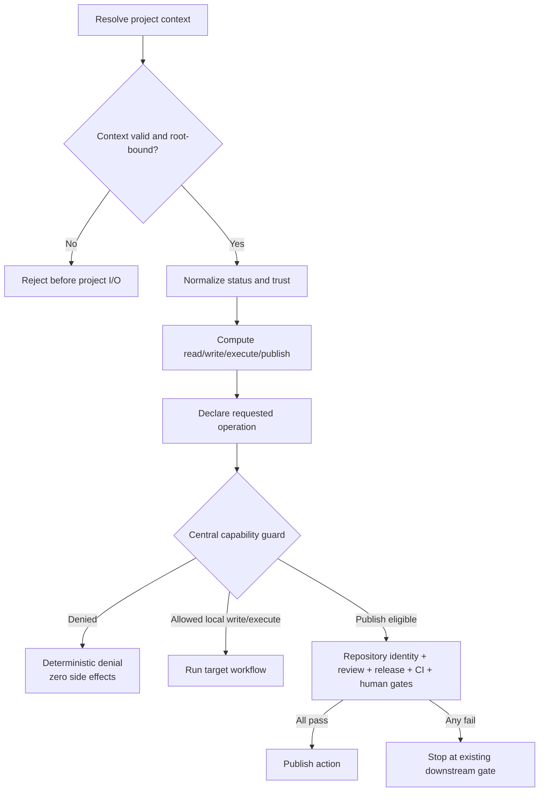

# Spec: Project Operation Capability Enforcement

Issue: `110-project-operation-capability-enforcement`
Prev: `workspace/reviews/2026-08-21-issue-102-post-release-validation.md` · Next: `product:plan 110-project-operation-capability-enforcement`

## Problem

Issue 102 made project selection deterministic and Issue 109 made canonical paths authoritative, but a resolved project is still treated as writable. The registry already carries project `status` and `trust_scope`; the resolved context omits status-derived policy and mutating workflows do not share an authorization boundary. An archived or read-only project can therefore be selected correctly and then modified by lifecycle, artifact, Git, or publication workflows.

The failure is architectural: discovery answers **which project**, while authorization must separately answer **which operation is permitted**. Resolver success must never imply mutation permission.

## Goals

1. Add normalized project status and explicit `read`, `write`, `execute`, and `publish` capabilities to every resolved context.
2. Preserve diagnostic reads for archived, read-only, and unknown-policy projects while denying every mutation fail-closed.
3. Require every target-project mutating boundary to use one shared authorization guard before its first side effect.
4. Return deterministic denial codes and remediation without files, temporary artifacts, Git changes, network calls, or external actions.
5. Keep publish eligibility subordinate to repository identity, review, release, status-check, and human-approval gates.

## Non-Goals

- Implementing Issue 103's atomic multi-file lifecycle transaction or rollback journal.
- Reworking Issue 109 canonical path ownership or moving project directories.
- Replacing Issue 088 repository identity authorization.
- Granting publish, merge, release, or external-write approval implicitly.
- Adding user/organization RBAC, authentication, or a remote policy service.
- Preventing read-only diagnostic commands from inspecting a safely resolved project.

## Policy Contract

### Normalized inputs

- `project_status`: `active | archived | unknown`.
- `trust_scope`: `internal | read-only | unknown` for policy evaluation.
- Missing, empty, or unrecognized source values normalize to `unknown`; the context retains the observed source value in denial evidence so Doctor can explain the repair.
- Unknown policy input does not make a safely located project undiscoverable. It permits diagnostic reads only and denies mutation.

### Capability matrix

| Normalized status | Normalized trust | read | write | execute | publish |
| --- | --- | ---: | ---: | ---: | ---: |
| `active` | `internal` | allow | allow | allow | eligible |
| `archived` | any | allow | deny | deny | deny |
| any | `read-only` | allow | deny | deny | deny |
| `unknown` | any | allow | deny | deny | deny |
| any | `unknown` | allow | deny | deny | deny |

`publish: eligible` means only that project policy does not reject publication. Repository identity, source release validation, review evidence, required status checks, and explicit human approval remain independently mandatory.

### Operation meanings

- `read`: status, Doctor, issues, project inspection, validation, and other non-mutating queries.
- `write`: project-local artifact creation or update without starting an execution or publication transition.
- `execute`: lifecycle transitions, implementation/review orchestration, worker execution, and workflows that may mutate several project or Git-local artifacts.
- `publish`: Git push, GitHub writes, release/deploy actions, or external publication. A workflow may require both `execute` and `publish`; denial of either stops it.

## Users & Scenarios

### Project operator

As an operator, I can inspect an archived or read-only project and receive a clear explanation that changes are blocked, so I can diagnose configuration without risking mutation.

### Workflow author

As a workflow author, I call one guard with a declared operation rather than reinterpreting project status in each module, so policy remains consistent.

### Release reviewer

As a reviewer, I can see that project policy allowed publication eligibility without mistaking that result for repository identity, CI, review, or human approval.

### Exception paths

- An unknown or missing status/trust value resolves for reads, reports observed policy inputs, and denies `write`, `execute`, and `publish`.
- An unresolved, ambiguous, malformed, or root-mismatched context is rejected by the existing Issue 109 boundary before authorization or project-local I/O.
- A denied operation creates no temporary file, lifecycle journal, Git change, subprocess side effect, network call, or external write.
- Portfolio selection/history updates are writes to the portfolio control workspace, not to the selected target project. They are classified separately and remain governed by the portfolio repository's own context and identity gates.

## Proposed Solution

### 1. Capability computation owned by project policy

Add a small policy layer next to `project_registry` that normalizes status/trust inputs and computes one immutable capability map. The resolver copies the resulting `project_status`, normalized policy trust, capability booleans, and per-capability reason evidence into every resolved context. Unresolved and ambiguous results keep the same complete shape with all capabilities denied.

Each denied capability carries:

- `reason_code`: stable machine identifier;
- `message`: concise explanation;
- `recommendation`: deterministic remediation;
- observed status/trust values for diagnostics.

The resolver additions are exact and additive:

```json
{
  "project_status": "archived",
  "policy_trust_scope": "read-only",
  "policy_inputs": {
    "project_status_source": "archived",
    "trust_scope_source": "read-only"
  },
  "capabilities": {
    "read": true,
    "write": false,
    "execute": false,
    "publish": false
  },
  "capability_reasons": {
    "read": {"reason_code": "PROJECT_READ_ALLOWED_DIAGNOSTIC"},
    "write": {
      "reason_code": "PROJECT_OPERATION_DENIED_ARCHIVED",
      "message": "Archived projects are read-only.",
      "recommendation": "Reactivate the project through an approved registry change before writing project artifacts."
    },
    "execute": {
      "reason_code": "PROJECT_OPERATION_DENIED_ARCHIVED",
      "message": "Archived projects are read-only.",
      "recommendation": "Reactivate the project through an approved registry change before executing workflows."
    },
    "publish": {
      "reason_code": "PROJECT_OPERATION_DENIED_ARCHIVED",
      "message": "Archived projects are read-only.",
      "recommendation": "Reactivate the project through an approved registry change before publishing."
    }
  }
}
```

Existing resolution `status` continues to mean `resolved | unresolved | ambiguous`; it is not renamed or overloaded. Existing raw `trust_scope` remains for compatibility, while `policy_trust_scope` is the normalized authorization input.

Legacy explicit-root contexts have no portfolio registry record and currently expose raw `trust_scope: project-local`. To preserve the accepted positional-root compatibility contract, `project_context_for_root()` emits synthetic `project_status: active` and `policy_trust_scope: internal` while retaining `trust_scope: project-local` and both synthetic sources in `policy_inputs`. A resolver-selected registry context never uses this compatibility mapping: its observed registry status and trust values remain authoritative.

### 2. One authorization decision and one enforcing guard

The policy layer exposes two interfaces:

```python
authorize_project_operation(project_context, operation) -> decision
require_project_capability(project_context, operation) -> decision
```

`authorize_project_operation` is side-effect free and always returns `moduflow.project-operation-authorization.v1`. `require_project_capability` returns the allowed decision or raises a typed `ProjectOperationDenied` carrying the same payload. Public mutators use the enforcing interface so a caller cannot accidentally continue after a denied boolean.

### 3. Guard before first side effect

Every target-project mutating public entry point declares `write`, `execute`, or `publish` and calls the guard immediately after `context_for_operation()` and before path probes that are not required for context validation. This ordering includes CLI modes, library APIs, temporary-file creation, Git commands, subprocess execution, and external clients.

A reviewed machine-readable entry-point registry records module, function/CLI mode, operation, scope, and guard owner. A coverage test fails when a registered target-project mutator lacks the central guard or when a discovered mutating command surface has no reviewed classification.

### 4. Preserve downstream gates

Publish-capable workflows run project authorization first, then the existing repository identity, review, release, CI/status-check, and human-approval gates. The capability result cannot set or synthesize any downstream approval.

### 5. Separate portfolio-control writes

Portfolio recent-selection/history writes receive an explicit `portfolio-control` scope classification. They do not borrow permission from the selected project because they mutate the portfolio workspace, not the target project. If a portfolio command also mutates the target, that target mutation must independently pass the target project's guard.



## Denial Contract

The authorization result has a stable shape:

```json
{
  "schema": "moduflow.project-operation-authorization.v1",
  "allowed": false,
  "operation": "execute",
  "project_id": "archive-demo",
  "project_status": "archived",
  "policy_trust_scope": "read-only",
  "policy_inputs": {
    "project_status_source": "archived",
    "trust_scope_source": "read-only"
  },
  "reason_code": "PROJECT_OPERATION_DENIED_ARCHIVED",
  "message": "Archived projects are read-only.",
  "recommendation": "Reactivate the project through an approved registry change before executing workflows."
}
```

CLI entry points serialize this payload without traceback and exit non-zero. Library entry points raise the typed error before side effects. Allowed decisions use the same schema with `allowed: true` and a stable allow reason.

## Error Handling

- **Archived project:** allow read; deny mutation with `PROJECT_OPERATION_DENIED_ARCHIVED`.
- **Read-only trust:** allow read; deny mutation with `PROJECT_OPERATION_DENIED_READ_ONLY`.
- **Unknown/missing status:** allow diagnostic read; deny mutation with `PROJECT_OPERATION_DENIED_STATUS_UNKNOWN` and the observed value.
- **Unknown/missing trust:** allow diagnostic read; deny mutation with `PROJECT_OPERATION_DENIED_TRUST_UNKNOWN` and the observed value.
- **Multiple denial causes:** use fixed precedence `archived > read-only > status-unknown > trust-unknown`, while retaining all policy diagnostics in the context.
- **Unknown operation name:** deny with `PROJECT_OPERATION_UNKNOWN`; never default to `read` or `write`.
- **Invalid context:** preserve Issue 109's context error; do not attempt capability fallback.
- **Downstream publish gate failure:** report the downstream gate's existing error separately from project policy authorization.

## Enforcement Inventory

Planning must audit every mutating surface, not only the initial issue list. The minimum required categories are:

- lifecycle and execution state changes;
- knowledge, memory, workflow, review, convergence, and production artifact writes;
- Spec Kit persisted validation outputs;
- PR/release handoff writes and GitHub issue projection;
- promotion, migration, profile, project initialization, and project-local generator writes;
- Git-local and external publication actions;
- portfolio-control writes, classified separately from target-project writes.

No mutator may be allowlisted merely because its current call site already selected an active internal project.

## Test Strategy

1. Table-driven tests cover every `status × trust_scope × operation` combination and reason precedence.
2. Resolver tests assert identical capability shape for explicit ID, CWD, alias, active, recent, default-layout compatibility, unresolved, and ambiguous results.
3. No-side-effect tests inject filesystem, tempfile, subprocess, Git, network, and external-client sentinels and prove denial occurs first.
4. Default active/internal tests prove existing positional callers and result schemas remain compatible except for additive fields.
5. Publish tests prove project eligibility cannot bypass repository identity, review, release, CI, or human gates.
6. Coverage tests compare the reviewed mutator registry with discovered command/function surfaces and require the central guard.
7. Issue 102 resolver, Issue 109 nested-context, Issue 088 identity, and full release suites remain green.

## Alternatives Considered

### A. Central computed capabilities plus enforcing guard — selected

One policy owner and a typed stop condition make authorization consistent and testable. The additive context fields preserve compatibility while mutator coverage can be audited mechanically.

### B. Per-command status checks

Rejected. It minimizes initial edits but duplicates policy, permits inconsistent reason codes, and makes a missed mutator indistinguishable from an intentionally unrestricted command.

### C. Capability-token objects passed to every mutator

Rejected for this issue. Unforgeable typed tokens could be stronger, but they would replace many public signatures and create a migration larger than the verified gap requires. The central enforcing guard provides the needed fail-closed boundary without that compatibility cost.

### D. Reject unknown policy projects during resolution

Rejected. It prevents Doctor/status from reading enough context to explain and repair the registry. Diagnostic read-only resolution is safer operationally while mutations remain denied.

## Acceptance Criteria

1. Every resolved context includes normalized `project_status`, normalized policy trust, all four capability booleans, and deterministic reason evidence.
2. Unresolved and ambiguous contexts expose the same capability shape with all operations denied and no candidate project-local reads.
3. `active + internal` permits read/write/execute and marks publish eligible; publish remains gated downstream.
4. Archived projects resolve for read and deny write/execute/publish.
5. Read-only projects resolve for read and deny write/execute/publish.
6. Missing or unrecognized status/trust permits diagnostic read only and includes observed values plus remediation.
7. Unknown operation names deny fail-closed.
8. Every target-project mutating public boundary calls the same enforcing guard before filesystem, tempfile, Git, subprocess, network, or external-client side effects.
9. Denied operations leave project files, lifecycle state, Git state, temporary locations, and external systems unchanged.
10. The reviewed entry-point registry has no unclassified or unguarded target-project mutator and no stale classification.
11. Portfolio-control writes are explicitly distinguished and never authorize a target-project mutation.
12. Publish eligibility does not bypass repository identity, review, release, required status checks, or human approval.
13. Default-layout positional-root callers remain compatible; authorization additions are keyword-only or additive result fields.
14. Project validation is valid, lifecycle drift is empty, full discovery passes, and `python3 scripts/release_check.py .` passes.

## Risks & Open Questions

- A mutator inventory can become stale. The reviewed registry plus discovery/guard coverage test is a release gate, not documentation only.
- Some functions combine read preparation and later writes. They must authorize before the first target-project probe that is unnecessary for context validation, even if that moves existing reads later.
- Portfolio and target-project scopes can coexist in one command. Each write must be authorized by the context that owns the mutated location.
- No product decision remains open: Dongwon Lee approved diagnostic read with fail-closed mutation for unknown policy inputs and the central enforcing-guard design on 2026-08-21.

## Next

After human review of this spec, run `product:plan 110-project-operation-capability-enforcement`.
