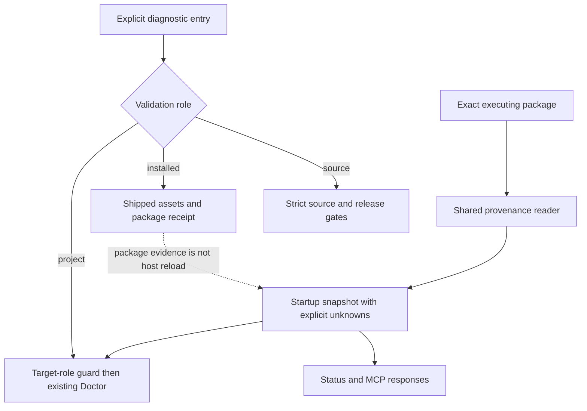

# Spec: Runtime Provenance and Validation Mode Separation

Issue: `111-runtime-provenance-and-validation-mode-separation`
Owner: Dongwon Lee
Phase: approved for inline implementation by Dongwon Lee on 2026-09-02 ("ㅇㅇ 이제 다음 뭐 할까 진행 하자고"); publication remains separately gated.
Source: `issues/111-runtime-provenance-and-validation-mode-separation.md`; confirmed findings F-003/F-004 in `workspace/reviews/2026-08-21-issue-102-post-release-validation.json`; 2026-09-02 user request to proceed with the next plan and simulation tests.
Prev: issue and review packet · Next: `product:review 111-runtime-provenance-and-validation-mode-separation` for implementation evidence in `review.md` / `status.md`.

## Problem

A source release, an installed package and a target project have different requirements. The current `validate_moduflow()` already excludes `SOURCE_ONLY_REQUIRED_FILES` when `.git` is absent; this partial fix must be preserved, not described as missing. However, its mode is inferred from `.git`, release validation has no target-role guard, and Doctor can inspect a cache as a project. Current cache copying also omits most tests/specs intentionally.

Installed-copy discovery in `project_doctor.installed_plugin_staleness()` is not proof of what a live process loaded. `mcp_server._server_version()` reads the nearby manifest on demand, so a mutable checkout/cache can change the reported version during a long-running process. The issue's proposed `scripts/project_status.py` does not exist: actual integration points are `scripts/mcp_server.py`, `scripts/project_doctor.py`, and `commands/product-status.md`.

## Goals

1. Make source, installed-package and project validation explicit without weakening existing release checks.
2. Report package evidence separately from a particular process's startup evidence and from unobservable AI-host skill loading.
3. Store package provenance once during explicit packaging/installation; all status/Doctor/MCP reads remain diagnostic.
4. Prove the boundary with offline fixtures, packaged-process smoke tests and separately recorded real-host observations.

## Non-Goals

- No project registry/capability migration, issue lifecycle redesign, general installer/config transaction framework, or all-purpose Doctor cleanup.
- No new execution engine, scheduler, background version watcher, database, dashboard, profile engine or Spec Kit upgrade.
- No automatic install, update, reload, release, external message or repair during diagnostics.
- No claim that MCP startup proves the host reloaded all prompt skills. No guessed `loaded_at`, host/session identity, source revision or install date.
- No company data, credentials, private project paths from other projects, or production workloads in simulation fixtures.

## Users & Scenarios

- Maintainer: strict source validation still rejects missing source tests, invalid artifacts and release evidence failures.
- Installed-package user: validate a distribution without a Git repository or full development test suite.
- Project user: diagnose an initialized or empty target project using the running plugin, not treating its target directory as the plugin itself.
- Long-running MCP: package B can become available while the process started from A; continue reporting A's startup snapshot. A fresh process from B reports B.
- Legacy/unknown host: distinguish a valid old package with missing provenance from invalid metadata and from an unknown live-session load.

## Proposed Solution

### Validation Roles

| Entry point | Explicit role | Contract |
|---|---|---|
| `validate_moduflow(path, mode="source")` / CLI `--mode source` | `source` | Require all existing source files. `release_check` uses this role and retains every existing gate. |
| `validate_moduflow(path, mode="installed")` / CLI `--mode installed` | `installed` | Require shipped runtime assets/fixtures/evidence, not `.git`, full tests or development issue/spec trees. A manifest alone is insufficient. |
| Existing call without mode | compatibility `auto` | Preserve existing callers, but report inferred role and evidence; command docs and release checks use explicit roles. |
| `inspect_project(path, ...)` / Doctor | `project` | Reject a known installed-package target before Git-parent discovery, project resolution, recovery inspection or artifact validation. |

Add `validation_role`, `role_source`, `warnings` and stable `error_codes` without removing existing result keys. Unknown modes fail explicitly. Source release validation rejects an installed or non-source target before running source gates; it never falls back to installed mode to become green.

Package identity uses the ModuFlow manifest plus package receipt/runtime layout. A recognized installed receipt takes precedence over copied project-looking files. For a receipt-less package without `.git`, runtime layout is a legacy diagnostic signal, not proof of installation or host load. Ambiguous package-looking targets return `TARGET_ROLE_AMBIGUOUS`; callers can run explicit package validation. ModuFlow's source repository remains a valid dogfooding project when no installed receipt is present. Unrelated projects remain normal project targets. No arbitrary parent/home search is added for runtime discovery.

### One Package and Runtime Evidence Reader

Introduce `scripts/runtime_provenance.py`. Every consumer uses it; do not create another status parser or a new status orchestration engine.

- `inspect_package(package_root)` reads that exact resolved package, its manifest and optional receipt. It returns evidence and diagnostics, never Git/subprocess/network results.
- `capture_runtime(package_root, *, runtime_kind, observed_at=None, host=None, session_id=None)` captures package evidence once at the entry point. `runtime_kind` is `cli_process`, `mcp_process` or a separately evidenced `host_session`. Unknown values remain null with a reason.
- The MCP entry point passes the immutable-by-convention snapshot through its request handler. Repeated requests do not refresh it from disk. Without an injected startup observation, import-level/test calls must not invent one.
- Provide a read-only JSON CLI on the same module for command-based status. This reports the invoked CLI package/process only; it does not prove the conversational host's loaded skill version.

The additive nested object `runtime_provenance` uses schema `moduflow.runtime-provenance.v1`, fields `package_version`, `package_path`, `source_commit`, `source_dirty`, `installed_at`, `loaded_at`, `runtime_kind`, `host`, `session_id`, `provenance_source`, `unavailable_reasons`, `error_codes`. Each null evidence field has an explicit reason. Each known value has a source in `provenance_source`. Preserve `moduflow.mcp.v1`, `state_schema` and existing Doctor payloads.

Version agreement is host-aware: a receipt's published version must equal the applicable distribution manifest version; the base before `+` must match the canonical Claude manifest. A valid Codex build suffix is not itself drift or invalid provenance. Without a receipt, expose the applicable exact manifest version as package evidence and do not infer installation.

`loaded_at` means the observed startup of the reported `runtime_kind`, never install time, file mtime, request time, or a guessed host reload. The MCP's version and process provenance come from the same snapshot. Reading a changed file later cannot prove the process's code changed.

### Immutable Package Receipt

Create `.moduflow-package.json` only inside the prepared distribution, with schema `moduflow.package-provenance.v1`, `package_version`, `source_commit`, `source_dirty`, `installed_at`, `payload_sha256`, `provenance_source`, `unavailable_reasons`. The source revision is collected through an injected command runner during explicit packaging, not during runtime reads. A dirty source's commit is a base revision, not an exact payload claim; `source_dirty` and payload digest keep that distinction visible.

The digest covers sorted package-relative paths and file hashes, excluding the receipt itself and interpreter cache files. The installer writes JSON to a same-directory temporary file, flushes/fsyncs, then atomically replaces the receipt in its unpublished staging directory. Validate the prepared package before exposing it. A failure must leave an existing usable cache unchanged. Reuse an existing version only when its payload and receipt validate and agree; otherwise return `PACKAGE_DESTINATION_CONFLICT` without deleting it. This is scoped package publication, not an atomic rewrite of all marketplace/config/link files.

Runtime consumers never amend the receipt. Missing metadata on legacy packages yields warnings/null reasons, not invented values. Malformed metadata, manifest/version disagreement or invalid timestamps yields `PROVENANCE_INVALID` and fails the installed self-check; it does not make an unrelated target project's artifacts invalid. The receipt is local build evidence, not a signature or tamper-proof attestation. A package built by another host without this receipt is explicitly legacy/unknown rather than silently modified.

### Existing Staleness and Presentation

Keep Issue 065's soft `checked`, `stale`, `recommendations` behavior. Use the shared reader for located package paths and label version-only host registration/cache-directory observations as inventory evidence, not active runtime. Parse/read failures become diagnostics instead of successful empty results. No automatic updates or broader cross-project scanning.

## Alternatives Considered

1. **Recommended: extend existing entry points with explicit roles and one evidence reader.** Reuses validation and Issue 065 while making the missing boundary testable.
2. **Only print the source version or newest cache directory.** Smaller change, but cannot identify a running process and preserves the original failure.
3. **Build a runtime registry, watcher and automatic reload manager.** Could collect more host events, but expands ModuFlow's execution responsibility and is outside this issue.

## Acceptance Criteria

- AC1: Source mode retains every existing source gate; installed mode succeeds without Git/full source tests while a missing required runtime asset fails.
- AC2: Doctor rejects an installed target before project resolution or Git-parent discovery; an empty project and a source dogfooding project still receive project diagnostics.
- AC3: Status, Doctor and MCP expose the same runtime provenance schema; every unknown evidence field has a null value and reason.
- AC4: Explicit packaging writes a validated atomic receipt; injected write/rename failures preserve an existing cache, and conflicting same-version payloads cannot overwrite it.
- AC5: A persistent process reports its original startup snapshot after package files change; a fresh process reports the new package; neither claims AI-host skill reload without host evidence.
- AC6: Issue 065 installed inventory and staleness recommendations remain soft diagnostics and never masquerade as loaded runtime evidence.
- AC7: Offline simulations cover source, installed, stale, missing/invalid metadata, mismatched source/runtime, wrong target, two projects, separate worktree, interrupted installation and no-write/no-network behavior.
- AC8: Release evidence separates unit tests, simulations, packaged CLI/MCP smoke, remote integration, publication and actual Codex/Claude host observations. Unavailable host evidence is recorded as unavailable, not passed.

## Risks & Open Questions

No unresolved product choice blocks the draft implementation plan. Technical risks to verify are backward-compatible result shapes, a copied source tree being mistaken for a project, and receipt/version conflicts during repeated installation. Host-level skill loading may not be observable; that is an explicit unknown, not a reason to invent a new host watcher. Real-host publication/reload remains a separately authorized release action.

Constitution: `workspace/constitution.md` v1.0. Scope/acceptance approved by Dongwon Lee on 2026-09-02 before implementation. Canonical implementation plan: `plan.md`; progress checklist: `tasks.md`; simulation matrix: `simulation-matrix.md`. Integration/publication approval remains separate.
