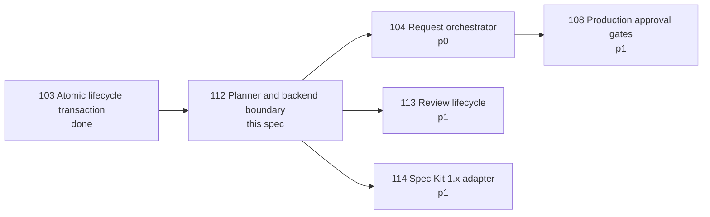
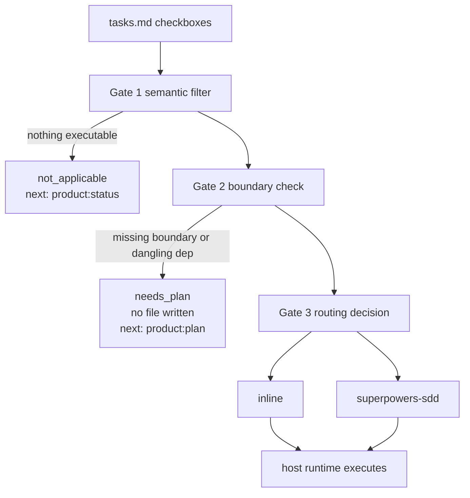

# Issue 112 Specification: Execution Planner and Backend Boundary

**Status:** draft for review — written 2026-09-05.
**Owner:** Dongwon Lee
**Updated:** 2026-09-05

Issue: `112-execution-planner-and-backend-boundary`
Prev: `knowledge/benchmarks/2026-09-01-agentic-execution-governance-trend.md`,
`docs/superpowers/specs/2026-09-01-execution-governance-scope-design.md` ·
Next: `product:plan 112-execution-planner-and-backend-boundary`

## 1. Problem

`worker_orchestrator.build_worker_plan` turns every checkbox in `tasks.md` into
a worker task with a prompt, a worktree name and a cognitive-demand hint. It
applies no semantic filter, requires no file boundary, validates no dependency,
and always writes `worker-plan.json` and `worker-plan.md`.

Measured against this repository on 2026-09-05 (HEAD `a5657dd`, 55 specs):

- 640 worker tasks are generated; **514 of them (80%) are already `done`**.
- **36 of 55 specs (65%) declare no file or glob boundary on any task**, and a
  further 3 declare one the parser cannot see: 103, 109 and 110 write
  `| Files: … | Depends: A1` instead of the `[files: …] [depends: T01]` form
  that `METADATA_RE` (`w_o.py:72`) matches. Those three are the most recent
  large issues, so the authored convention is drifting away from the one
  `commands/product-plan.md` documents. 16 specs use the readable form.
- `Required Gates` alone contributes 34 checkboxes, e.g. *"All 13 Issue 102
  acceptance criteria have test or status evidence."* `WORKER_RULES`
  (`w_o.py:17`) routes `acceptance` and `criteria` to `pm-strategist`, so
  acceptance criteria become worker tasks by design.
- Concrete failure, `specs/001-project-migration`: the single open task is
  `Commit and push.` It is assigned to `implementation-worker`, given the
  worktree `codex/001-project-migration-t08`, handed the prompt line
  `Expected files: none`, and reported as `dispatchable`. It is a Git
  operation with no declared boundary, offered as ready implementation work.

Two further defects sit in the same write path:

- `build_worker_plan` persists an absolute `project_root` (`w_o.py:430`) into
  the Git-tracked `worker-plan.json`, so the artifact carries one machine's
  filesystem layout. Measured across the 10 committed `worker-plan.json` files:
  **9 name a directory that does not exist here** — seven point at
  `/Users/dongwon.lee/workhub/…` from the company machine and three at
  `/Users/dongwon.lee/.config/superpowers/worktrees/…`, a temporary worktree
  that is long gone. Only the one generated on this machine resolves.
- `write_worker_plan` enforces `capabilities.write` (`w_o.py:526`) but has **no
  repository-identity gate**, while the sibling write path in
  `project_execution.main` (`p_e.py:349-353`) calls `inspect_repository_identity`
  and `operation_decision`. Two write paths, one identity check. This is an
  independent defect and is tracked as Issue 122, not fixed here — see
  section 3.

The consequence is not a broken plan; it is a plan that looks authoritative and
is not. A human must read every generated plan to decide which lines are real
work, and in this corpus the answer is usually "almost none".

## 2. Goals

1. Select only unchecked, non-deferred implementation work from canonical
   `tasks.md`; never turn decisions, Hard Gates, acceptance criteria,
   verification gates or completed tasks into worker tasks.
2. Refuse rather than guess: a task without a concrete file/glob boundary, or
   with a dependency that resolves to nothing, produces no worker-plan file and
   returns `needs_plan`.
3. Emit exactly one execution-routing decision — `inline` or `superpowers-sdd`
   — with the reason that selected it, and never claim dispatch occurred.
4. Keep the routing result host-neutral so Claude Code, Codex or Copilot can
   map the same result without changing canonical artifacts.
5. Keep `spec.md`, `plan.md` and `tasks.md` canonical; link Superpowers
   execution detail rather than letting it hold a second completion truth.
6. Emit `project_root` as a repository-relative path.

## 3. Non-Goals

- No ModuFlow scheduler, queue, agent tree, worktree engine or subagent
  runtime. ModuFlow owns selection, state, evidence and policy; the selected
  host owns execution.
- No reimplementation of Superpowers SDD inside ModuFlow.
- No Spec Kit `implement`, and no Spec Kit ownership of Git, lifecycle, review
  or release.
- No automatic parallel or fleet mode. `inline` is a normal success.
- No re-planning of `dispatchable_now()` — see section 5.
- No review state machine (Issue 113) and no Spec Kit 1.x adapter refresh
  (Issue 114), although the same scope design covers all three.
- No prompt context-budget optimisation (Issue 084).
- No retroactive annotation of existing `tasks.md` files by this issue.
- **No repository-identity gate for the worker write path.** The gap is real
  and measured (section 1), but it is an independent defect that should not
  wait on this issue's approval, plan and execution. Split out as Issue 122.

## 4. Dependency Contract

Issue 103 is `done`, so this issue is unblocked. It gates four downstream
issues; 104 must consume this boundary rather than a second contract.

## 5. Already Landed — Excluded From This Spec

`dispatchable_now(planned_tasks)` (`w_o.py:225`) and the `Dispatchable Now`
section of the rendered plan (`w_o.py:481`) shipped in commit `ba1269a`,
confirmed an ancestor of HEAD. This spec does not re-plan them.

One consequence is binding on section 6.2: `dispatchable_now` treats a
dependency on a completed task as **satisfied** (`w_o.py:246`). Gate 2 must use
the same semantics. The opposite rule would contradict shipped behaviour and
make a spec degrade from plannable to refused as its own work progresses.

## 6. Gate Contract

Three gates inside one `product:workers` invocation. The command count the user
runs does not change; what changes is that the planner may now refuse.

### 6.1 Gate 1 — semantic filter

Keep a checkbox when all hold:

- it is unchecked;
- it is not `[deferred → …]`;
- its enclosing section is not a gate/evidence section.

Section exclusion matches the **whole** normalised section name, after
stripping a `Stream <x> —` prefix, against: `required gates`, `gates recap`,
`acceptance coverage`, `acceptance criteria`, `verification`,
`verification per task`, `converge findings (auto)`, `next`, `next command`.

Whole-name matching is required, not stylistic. Substring matching on
`verification` was measured to swallow four genuine test-writing tasks under
`Stream 3 — Tests + verification (gate)`. Gate 1 is deliberately conservative:
anything ambiguous falls through to Gate 2, which refuses unusable work anyway.

Task IDs are positional in the source file and are assigned **before**
filtering. Survivors are never renumbered — a human-written `[depends: T01]`
must keep pointing at the same source line after any task is dropped.

### 6.2 Gate 2 — boundary check

Every survivor must declare at least one `[files:]` entry or one `[globs:]`
entry. Every declared dependency must resolve to a task that is either another
survivor or already `done`. A dependency pointing at a nonexistent ID, or at a
task deferred to another issue, is a gap.

Gate 2 fails closed **at plan level**: one gap refuses the whole plan. No
`worker-plan.json` or `worker-plan.md` is written, the result lists every gap
by task ID, and `next_command` is `product:plan`.

A gap must say which of the two it is. "Declares no boundary" and "declares a
boundary the parser cannot read" call for different fixes, and specs 103, 109
and 110 are in the second category. Reporting the second as the first sends the
author looking for something they already wrote.

Distinguish the two negative results. Nothing executable is `not_applicable`
(the spec is finished); executable work without a usable boundary is
`needs_plan` (the spec needs authoring). They are not the same event.

### 6.3 Gate 3 — routing decision

Exactly one backend, with a recorded reason:

| Condition | Backend |
| --- | --- |
| one surviving task | `inline` |
| any surviving task touches shared state | `inline` |
| two survivors' boundaries can touch the same file | `inline` |
| otherwise | `superpowers-sdd` |

Boundary collision is **path containment, not string equality**. A glob must be
matched against the other task's declared files. Measured on
`specs/027-reduce-approval-popup-friction`: `scripts/*` and four named
`scripts/` files were treated as disjoint and routed to two parallel workers on
the same files.

`inline` is a normal success, not a fallback. Anthropic's current guidance
warns that simple, sequential, single-file and shared-context work should be
done directly rather than delegated
(`knowledge/benchmarks/2026-09-01-agentic-execution-governance-trend.md`,
line 39), and the benchmark's roadmap decision 1 requires it.

## 7. Result Schema

Schema `moduflow.execution-routing.v1`. Required fields:

- `schema`, `issue_id`, `project_root` (repository-relative, never absolute);
- `status`: `ok`, `needs_plan`, or `not_applicable`;
- `backend`: `inline`, `superpowers-sdd`, or null;
- `routing_reason`: non-empty for every status;
- `gaps`: task-addressed reasons, empty unless `needs_plan`;
- `tasks`: the selected tasks with their boundaries and dependencies, empty
  unless `ok`;
- `written`: the files actually written, empty for both refusal statuses;
- `dispatched`: always `false`;
- `executed_by`: always null;
- `next_command`.

`dispatched` and `executed_by` are explicit fields rather than omissions so
that "ModuFlow did not run this" is assertable in a test, not merely implied.

## 8. Host Adapter Boundary

The routing result must contain no host-specific value. Today it does:
`isolation.worktree` hardcodes a `codex/` prefix (`w_o.py:408`) and every task
prompt embeds OpenAI GPT-5.6 model names through `COGNITIVE_DEMAND_GUIDANCE`
(`w_o.py:50-66`, applied at `w_o.py:388`).

The result carries semantic intent — cognitive demand, isolation requirement,
file boundary, dependency order. A per-host adapter maps that intent to the
host's own subagent, worktree and model vocabulary. Adding a host adds an
adapter and changes no canonical artifact.

## 9. Canonical Artifact Ownership

`spec.md`, `plan.md` and `tasks.md` remain the single completion truth. A
Superpowers design or plan document is linked as execution detail and can never
mark a ModuFlow task complete. Where both describe the same task, the canonical
artifact wins and the divergence is reported rather than silently resolved.

## 10. Migration Position

Applied to the current corpus, the gates produce: 2 specs planning, 19 refused,
34 recognised as finished. The 19 are live work and will return `needs_plan`
until `[files:]` annotations are added.

This spec adopts **fail-closed** (option 1 of three weighed in section 11).
Refusal names the exact tasks missing a boundary, so the remediation is
enumerable. This issue does not annotate those specs; each is annotated when
its own work is next picked up.

## 11. Alternatives Considered

1. **Keep writing the plan and mark it `unverified` — rejected.** It preserves
   the artifact that this issue exists to remove. A plan a human must audit
   before trusting is the current failure, relabelled.
2. **Treat a spec with zero annotations as legacy and pass it through —
   rejected.** It creates a silent two-tier behaviour where the same command
   means different things depending on invisible file history.
3. **Drop boundary-less tasks and plan the rest — rejected.** Partial plans
   read as complete. A spec where 12 of 14 tasks were silently dropped is more
   misleading than a refusal.
4. **Filter by keyword instead of section — rejected.** `WORKER_RULES` already
   demonstrates the failure mode: keyword routing is what maps `acceptance`
   to a worker in the first place.
5. **Let ModuFlow dispatch directly — rejected.** It duplicates host runtime
   features and produces stale state, cost and false execution claims
   (benchmark alignment table, "ModuFlow creates another dispatcher").

## Acceptance Criteria

Traceable to the issue's seven criteria. The identity gap found on 2026-09-05
is deliberately absent — it is Issue 122.

1. Decision text, Hard Gates, acceptance criteria, verification gates, deferred
   tasks and completed tasks never appear in `tasks`.
2. Writing tests is implementation work and survives Gate 1 even when its
   section name mentions verification.
3. Every task in `tasks` declares at least one file or glob, and every
   dependency resolves to a survivor or a completed task.
4. A dependency on a completed task is satisfied, matching `dispatchable_now`.
5. Dropping a task never renumbers survivors; existing `[depends:]` references
   still resolve.
6. Any gap yields `needs_plan`, `written` is empty, no `worker-plan.*` exists
   on disk afterwards, and `next_command` is `product:plan`.
7. A gap distinguishes "no boundary declared" from "boundary declared in a
   notation the parser does not read", using the `| Files: …` form in specs
   103, 109 and 110 as the fixture.
8. A spec with no executable work yields `not_applicable`, not `needs_plan`.
9. Exactly one of `inline` / `superpowers-sdd` is returned, with a non-empty
   `routing_reason`.
10. A glob that covers another task's declared file routes `inline`.
11. `dispatched` is `false` and `executed_by` is null in every result.
12. `project_root` is repository-relative in every result.
13. The same routing result maps to Claude Code, Codex and Copilot fixtures
    with no change to canonical artifacts.
14. Canonical artifacts and linked Superpowers detail cannot both claim
    completion; divergence is reported.
15. Issue 103 transaction, implementation-readiness and capability gates remain
    authoritative and unchanged.

## 13. Verification Strategy

A prototype of gates 1-3 was built outside the repository and run against all
55 specs on 2026-09-05; 34 tests pass, including a parity assertion that its
scan matches the shipped `parse_tasks` on every spec. Evidence and the three
defects it surfaced are recorded in the review packet for this issue. That run
covers criteria 1-11 in principle and must be reproduced as repository tests.

Required fixtures:

- `specs/001-project-migration` — `needs_plan`, nothing written.
- `specs/023-worker-routing-and-isolation` — `not_applicable`, all tasks done.
- `specs/029-antigravity-artifact-sync-connector` — **positive control**: open
  tasks carrying real boundaries and `[depends: T01]` must produce a usable
  plan. A gate set that also rejects this one is too aggressive.
- `029` with its first task checked off — must stay `ok`, proving criterion 4.
- `specs/086-…` — a deferred task carrying a boundary must never become work.
- Synthetic: dropped middle task, unknown dependency ID, deferred dependency,
  empty `- [ ]`, `Stream <x> — Verification`, `Stream 3 — Tests + verification (gate)`,
  glob-covers-file, two globs over different trees.
- Cross-host fixtures for Claude Code, Codex and Copilot (criterion 12).

Existing suites must stay green: `tests/test_worker_orchestration.py`,
`tests/test_project_execution.py`, and `python3 scripts/release_check.py .`.

## 14. Risks and Open Questions

- **Criteria 12 and 13 are unvalidated.** The prototype tested selection,
  refusal and routing only. The host-neutral adapter and the canonical-versus-
  Superpowers reconciliation have no evidence yet and carry the implementation
  risk in this issue.
- **The section exclusion list is corpus-derived.** A future `tasks.md` may
  invent a gate section name that is not on it. Gate 2 limits the damage but
  does not eliminate it; the list needs a documented place to grow.
- **19 refused specs is a real cost**, accepted deliberately in section 10.
  If annotation proves impractical in use, alternative 1 should be revisited
  with usage evidence rather than assumption.
- **Shared-state detection is still keyword-based** (`SHARED_STATE_KEYWORDS`,
  `w_o.py:27`) and inherits the weakness criticised in alternative 4. It is out
  of scope here but should not be treated as reliable.

## 15. Human Review Decisions

Reviewers must approve:

- fail-closed at plan level, and the resulting 19 refused specs (section 10);
- the whole-name section exclusion list and its growth path (section 6.1);
- treating a dependency on a completed task as satisfied (section 6.2);
- the `inline` conditions, in particular that shared state forces `inline`.

Next command after approval: `product:plan 112-execution-planner-and-backend-boundary`.
