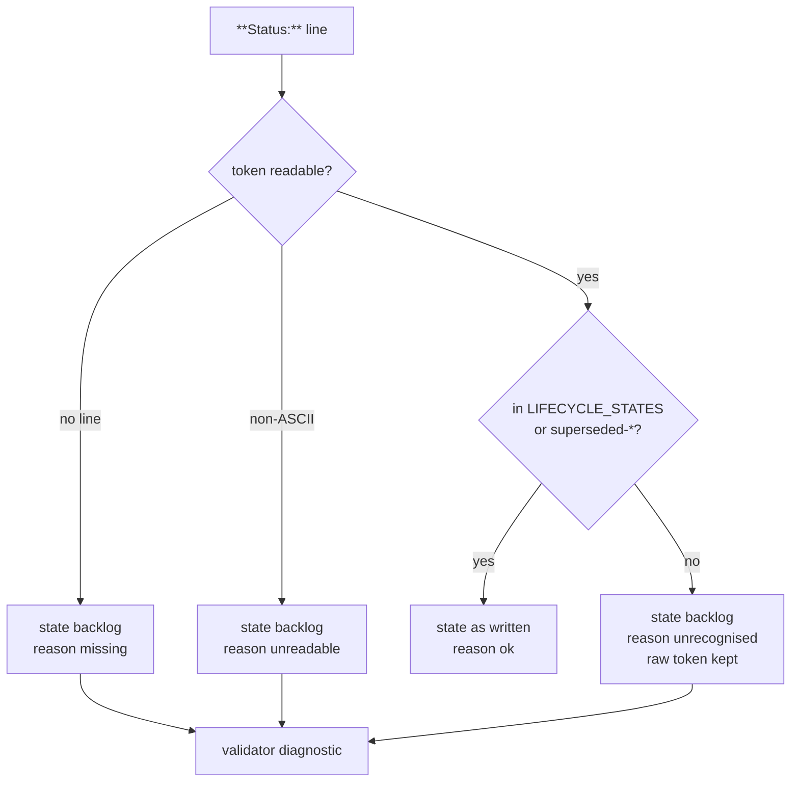

# Issue 120 Specification: Silent Status Fallback in the Issue Parser

**Status:** draft for review — written 2026-09-05.
**Owner:** Dongwon Lee
**Updated:** 2026-09-05

Issue: `120-silent-status-fallback-in-issue-parser`
Prev: issue observation during 119 · Next: `product:plan 120-silent-status-fallback-in-issue-parser`

## 1. Problem

`markdown_status` (`scripts/project_issue_schema.py:608`) resolves any status it
does not recognise to `backlog` and says nothing:

```python
def markdown_status(text):
    status = markdown_status_projection(text)
    if status is None:
        return "backlog"
    if status.startswith("superseded"):
        return "superseded"
    return status if status in LIFECYCLE_STATES else "backlog"
```

`LIFECYCLE_STATES` is `{active, backlog, done}`. Three different facts collapse
into one value on the last line and the one above it:

| Input | Today | The fact |
| --- | --- | --- |
| no `**Status:**` line | `backlog` | metadata missing |
| `**Status: 진행중**` | `backlog` | token unreadable — the regex is ASCII-only |
| `**Status: review**` | `backlog` | token read, then discarded as invalid |
| `**Status: backlog**` | `backlog` | actually in the backlog |

The fallback is directional, which is what makes it dangerous. It always lands
on `backlog` — the state meaning "not started" — so the error always
under-reports progress, never over-reports it.

**It fired on 2026-09-05.** Issue 125 was filed that afternoon with
`**Status: review**`, an invented state. The parser returned `backlog`, so a
finished and tested fix was reported as not started. Nothing logged it. It
surfaced only because someone printed the raw token beside the parsed one while
counting open issues.

A scan of all 125 issue files the same day found exactly one file relying on the
fallback — 125, since corrected. The other seven non-`LIFECYCLE_STATES` tokens
are `superseded-by-<id>`, which line 612 handles explicitly and correctly.

This violates constitution **C2 — no silent exceptions**. The blast radius is
wide precisely because C8 is being honoured: `markdown_status` is correctly the
only status parser, so `project_lifecycle`, the readiness gate, the dashboard
status column and grouping, and `moduflow_ready` all inherit the same silence.

## 2. Goals

1. Separate the three inputs above into three distinguishable results.
2. Emit a diagnostic naming the issue and the raw token whenever a fallback is
   applied, through the schema validator's existing channel.
3. Decide, and write down, whether a non-ASCII status token is an error or a
   reported fallback — rather than leaving the behaviour to a character class
   nobody chose deliberately.
4. Change no behaviour for a valid issue.

## 3. Non-Goals

- Adding, renaming or translating lifecycle states. `LIFECYCLE_STATES` is
  untouched, and `review` does not become a state because 125 wanted one.
- A second status parser. C8 stands.
- Making this a release gate on its own. Whether the validator escalates from
  diagnostic to error is decided in section 6, not assumed here.
- Changing the `backlog` default itself. This issue is about the silence.
- Repairing issue files. 125 was corrected when the firing was found; a scan is
  verification, not scope.
- Touching the `superseded-by-<id>` path, which works.

## 4. Proposed Solution

Keep one parser and one return value for callers that only need the state. Add a
second, richer entry point for callers that need to know how the value was
reached.



`markdown_status(text)` keeps its exact signature and return values, so no
caller changes. A new `markdown_status_result(text)` returns the state plus
`reason` (`ok` / `missing` / `unreadable` / `unrecognised`) and the raw token
when there was one. `markdown_status` becomes a thin wrapper over it, which is
how C8 is preserved — one implementation, two views.

The schema validator calls the richer form and reports any reason other than
`ok`, naming the issue id and the raw token.

## 5. Alternatives Considered

1. **Raise on an unrecognised token — rejected.** A single mistyped word would
   break `product:status`, the dashboard and the readiness gate at once. The
   parser is on too many read paths to be allowed to throw.
2. **Log a warning from inside `markdown_status` — rejected.** It is a pure
   function used in loops over every issue; a print or logger call there would
   emit hundreds of lines and put I/O in a parser.
3. **Return `None` for unrecognised input and let callers decide — rejected.**
   That is the widest possible change: every one of the callers listed in
   section 1 would need a new branch, and any missed one becomes a crash.
4. **Add `review` to `LIFECYCLE_STATES` — rejected, and it is the tempting one.**
   It would make 125 parse and would fix nothing: the next invented word fails
   the same silent way. The vocabulary is not the defect.

## 6. Decision — Non-ASCII Status Tokens

`_markdown_status_token` matches `[A-Za-z0-9_-]+`, so `**Status: 진행중**` does
not match at all and arrives as "no line". That is wrong on the facts — a status
line is present.

**Decision: a non-ASCII token is a reported fallback, not an error**, carrying
`reason: unreadable` distinct from `missing`. Reasons:

- It is consistent with alternative 1. Nothing in this parser raises.
- `missing` and `unreadable` call for different fixes — one means write a status
  line, the other means write it in the supported vocabulary.
- The repository is bilingual by design: issue bodies carry Korean 요약 sections
  and specs ship a `.ko.md` sidecar. Someone writing `**Status: 진행중**` is
  following the document's own convention into a field that does not support it.
  They deserve a message, not silence.

Lifecycle state names stay ASCII (Non-Goals). This decision is about diagnosing
the input, not accepting it.

## Acceptance Criteria

1. `markdown_status` returns exactly what it returns today for every input, and
   the existing suites pass unchanged.
2. `markdown_status_result` reports `ok`, `missing`, `unreadable` or
   `unrecognised`, and carries the raw token whenever one was present.
3. A file with no status line and a file with an unrecognised token produce
   different reasons.
4. `**Status: 진행중**` yields `unreadable`, not `missing`.
5. `**Status: review**` — the token that actually fired — yields `unrecognised`
   with `review` retained as the raw token.
6. `superseded-by-<id>` yields `ok` and resolves to `superseded`, unchanged.
7. The schema validator emits one diagnostic per non-`ok` issue, naming the
   issue id and the raw token; a valid issue adds no diagnostic.
8. Nothing raises on any input, including empty text and a status line with no
   value.
9. `commands/product-issue.md` documents the supported vocabulary and states
   that an unsupported token is reported and treated as `backlog`.
10. A scan across `issues/` reports the count relying on the fallback; it is 0
    at merge.
11. `python3 scripts/release_check.py .` passes and lifecycle drift is unchanged
    before and after.

## Verification Strategy

- Unit tests over the four reasons, plus the empty-text and empty-value edges.
- The `**Status: review**` case is a regression fixture, not a synthetic one —
  it is the token that fired on 2026-09-05.
- `python3 -m unittest tests.test_project_issue_schema`
- `python3 -m unittest discover -s tests`
- `python3 scripts/project_lifecycle.py . --drift` before and after.
- `python3 scripts/release_check.py .`

## Risks and Open Questions

- **A diagnostic nobody reads is the same as silence.** The validator's output
  has to reach a surface a person looks at — `product:doctor` at minimum. If it
  lands only in a JSON blob, this issue will have moved the silence rather than
  removed it. Worth checking during plan.
- **Whether the validator should escalate to an error later** is deliberately
  left open. Getting the diagnostic right first is the prerequisite for that
  conversation.
- The `unreadable` case has no live example in the corpus — it is reasoned from
  the regex, not measured. Its fixture is synthetic and should say so.

## Human Review Decisions

- [확인만] The non-ASCII decision in section 6 — `**Status: 진행중**` reports
  `unreadable`, not `missing`. Measured: `_markdown_status_token` matches
  `[A-Za-z0-9_-]+`, so a Korean token arrives as "no line at all", which is
  wrong on the facts. Section 6 carries the reasoning.
- [확인만] `review` is not added to the vocabulary. Section 7 alternative 4
  records why: it would make issue 125 parse and fix nothing, because the next
  invented word fails the same silent way. The vocabulary is not the defect.
- [확인만] **The diagnostic reaches `product:doctor`. Settled 2026-09-06 by
  evidence, not by judgement** — a survey of thirteen tools found no
  counter-example, and issue 146 now owns the landing place.

  What settled it: `brew doctor` prints 73 flat warnings with a header saying
  "just ignore this" and exits 1, and it is the tool ModuFlow most resembles
  today. `expo-doctor` leads with "Running 17 checks… 16/17 passed", collapses
  the passing ones, and gives each failure an `Advice:` line. The difference is
  not severity levels — it is that one of them tells you the denominator and
  what to do next.

  So this spec's own sentence was right: "A diagnostic nobody reads is the same
  as silence." Landing it only in a JSON blob would move the silence.

  **What this issue owns, narrowed:** produce the diagnostic and get it to
  doctor. It does **not** own the rendering — the severity levels, the
  denominator line, the `Advice:` blocks and `--fail-level` are issue 146,
  which blocks nothing here because a finding can land before the renderer
  improves.

  The three reasons map onto 146's levels as: `unrecognised` and `missing` are
  `warning`; `unreadable` is `note`, because it has no live example in the
  corpus and SARIF §3.27.10 defines `note` as "the rule applies to this
  location, but the problem it describes is not a defect". If it ever fires,
  the count moves and it can be promoted then.

Next command after approval: `product:plan 120-silent-status-fallback-in-issue-parser`.
