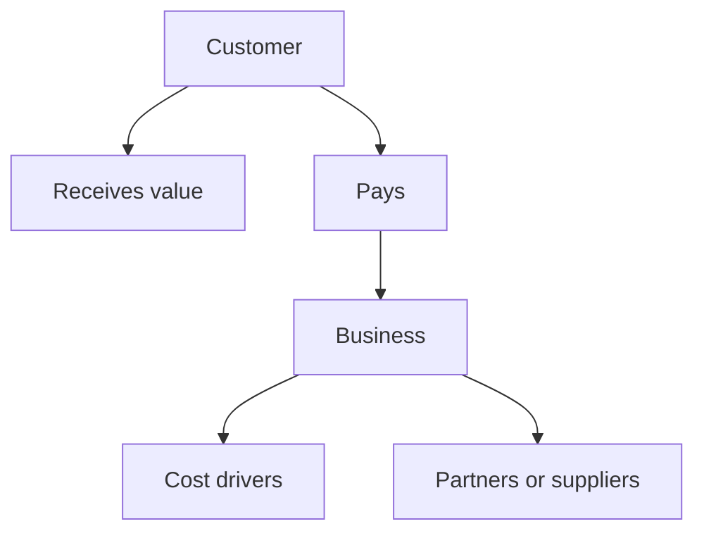

# Business Brief

Issue:
Source request:
Owner:
Phase: Draft
Next command: `moduflow:business-plan`

## One-Line Idea

-

## Customer

- Primary user:
- Buyer or decision maker:
- Early adopter:

## Problem

-

## Current Alternatives

-

## Solution

-

## Why Now

-

## Business Model

- Revenue:
- Cost drivers:
- Channel:
- Key metric:

## Diagrams

### Business Model Flow

## Open Questions

-
