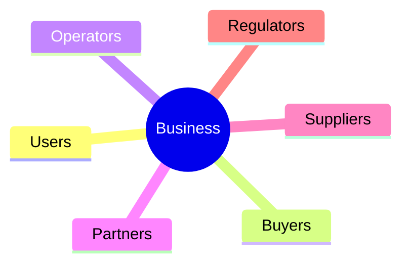
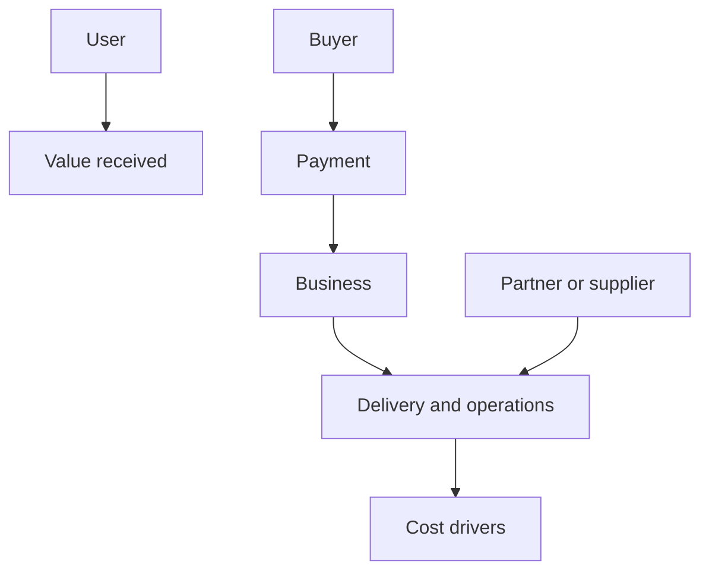
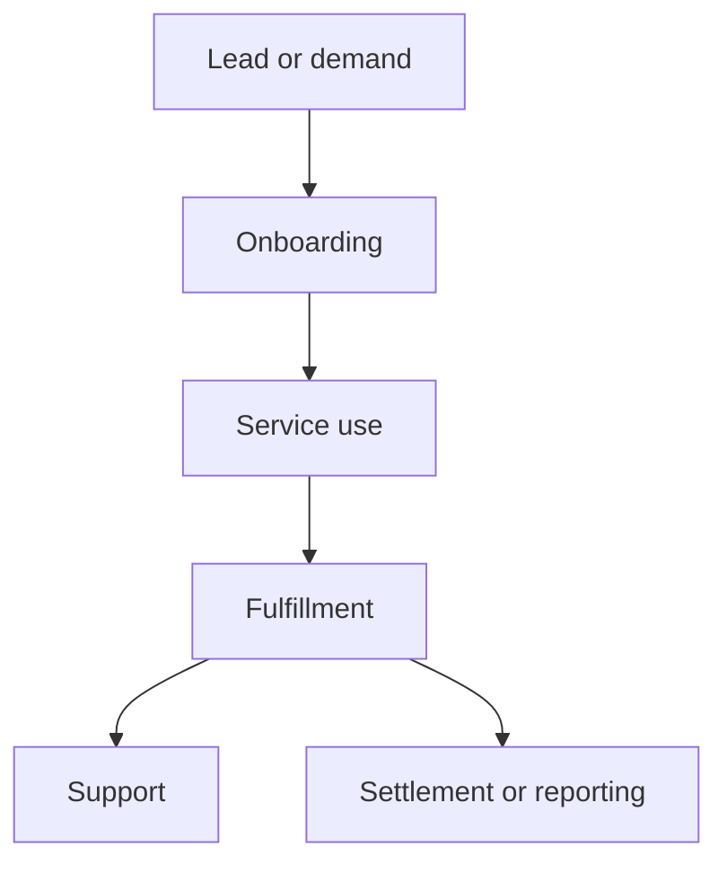
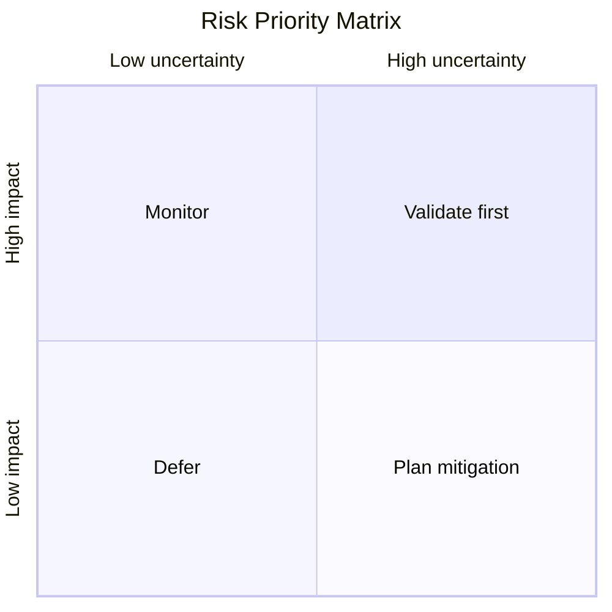

# Business Plan

Issue:
Source request:
Owner:
Phase: Draft
Next command: `product:review`

## Executive Summary

-

## Customer And Problem

- Primary persona:
- Buyer or decision maker:
- Problem:
- Existing alternatives:

## Market Opportunity

- Segment:
- Market size assumption:
- Timing:
- Evidence:

## Solution

-

## Product Or Service

-

## Business Model

- Revenue model:
- Pricing assumption:
- Cost structure:
- Unit economics hypothesis:

## Go-To-Market

- Channel:
- First audience:
- Activation strategy:
- Retention strategy:

## Competitive Landscape

| Alternative | Strength | Weakness | Our Difference |
| --- | --- | --- | --- |
|  |  |  |  |

## Operations Plan

-

## Financial Assumptions

| Assumption | Value | Evidence | Risk |
| --- | --- | --- | --- |
|  |  |  |  |

## Risks And Validation Plan

-

## Execution Roadmap

-

## Diagrams

### Stakeholder Map

### Business Model Flow

### Operating Process Map

### Risk Priority Matrix

