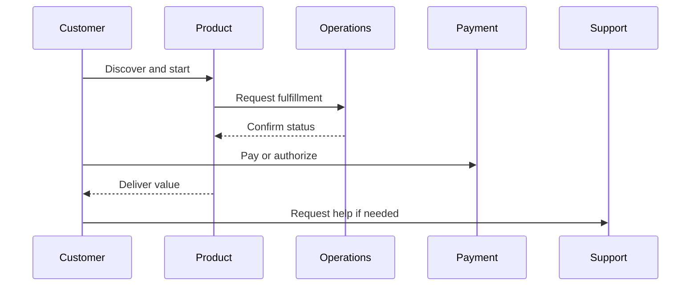
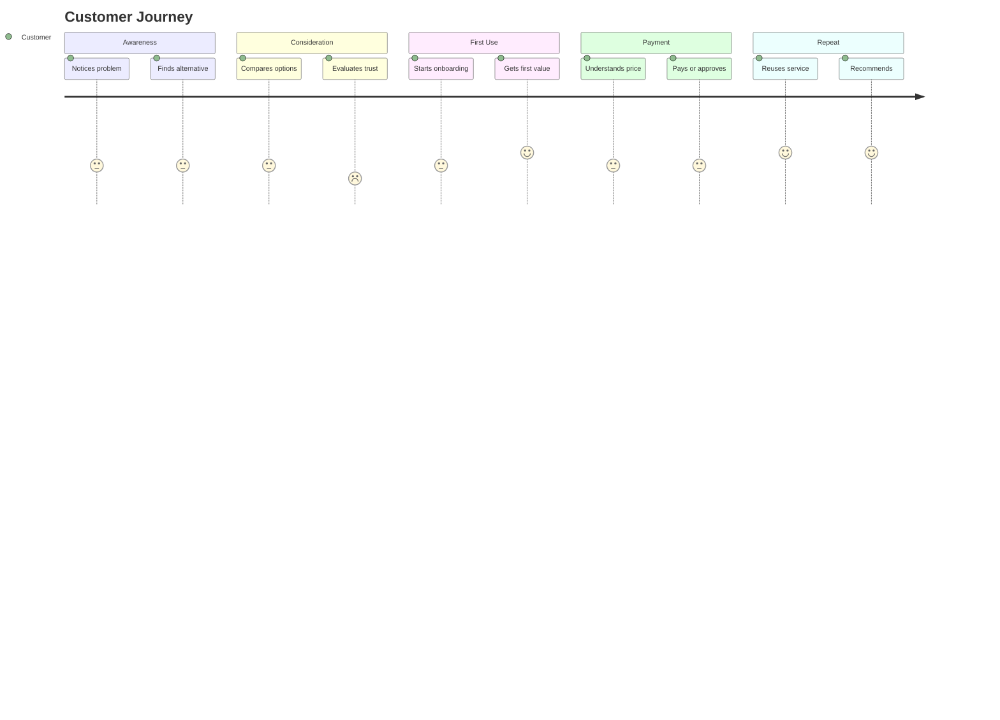

# Pitch Deck Outline

Issue:
Source request:
Owner:
Phase: Draft
Next command: `product:review`

## Slide Outline

| Slide | Title | Core Message | Source |
| --- | --- | --- | --- |
| 1 | Cover |  | executive-summary.md |
| 2 | Problem |  | business-plan.md |
| 3 | Customer / Persona |  | persona-scenarios.md |
| 4 | Current Alternatives |  | business-plan.md |
| 5 | Solution |  | business-plan.md |
| 6 | Product / Service Flow |  | deck-outline.md |
| 7 | Business Model |  | business-plan.md |
| 8 | Go-To-Market |  | business-plan.md |
| 9 | Market Opportunity |  | business-plan.md |
| 10 | Competition |  | business-plan.md |
| 11 | Validation Plan |  | validation-plan.md |
| 12 | Roadmap |  | issue-candidates.md |
| 13 | Risks |  | validation-plan.md |
| 14 | Ask / Next Steps |  | executive-summary.md |

## Diagrams

### Sequence Diagram

### Customer Journey Map

## Export Notes

- Presentations plugin should create PPTX from this outline.
- Keep slide claims traceable to Markdown source files.
- Do not treat exported PPTX as the primary source.
