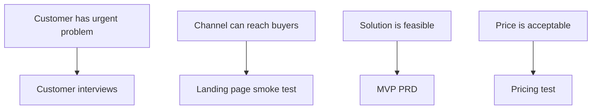

# Issue Candidates

Issue:
Source request:
Owner:
Phase: Draft
Next command: `product:issue`

## Candidate Issues

| Candidate | Type | Source Hypothesis | Priority | Next Command |
| --- | --- | --- | --- | --- |
| customer-interviews | Research |  | High | `product:issue customer-interviews` |
| competitor-benchmark | Benchmark |  | Medium | `product:benchmark competitor-benchmark` |
| landing-page-smoke-test | Experiment |  | Medium | `product:issue landing-page-smoke-test` |
| mvp-prd | Spec |  | High | `product:spec mvp-prd` |

## Scenario-To-Issue Mapping

| Persona Scenario | Needed Work | Candidate Issue |
| --- | --- | --- |
|  |  |  |

## Hypothesis-To-Issue Mapping

## Roadmap Candidates

-

## Notes

-
