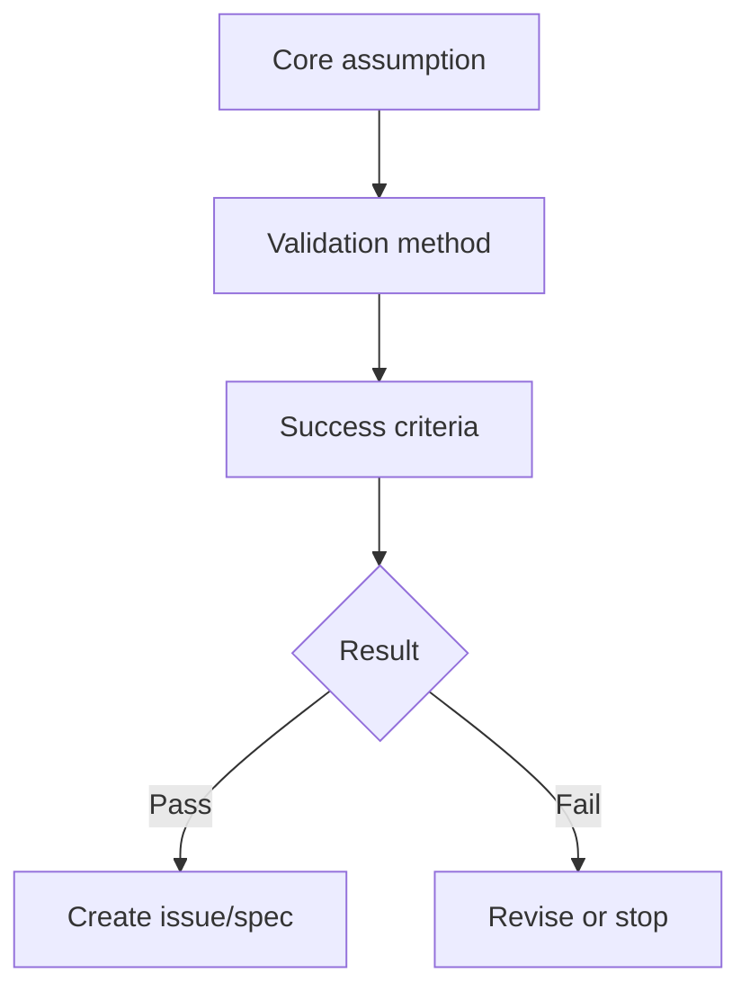

# Lean Canvas

Issue:
Source request:
Owner:
Phase: Draft
Next command: `moduflow:business-plan`

## Problem

1.
2.
3.

## Customer Segments

-

## Unique Value Proposition

-

## Solution

1.
2.
3.

## Channels

-

## Revenue Streams

-

## Cost Structure

-

## Key Metrics

-

## Unfair Advantage

-

## Highest-Risk Assumptions

| Assumption | Why It Matters | Evidence Needed | Priority |
| --- | --- | --- | --- |
|  |  |  |  |

## Diagrams

### Hypothesis Validation Map

## Validation Notes

-
