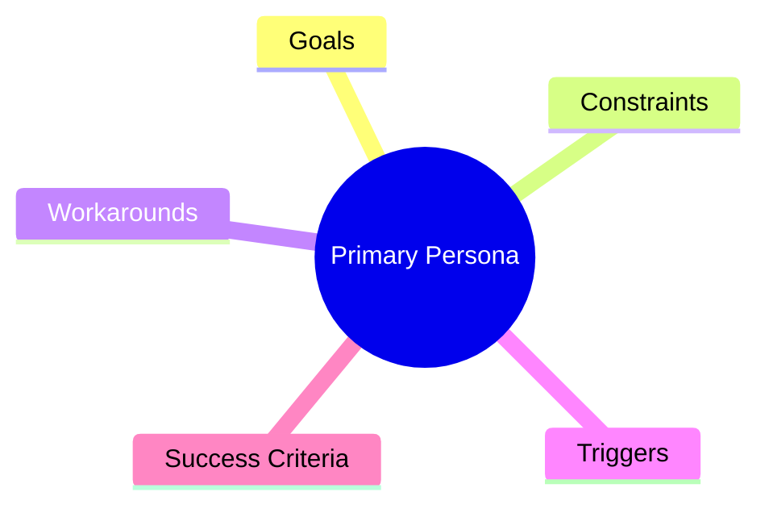
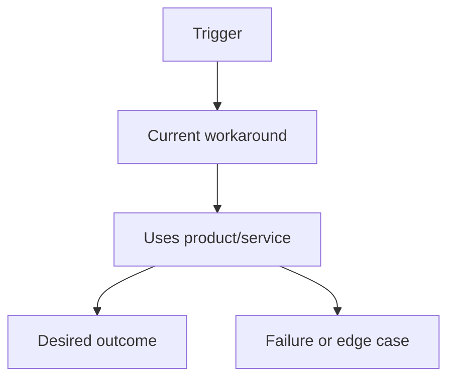

# Persona Scenarios

Issue:
Source request:
Owner:
Phase: Draft
Next command: `moduflow:business-plan`

## Primary Persona

- Name or archetype:
- Role:
- Context:
- Goals:
- Constraints:
- Budget or authority:

## Secondary Persona

- Name or archetype:
- Role:
- Context:
- Goals:
- Constraints:

## Buyer Or Decision Maker

- Role:
- Decision criteria:
- Objections:
- Approval path:

## Situation And Trigger

-

## Current Workaround

-

## Desired Outcome

-

## Step-By-Step User Scenario

1.
2.
3.
4.
5.

## Success Criteria

-

## Failure And Edge Scenarios

| Scenario | Impact | Mitigation | Validation |
| --- | --- | --- | --- |
|  |  |  |  |

## Scenario-To-Feature Mapping

| Scenario Step | Needed Capability | Feature Candidate | Priority |
| --- | --- | --- | --- |
|  |  |  |  |

## Scenario-To-Validation Mapping

| Scenario Step | Hypothesis | Validation Method | Success Criteria |
| --- | --- | --- | --- |
|  |  |  |  |

## Diagrams

### Persona Map

### Scenario Flow

