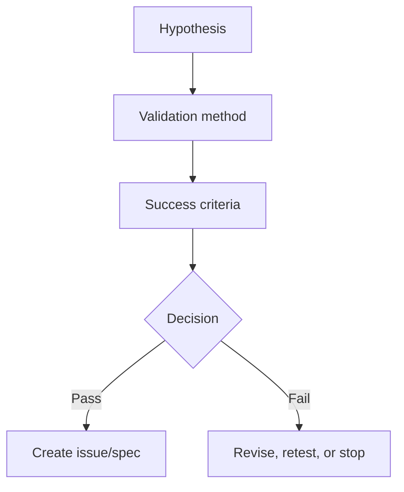
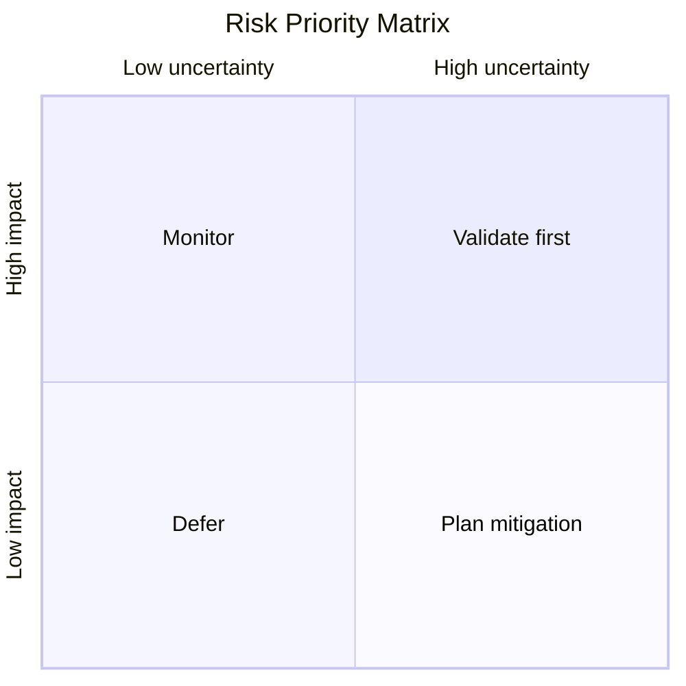

# Validation Plan

Issue:
Source request:
Owner:
Phase: Draft
Next command: `product:issue`

## Validation Strategy

-

## Hypotheses

| Hypothesis | Evidence Needed | Method | Success Criteria | Decision |
| --- | --- | --- | --- | --- |
|  |  |  |  |  |

## Tests

| Test | Owner | Timeline | Cost | Output |
| --- | --- | --- | --- | --- |
| Customer interviews |  |  |  |  |
| Competitor benchmark |  |  |  |  |
| Landing page smoke test |  |  |  |  |
| Prototype test |  |  |  |  |
| Pricing test |  |  |  |  |

## Diagrams

### Hypothesis Validation Map

### Risk Priority Matrix

## Issue Candidates

-
