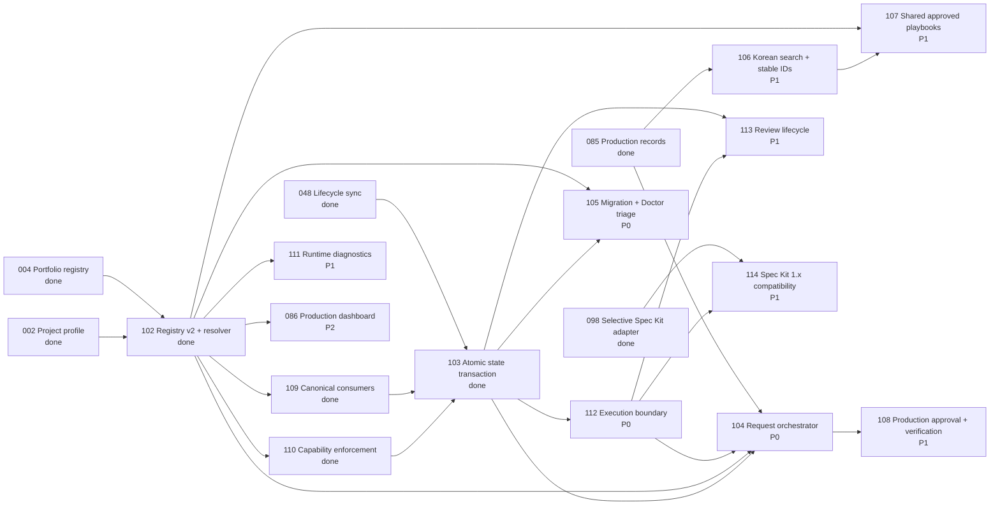

# Goal: Trustworthy Execution and Project Knowledge

## Objective

Make ModuFlow stop unsafe work before it reaches the wrong repository, turn external review into evidence-backed remediation, and give each project a reproducible knowledge, artifact, analysis, and dashboard home.

The current product focus is continuity across projects and AI tasks: people and AI find selected evidence through one short project home. ModuFlow manages context, records, decisions and next actions; external company standards and replaceable specialist tools/runners perform the work.

## Owner

Dongwon Lee

## Why Now

Repository sync, review handoff, production records, and dashboard foundations already exist. The remaining risk is trust and continuity: remote names can conceal the wrong repository, external review can be accepted without proof, and project conclusions or artifacts can become scattered across files and Sheets.

The 2026-09-02 user requests prioritize material discovery, cross-session handoff and reusable company standards over further execution expansion. See `workspace/roadmap.md` for the authoritative Now/Next/Later ordering. Issue 103 is merged; the 111/060 release 0.3.56 is published and installed. Prioritize 090 → 091 → 086 → 092 before richer orchestration. This changes execution order, not hard dependencies.

## Issues

Current checkpoint (2026-09-03): 090 implementation, full verification, explicitly approved PR #47 integration and 0.3.57 publication/installation are complete. Installed validation and fresh CLI/MCP passed; see `specs/090-project-knowledge-and-artifact-registry/release.md`. Canonical completion transaction set 090 to done without a fictional earlier start or second active issue. 111 remains active for R01/R02 actual Codex/Claude prompt-skill observations. Remaining implementation priority is 091 → 086 → 092; no next implementation is started here. 086 stays limited to separately prepared QA documents/synthetic inputs. Actual company-project adoption is unperformed, and no runtime/scheduler was introduced.

- `088-canonical-repository-remote-identity-gate` — P0; canonical repo/base identity and pre-write blocking.
- `089-verified-code-review-intake-and-remediation-routing` — P1; evidence-backed review disposition.
- `093-frontmatter-issue-schema-readiness-gate` — P1; contradictory readiness/dependency blocking.
- `094-risk-based-security-and-quality-review-gate` — P1; preventive checks learned from approved review history.
- `086-project-aware-production-library-dashboard` — P2; project-scoped production/playbook views after the safety gate sequence.
- `090-project-knowledge-and-artifact-registry` — P1; structured project wiki and artifact registry.
- `091-reproducible-analysis-runs-and-template-pack` — P1; reproducible analysis history and templates.
- `092-project-home-dashboard` — P2; final project home; blocked by 086, 090, and 091.
- `087-korean-github-pr-review-surface` — P1; Korean-first GitHub review publication.
- `097-single-entry-capability-routing-contract` — P2; predictable single-entry specialist routing with offline safety simulation.
- `098-speckit-selective-validation-adapter` — P2; selectively activate Spec Kit validation after Issue 097 proves the routing boundary.
- `102-project-registry-and-resolver` — P0; explicit registry v2, deterministic project resolution, and canonical artifact paths.
- `103-atomic-lifecycle-state-transaction` — P0; all-or-nothing lifecycle/state/dashboard/production updates with rollback.
- `104-project-aware-natural-language-request-orchestrator` — P0; connect the existing single entry point to project context, production knowledge, capability routing, verification, and atomic handoff.
- `105-schema-migration-and-doctor-triage` — P0; prioritize blockers, plan/apply reversible migrations, and safely fix deterministic legacy drift.
- `106-korean-production-search-and-stable-ids` — P1; Korean multi-token retrieval, match reasons, and meaningful collision-resistant production IDs.
- `107-shared-approved-playbook-layer` — P1; share only explicitly approved and redacted organization rules while raw project knowledge stays isolated.
- `108-production-approval-and-verification-gates` — P1; approver readiness and evidence-backed deliverable-specific final-state gates.
- `109-canonical-project-context-consumer-convergence` — P0; eliminate remaining direct project-path assumptions before Issue 103 implementation.
- `110-project-operation-capability-enforcement` — P0; separate resolved identity from read/write/execute/publish authorization before Issue 103 implementation.
- `111-runtime-provenance-and-validation-mode-separation` — P1; distinguish source, installed package, and target-project validation and expose active runtime provenance before the next plugin release.
- `112-execution-planner-and-backend-boundary` — P0; plan only concrete implementation work and select one inline or Superpowers SDD execution path without building another runtime.
- `113-review-lifecycle-and-exception-fix-approval` — P1; separate implementation, review, fixes, approval, and merge states and record user-approved exception fix rounds.
- `114-speckit-selective-adapter-1x-compatibility` — P1; review and pin one exact Spec Kit 1.x version for the four read-only advisory functions only.
- `115-playbook-process-and-checklist-extension` — P1; add an external `process_ref` and a numbered human-owned `Required Checks` checklist to `moduflow.playbook.v1` as an Issue 085 follow-up; blocks 091.
- `116-merged-issue-completion-parity` — P1; report an issue whose commits are merged on the canonical remote while its own lifecycle state is not `done`, using the Issue 095 attribution index.

## Workstream: Safe Multi-Project Request Orchestration

Route natural-language work to one explicit project, reuse only permitted project/shared knowledge, verify the result, and update every lifecycle view without partial state.

**Review decision:** existing Issues 020, 022, 065, 076, 088, 097, 102, 103, and 105 were checked before registration. The verified Issue 102 follow-up findings are not duplicate deliverables: Issues 109 and 110 are P0 prerequisites for Issue 103 implementation, while the two related runtime/validation findings are intentionally grouped into Issue 111.

## Completion Criteria

- Wrong repository or archived/read-only identity stops execute, PR, release, and push before writes.
- External review findings have evidence, disposition, remediation timing, and issue candidates.
- Mixed issue schemas cannot report ready/execute while dependencies or readiness are unmet.
- Projects maintain structured knowledge, artifact, and reproducible analysis records.
- The project home shows current work, recent outputs, key Sheets, conclusions, and next actions.
- People and fresh AI tasks use the same short home and source-linked catalog; validate two-project isolation, committed-worktree handoff, stale/missing links and optional private-source absence separately from actual host/session loading.
- Company analysis/document standards are external versioned references, not copied business logic; record effective rules and applicable validation evidence without weakening privacy/access constraints.
- Analysis run completion, validation, human approval, observation-pending decisions and actually scheduled follow-ups remain distinguishable.
- Each phase proves its user-facing boundaries with synthetic simulation scenarios before actual use; unit tests, simulated execution, packaged smoke and actual project/host observations remain separate evidence.
- A request resolves exactly one registered project before any project-local read or write.
- Every project-aware path consumer uses that resolved context, including non-default registered folders.
- Archived/read-only projects remain readable but cannot write, execute, or publish.
- Project A raw issues, records, local playbooks, and brand language never appear in Project B work.
- Related work attaches to an existing issue; only independent deliverables create new issue candidates.
- Lifecycle mutations either update all configured canonical/derived state together or preserve the complete prior state.
- Legacy migration is planned, reversible, idempotent, and separated from current-work blockers in Doctor output.
- Source release validation, installed-plugin self-check, and target-project Doctor are distinct, and status identifies the actually loaded runtime/package provenance.
- Korean multi-token production search returns explained matches and Korean-titled records receive stable meaningful IDs.
- Only explicitly approved, redacted shared playbooks cross project boundaries.
- Production artifacts cannot become final, approved, published, or upload-ready without required verification evidence.
- Worker plans contain only unfinished executable tasks with concrete file/dependency boundaries; simple or shared-state work remains inline.
- ModuFlow selects one execution path and records truthful evidence while the active host/Superpowers runtime performs actual execution.
- Implementation completion, review findings, explicit approval, and verified merge remain distinct states.
- Spec Kit stays optional and read-only; any 1.x refresh is exact-version/hash pinned after compatibility review.

## Constraints

- Git-tracked project files remain canonical; GitHub and dashboard surfaces are projections.
- No automatic remote rewrite or unapproved external publication.
- Sensitive source data and credentials stay outside the repository.
- Existing staged work for issues 081–084 remains independent from this branch.
- Existing Issues 085 and 086 are extended through follow-ups, not replaced or rewritten.
- Registered projects only; no arbitrary sibling-project crawling or cross-project raw-record search.
- No automatic shared-playbook promotion, approver authorization, or unverified final-state transition.
- Issue 102 is merged and externally revalidated. Issues 109 and 110 completed before Issue 103 implementation began; Issue 111 may run in parallel but must complete before the next plugin release.
- No second ModuFlow subagent runtime, scheduler, queue, or full Spec Kit implementation lifecycle.
- Keep the Issue DB/table/tab UI and Git-native source records; do not introduce a second dashboard database or embed private cross-project payloads in a shared HTML page.
- Reconcile new requirements within 086/090/091/092 before implementation; preserve existing acceptance criteria, including 091's five templates. Automation expansion remains a later bounded scope, not a newly authorized runner installation or schedule.
- Issue 104 consumes Issue 112's execution-routing contract; Issue 113 consumes Issues 103 and 112; Issue 114 never blocks projects that keep the approved 0.16.1 adapter disabled or pinned.

## Status

- State: `active`
- Blocker: next plugin publication is held for Issue 111. Its spec/plan and simulation matrix are drafted and await review before implementation. Issue 103 implementation and PR #44 merge are complete.
- Updated: 2026-09-02

## History

- `team-visibility-onboarding` — closed before 2026-07-16.
- `visual-workbench` — closed 2026-07-05.
- 2026-09-02: refreshed priorities for project discovery, cross-session continuity and external company standards; retained Issue 111's release gate and deferred expanded execution/automation. No new issues or implementation started by this refresh.
- 2026-09-02: added the cross-phase simulation contract and Issue 111's four-stream spec/plan with twelve offline scenarios and two actual-host observations. Document preparation does not count as execution approval or passing tests.

## Next Command

`product:review 111-runtime-provenance-and-validation-mode-separation`

Review the drafted 111 spec/plan, then implement and verify its four inline streams before resuming publication. Next deliver the 090/091/086/092 project-knowledge slice; 112 still precedes 104/113/114, but is not a new prerequisite for that slice.
